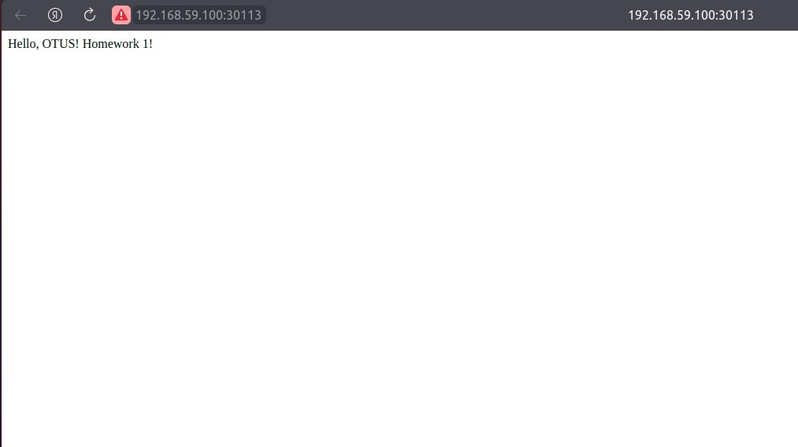
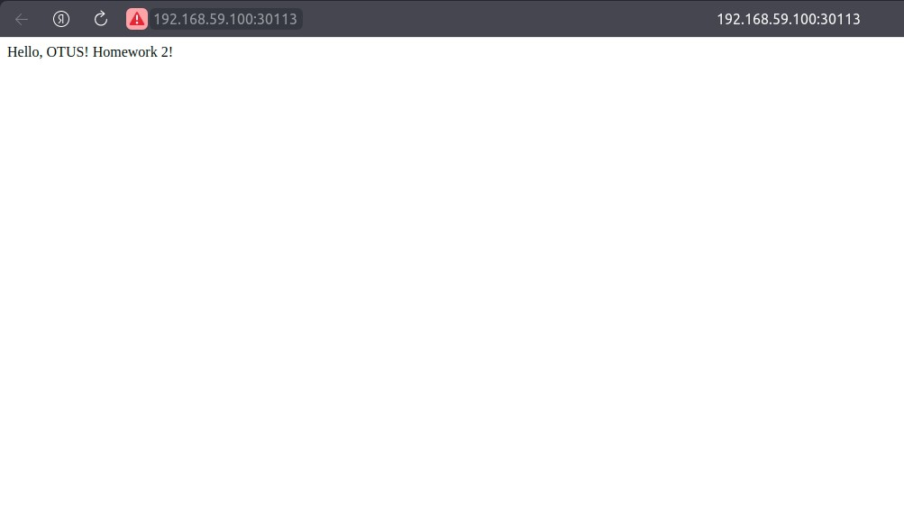
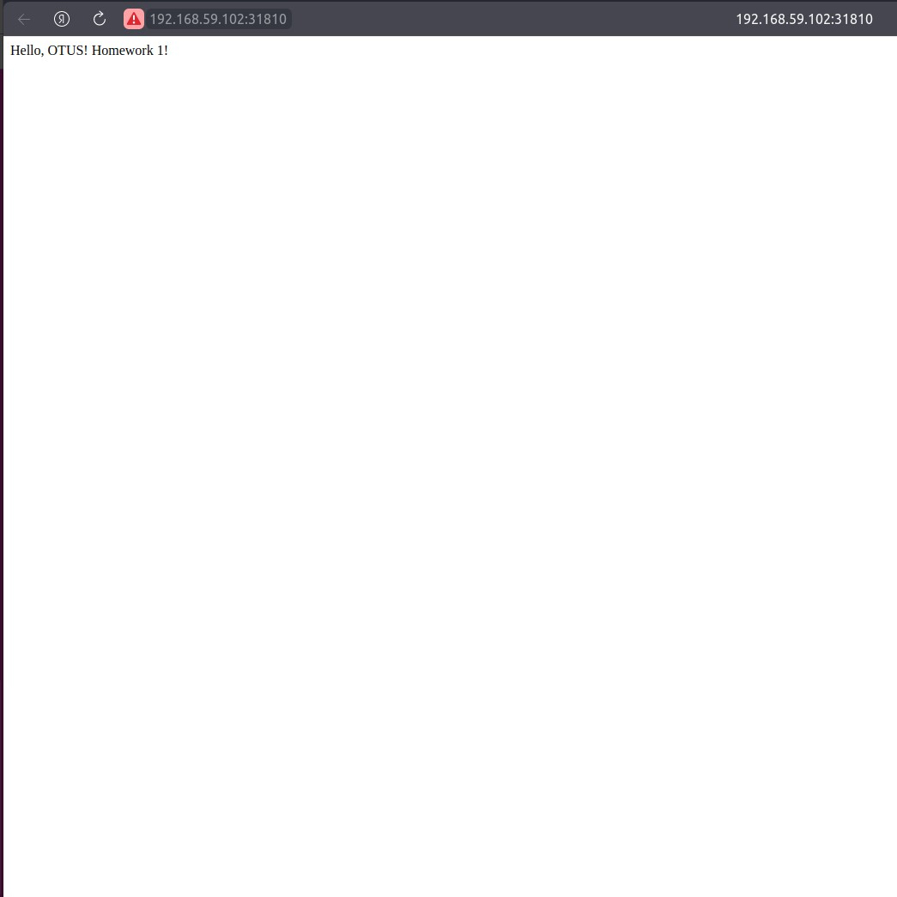

# Репозиторий для выполнения домашних заданий курса "Инфраструктурная платформа на основе Kubernetes-2024-08" 

# Практические занятия:

## skyfly535_repo
skyfly535 kubernetes repository

### Оглавление:

- [HW1 Знакомство с решениями для запуска локального Kubernetes кластера, создание первого pod.](#hw1-знакомство-с-решениями-для-запуска-локального-kubernetes-кластера-создание-первого-pod)

- [HW2 Kubernetes controllers. ReplicaSet, Deployment, DaemonSet.](#hw2-kubernetes-controllers-replicaset-deployment-daemonset)

- [HW3 Сетевое взаимодействие Pod, сервисы.](#hw3-сетевое-взаимодействие-pod-сервисы)

- [HW4 Volumes, StorageClass, PV, PVC.](#hw4-volumes-storageclass-pv-pvc)

- [HW5 Настройка сервисных аккаунтов и ограничение прав для них.](#hw5-настройка-сервисных-аккаунтов-и-ограничение-прав-для-них)

- [HW6 Шаблонизация манифестов приложения, использование Helm. Установка community Helm charts.](#hw6-шаблонизация-манифестов-приложения-использование-helm-установка-community-helm-charts)

- [HW7 Создание собственного CRD.](#hw7-создание-собственного-crd)

# HW7 Создание собственного CRD.

## В процессе выполнения ДЗ выполнены следующие мероприятия:

### 1. Создан манифест объекта `CustomResourceDefinition` удовлетворяющий требованиям ДЗ.

**1.1 CustomResourceDefinition (CRD) для MySQL**

```yaml
apiVersion: apiextensions.k8s.io/v1
kind: CustomResourceDefinition
metadata:
  name: mysqls.otus.homework
spec:
  group: otus.homework
  versions:
    - name: v1
      served: true
      storage: true
      schema:
        openAPIV3Schema:
          type: object
          required:
            - spec
          properties:
            spec:
              type: object
              required:
                - image
                - database
                - password
                - storage_size
              properties:
                image:
                  type: string
                database:
                  type: string
                password:
                  type: string
                storage_size:
                  type: string
  scope: Namespaced
  names:
    plural: mysqls
    singular: mysql
    kind: MySQL
    shortNames:
      - my
```

---

**1.2 ServiceAccount, ClusterRole и ClusterRoleBinding**

- **ServiceAccount**

  ```yaml
  apiVersion: v1
  kind: ServiceAccount
  metadata:
    name: mysql-operator
    namespace: default
  ```

- **ClusterRole с полным доступом**

  ```yaml
  apiVersion: rbac.authorization.k8s.io/v1
  kind: ClusterRole
  metadata:
    name: mysql-operator
  rules:
    - apiGroups: ["*"]
      resources: ["*"]
      verbs: ["*"]
  ```

- **ClusterRoleBinding**

  ```yaml
  apiVersion: rbac.authorization.k8s.io/v1
  kind: ClusterRoleBinding
  metadata:
    name: mysql-operator
  subjects:
    - kind: ServiceAccount
      name: mysql-operator
      namespace: default
  roleRef:
    kind: ClusterRole
    name: mysql-operator
    apiGroup: rbac.authorization.k8s.io
  ```

---

**1.3 Deployment для оператора**

```yaml
apiVersion: apps/v1
kind: Deployment
metadata:
  name: mysql-operator
  namespace: default
spec:
  replicas: 1
  selector:
    matchLabels:
      name: mysql-operator
  template:
    metadata:
      labels:
        name: mysql-operator
    spec:
      serviceAccountName: mysql-operator
      containers:
        - name: mysql-operator
          image: roflmaoinmysoul/mysql-operator:1.0.0
```

---

**1.4 Кастомный ресурс типа MySQL**

```yaml
apiVersion: otus.homework/v1
kind: MySQL
metadata:
  name: mysql-instance
  namespace: default
spec:
  image: mysql:5.7
  database: mydb
  password: mypassword
  storage_size: 1Gi
```

---

**Пояснение:**

- **CRD:** Определяет новый кастомный ресурс `MySQL` с обязательными строковыми атрибутами: `image`, `database`, `password` и `storage_size`.
- **ServiceAccount, ClusterRole, ClusterRoleBinding:** Настраивает сервисный аккаунт `mysql-operator` с полным доступом к API.
- **Deployment:** Развертывает оператор, используя указанный образ и сервисный аккаунт.
- **Кастомный ресурс:** Экземпляр `MySQL`, которым будет управлять оператор.


**Применяем манифесты и проверяем работу оператора**

Проверку проводим в `Minikube`

- **Применение манифестов**

```bash
./kubernetes-operators$ kubectl apply -f CRD_MySQL.yaml 
customresourcedefinition.apiextensions.k8s.io/mysqls.otus.homework created

./kubernetes-operators$ kubectl apply -f SA_MySQL.yaml 
serviceaccount/mysql-operator created

./kubernetes-operators$ kubectl apply -f CR_MySQL_old.yaml 
clusterrole.rbac.authorization.k8s.io/mysql-operator created

./kubernetes-operators$ kubectl apply -f CRB_MySQL.yaml 
clusterrolebinding.rbac.authorization.k8s.io/mysql-operator created

./kubernetes-operators$ kubectl apply -f Deployment_MySQL.yaml 
deployment.apps/mysql-operator created

./kubernetes-operators$ kubectl apply -f MySQL.yaml 
mysql.otus.homework/mysql-instance created
```

- **Проверка создания CRD**

```bash
$ kubectl get crd mysqls.otus.homework
NAME                   CREATED AT
mysqls.otus.homework   2024-10-01T12:43:58Z
```

- **Проверяем, что Deployment оператора работает**

```bash
$ kubectl get deployments
NAME             READY   UP-TO-DATE   AVAILABLE   AGE
mysql-instance   1/1     1            1           2m24s
mysql-operator   1/1     1            1           4m43s
```

- **Проверка кастомного ресурса**

```bash
$ kubectl get mysqls
NAME             AGE
mysql-instance   3m55s
```

- **Проверка созданных оператором Deployment, Service, PV и PVC**

```bash
$ kubectl get deployments
NAME             READY   UP-TO-DATE   AVAILABLE   AGE
mysql-instance   1/1     1            1           4m57s
mysql-operator   1/1     1            1           7m16s

$ kubectl get service
NAME             TYPE        CLUSTER-IP   EXTERNAL-IP   PORT(S)    AGE
kubernetes       ClusterIP   10.96.0.1    <none>        443/TCP    10m
mysql-instance   ClusterIP   None         <none>        3306/TCP   5m5s

$ kubectl get pv
NAME                CAPACITY   ACCESS MODES   RECLAIM POLICY   STATUS   CLAIM                        STORAGECLASS   REASON   AGE
mysql-instance-pv   1Gi        RWO            Retain           Bound    default/mysql-instance-pvc   standard                5m13s

$ kubectl get pvc
NAME                 STATUS   VOLUME              CAPACITY   ACCESS MODES   STORAGECLASS   AGE
mysql-instance-pvc   Bound    mysql-instance-pv   1Gi        RWO            standard       5m19s

$ kubectl get pod
NAME                              READY   STATUS    RESTARTS   AGE
mysql-instance-6d64c5596f-lfz4r   1/1     Running   0          5m26s
mysql-operator-68b4cf86d-hnrvc    1/1     Running   0          7m45s\
```

- **Удаление кастомного ресурса и проверка очистки**

```bash
$ kubectl delete -f MySQL.yaml 
mysql.otus.homework "mysql-instance" deleted

$ kubectl get deployments
NAME             READY   UP-TO-DATE   AVAILABLE   AGE
mysql-operator   1/1     1            1           10m

$ kubectl get service
NAME         TYPE        CLUSTER-IP   EXTERNAL-IP   PORT(S)   AGE
kubernetes   ClusterIP   10.96.0.1    <none>        443/TCP   13m

$ kubectl get pv
No resources found

$ kubectl get pvc
No resources found in default namespace.
```
### 2. Изменен манифест `ClusterRole`, для описания в нем минимального набора прав доступа необходимых для нашего CRD.

**Обновленный манифест ClusterRole с минимальным набором прав доступа:**

```yaml
apiVersion: rbac.authorization.k8s.io/v1
kind: ClusterRole
metadata:
  name: mysql-operator
rules:
  - apiGroups:
      - "otus.homework"
    resources:
      - mysqls
      - mysqls/status
    verbs:
      - get
      - list
      - watch
      - create
      - update
      - patch
      - delete
  - apiGroups:
      - ""
    resources:
      - pods              # данный компонент добавлен для для наблюдения за изменениями ресурсов (создание, удаление, обновление). Иначе оператор будет обновлять ресурсы только при перезапуске.
      - events
      - pods/status        
      - services          # данный компонент добавлен для для наблюдения за изменениями ресурсов (создание, удаление, обновление). Иначе оператор будет обновлять ресурсы только при перезапуске.
      - persistentvolumeclaims
      - persistentvolumes # если PV не используется можно удалить
    verbs:
      - get
      - list
      - watch
      - create
      - update
      - patch
      - delete
  - apiGroups:
      - "apps"
    resources:
      - deployments      # данный компонент добавлен для для наблюдения за изменениями ресурсов (создание, удаление, обновление). Иначе оператор будет обновлять ресурсы только при перезапуске.
      - deployments/status
    verbs:
      - get
      - list
      - watch
      - create
      - update
      - patch
      - delete
```

**Пояснение:**

**2.1 Управление ресурсом CRD (`MySQL`):**

   - **apiGroups:** `otus.homework`
   - **resources:** `mysqls` , `mysqls/status`
   - **verbs:** `get`, `list`, `watch`, `create`, `update`, `patch`, `delete`

   Это позволяет оператору управлять своими кастомными ресурсами `MySQL`, включая их создание, обновление и удаление.

**2.2 Создание и управление Deployment:**

   - **apiGroups:** `apps`
   - **resources:** `deployments` , `deployments/status`
   - **verbs:** `get`, `list`, `watch`, `create`, `update`, `patch`, `delete`

   Оператор создает Deployment для запуска экземпляра MySQL, поэтому ему необходимы эти права.

**2.3 Создание и управление Service и PersistentVolumeClaim (PVC):**

   - **apiGroups:** `""` (core API group)
   - **resources:** `services`, `persistentvolumeclaims` , `pods` , `events` , `pods/status` , `persistentvolumes`
   - **verbs:** `get`, `list`, `watch`, `create`, `update`, `patch`, `delete`


**Проверяем**

```bash
kubectl apply -f CR_MySQL.yaml

kubectl apply -f CRB_MySQL.yaml
   ```

**Смотрим лог пода кастомного ресурса**

```bash
$ kubectl logs mysql-instance-6d64c5596f-fs6dm
2024-10-01 13:00:24+00:00 [Note] [Entrypoint]: Entrypoint script for MySQL Server 5.7.44-1.el7 started.
2024-10-01 13:00:24+00:00 [Note] [Entrypoint]: Switching to dedicated user 'mysql'
2024-10-01 13:00:24+00:00 [Note] [Entrypoint]: Entrypoint script for MySQL Server 5.7.44-1.el7 started.
'/var/lib/mysql/mysql.sock' -> '/var/run/mysqld/mysqld.sock'
2024-10-01T13:00:24.846002Z 0 [Warning] TIMESTAMP with implicit DEFAULT value is deprecated. Please use --explicit_defaults_for_timestamp server option (see documentation for more details).
2024-10-01T13:00:24.846830Z 0 [Note] mysqld (mysqld 5.7.44) starting as process 1 ...
2024-10-01T13:00:24.849048Z 0 [Note] InnoDB: PUNCH HOLE support available
2024-10-01T13:00:24.849061Z 0 [Note] InnoDB: Mutexes and rw_locks use GCC atomic builtins
2024-10-01T13:00:24.849064Z 0 [Note] InnoDB: Uses event mutexes
2024-10-01T13:00:24.849066Z 0 [Note] InnoDB: GCC builtin __atomic_thread_fence() is used for memory barrier
2024-10-01T13:00:24.849068Z 0 [Note] InnoDB: Compressed tables use zlib 1.2.13
2024-10-01T13:00:24.849070Z 0 [Note] InnoDB: Using Linux native AIO
2024-10-01T13:00:24.849248Z 0 [Note] InnoDB: Number of pools: 1
2024-10-01T13:00:24.849334Z 0 [Note] InnoDB: Using CPU crc32 instructions
2024-10-01T13:00:24.850284Z 0 [Note] InnoDB: Initializing buffer pool, total size = 128M, instances = 1, chunk size = 128M
2024-10-01T13:00:24.855467Z 0 [Note] InnoDB: Completed initialization of buffer pool

...

```
### 3. Создан свой оператор, который реализовывать функционал удовлетворяющий условиям ДЗ.

- При создании объекта `MySQL` оператор будет создавать:
  - Deployment с указанным образом MySQL.
  - Service типа `ClusterIP`.
  - PersistentVolume (PV) и PersistentVolumeClaim (PVC) с заданным размером и `StorageClass`.
- При удалении объекта `MySQL` оператор будет удалять созданные ресурсы.

---

### Установка Operator SDK

1. **Установка `Go` (необходим для Operator SDK):**

```bash
wget https://golang.org/dl/go1.17.6.linux-amd64.tar.gz
sudo tar -C /usr/local -xzf go1.17.6.linux-amd64.tar.gz
export PATH=$PATH:/usr/local/go/bin
```

2. **Установка `Operator SDK`:**

```bash
curl -LO https://github.com/operator-framework/operator-sdk/releases/download/v1.15.0/operator-sdk_linux_amd64
chmod +x operator-sdk_linux_amd64
sudo mv operator-sdk_linux_amd64 /usr/local/bin/operator-sdk
```

3.   **Проверка установки:**

```bash
operator-sdk version
```

---

### Инициализация проекта оператора

1. **Создаем директорию для проекта и переходим в нее:**

```bash
mkdir mysql-operator
cd mysql-operator
```

2. **Инициализируем новый `Ansible-оператор`:**

```bash
operator-sdk init --plugins=ansible --domain=otus.homework 
```

---

### Создание API и CRD

1. **Создайте API для ресурса `MySQL`:**

```bash
operator-sdk create api --group=otus.homework --version=v1 --kind=MySQL --generate-role
```

  Это создаст структуру каталогов и файлов для вашего CRD и соответствующих Ansible-ролей.

2. **Обновлен CRD с необходимыми полями и валидацией. Файл `config/crd/bases/mysql.otus.homework_mysqls.yaml`.**

```yaml
apiVersion: apiextensions.k8s.io/v1
kind: CustomResourceDefinition
metadata:
  name: mysqls.mysql.otus.homework
spec:
  group: mysql.otus.homework
  names:
    kind: MySQL
    listKind: MySQLList
    plural: mysqls
    singular: mysql
  scope: Namespaced
  versions:
    - name: v1
      served: true
      storage: true
      schema:
        openAPIV3Schema:
          type: object
          properties:
            spec:
              type: object
              required:
                - image
                - database
                - password
                - storage_size
                - storageClassName
              properties:
                image:
                  type: string
                database:
                  type: string
                password:
                  type: string
                storage_size:
                  type: string
                storageClassName:
                  type: string
      subresources:
        status: {}
```
---

### Разработка Ansible-ролей

1. **Переходим в директорию роли:**

```bash
cd roles/mysql
```

2. **Редактируем файл `tasks/main.yml`, чтобы описать логику создания и удаления ресурсов.**

   **Создание файла `tasks/main.yml`:**

```yaml
---

- name: Print available variables
  debug:
    var: vars

- name: Check if resource is being deleted
  when: meta.deletionTimestamp is defined
  include_tasks: "../handlers/main.yml"

- name: Exit if resource is being deleted and skip further tasks
  when: meta.deletionTimestamp is defined
  debug:
    msg: "Resource is being deleted"
  vars:
    ansible_skip_tasks: true

# +kubebuilder:permissions:verbs=create;update;delete;get;list;watch,resources=persistentvolumeclaims
- name: Create PVC
  k8s:
    state: present
    definition:
      apiVersion: v1
      kind: PersistentVolumeClaim
      metadata:
        name: "{{ meta.name }}-pvc"
        namespace: "{{ meta.namespace }}"
      spec:
        accessModes:
          - ReadWriteOnce
        resources:
          requests:
            storage: "{{ spec.storage_size }}"
        storageClassName: "{{ spec.storageClassName }}"

- name: Create Deployment
  k8s:
    state: present
    definition:
      apiVersion: apps/v1
      kind: Deployment
      metadata:
        name: "{{ meta.name }}"
        namespace: "{{ meta.namespace }}"
      spec:
        replicas: 1
        selector:
          matchLabels:
            app: "{{ meta.name }}"
        template:
          metadata:
            labels:
              app: "{{ meta.name }}"
          spec:
            containers:
              - name: mysql
                image: "{{ spec.image }}"
                env:
                  - name: MYSQL_DATABASE
                    value: "{{ spec.database }}"
                  - name: MYSQL_ROOT_PASSWORD
                    value: "{{ spec.password }}"
                ports:
                  - containerPort: 3306
                volumeMounts:
                  - name: mysql-storage
                    mountPath: /var/lib/mysql
            volumes:
              - name: mysql-storage
                persistentVolumeClaim:
                  claimName: "{{ meta.name }}-pvc"

- name: Create Service
  k8s:
    state: present
    definition:
      apiVersion: v1
      kind: Service
      metadata:
        name: "{{ meta.name }}"
        namespace: "{{ meta.namespace }}"
      spec:
        type: ClusterIP
        selector:
          app: "{{ meta.name }}"
        ports:
          - protocol: TCP
            port: 3306
            targetPort: 3306

```

   **Удаление ресурсов при удалении CR:**

   Ansible оператор автоматически удаляет созданные ресурсы при удалении кастомного ресурса, если вы используете `k8s` модуль с `state: absent`. Однако в данном случае, поскольку мы используем `state: present`, нам нужно убедиться, что удаление ресурсов происходит автоматически.

   **Добавляем файл `handlers/main.yml`:**

```yaml
---

- name: Delete Deployment
  k8s:
    state: absent
    kind: Deployment
    name: "{{ meta.name }}"
    namespace: "{{ meta.namespace }}"

- name: Delete Service
  k8s:
    state: absent
    kind: Service
    name: "{{ meta.name }}"
    namespace: "{{ meta.namespace }}"

- name: Delete PVC
  k8s:
    state: absent
    kind: PersistentVolumeClaim
    name: "{{ meta.name }}-pvc"
    namespace: "{{ meta.namespace }}"

```

**Создание файла `./watches.yaml` (Чтобы упростить доступ к данным из metadata и spec, явно определяем переменные `meta` и `spec` в файле watches.yaml):**

```yaml
---
# Use the 'create api' subcommand to add watches to this file.
- version: v1
  group: mysql.otus.homework
  kind: MySQL
  role: mysql
  vars:
    meta: "{{ _mysql_otus_homework_mysql.metadata }}"
    spec: "{{ _mysql_otus_homework_mysql.spec }}"
#+kubebuilder:scaffold:watch
```

### Обновляем права доступа (RBAC)

1. **Обновите файл `config/rbac/role.yaml` с минимально необходимыми правами:**

```yaml
   apiVersion: rbac.authorization.k8s.io/v1
kind: ClusterRole
metadata:
  name: manager-role
rules:
  - apiGroups:
      - ""
    resources:
      - pods
    verbs:
      - get
      - list
      - watch
  - apiGroups:
      - ""
    resources:
      - persistentvolumeclaims
      - services
    verbs:
      - get
      - list
      - watch
      - create
      - update
      - patch
      - delete
  - apiGroups:
      - apps
    resources:
      - deployments
    verbs:
      - get
      - list
      - watch
      - create
      - update
      - patch
      - delete
```
---

### Построение и развертывание оператора

1. **Собираем контейнерный образ оператора:**

   Обновляем файл `Makefile`, указав репозиторий:

```makefile
IMG=<your-dockerhub-username>/mysql-operator:latest
```

   Строим образ:

```bash
make docker-build docker-push IMG=<your-dockerhub-username>/mysql-operator:latest
```

2. **Разверните оператор в кластер (сервис `k8s` от `YC`):**

```bash
$ make deploy IMG=skyfly534/mysql-operator:01.10.6
cd config/manager && /home/roman/Infr_k8s/skyfly535_repo/kubernetes-operators/mysql-operator/bin/kustomize edit set image controller=skyfly534/mysql-operator:01.10.6
/home/roman/Infr_k8s/skyfly535_repo/kubernetes-operators/mysql-operator/bin/kustomize build config/default | kubectl apply -f -
namespace/mysql-operator-system created
customresourcedefinition.apiextensions.k8s.io/mysqls.mysql.otus.homework created
serviceaccount/mysql-operator-controller-manager created
role.rbac.authorization.k8s.io/mysql-operator-leader-election-role created
clusterrole.rbac.authorization.k8s.io/mysql-operator-manager-role created
clusterrole.rbac.authorization.k8s.io/mysql-operator-metrics-reader created
clusterrole.rbac.authorization.k8s.io/mysql-operator-proxy-role created
rolebinding.rbac.authorization.k8s.io/mysql-operator-leader-election-rolebinding created
clusterrolebinding.rbac.authorization.k8s.io/mysql-operator-manager-rolebinding created
clusterrolebinding.rbac.authorization.k8s.io/mysql-operator-proxy-rolebinding created
configmap/mysql-operator-manager-config created
service/mysql-operator-controller-manager-metrics-service created
deployment.apps/mysql-operator-controller-manager created

$ kubectl logs deployment/mysql-operator-controller-manager -n mysql-operator-system -c manager
{"level":"info","ts":1727791527.5388258,"logger":"cmd","msg":"Version","Go Version":"go1.16.13","GOOS":"linux","GOARCH":"amd64","ansible-operator":"v1.15.0","commit":"f6326e832a8a5e5453d0ad25e86714a0de2c0fc8"}
{"level":"info","ts":1727791527.539148,"logger":"cmd","msg":"Watch namespaces not configured by environment variable WATCH_NAMESPACE or file. Watching all namespaces.","Namespace":""}
{"level":"info","ts":1727791527.5794044,"logger":"controller-runtime.metrics","msg":"metrics server is starting to listen","addr":"127.0.0.1:8080"}
{"level":"info","ts":1727791527.5800602,"logger":"watches","msg":"Environment variable not set; using default value","envVar":"ANSIBLE_VERBOSITY_MYSQL_MYSQL_OTUS_HOMEWORK","default":2}
{"level":"info","ts":1727791527.5801437,"logger":"cmd","msg":"Environment variable not set; using default value","Namespace":"","envVar":"ANSIBLE_DEBUG_LOGS","ANSIBLE_DEBUG_LOGS":false}
{"level":"info","ts":1727791527.5801656,"logger":"ansible-controller","msg":"Watching resource","Options.Group":"mysql.otus.homework","Options.Version":"v1","Options.Kind":"MySQL"}
{"level":"info","ts":1727791527.5818841,"logger":"proxy","msg":"Starting to serve","Address":"127.0.0.1:8888"}
I1001 14:05:27.582040       7 leaderelection.go:248] attempting to acquire leader lease mysql-operator-system/mysql-operator...
{"level":"info","ts":1727791527.5821953,"msg":"starting metrics server","path":"/metrics"}
```

**Образ в моей репе Docker Hub**

### skyfly534/mysql-operator:01.10.6
---

### Создание экземпляра MySQL

1. **Создан файл `config/samples/otus.homework_v1_mysql.yaml`:**

   ```yaml
   apiVersion: otus.homework/v1
   kind: MySQL
   metadata:
     name: mysql-instance
     namespace: default
   spec:
     image: mysql:5.7
     database: mydb
     password: mypassword
     storage_size: 1Gi
     storageClassName: yc-network-hdd
   ```

2. **Применяем манифест:**

```bash
kubectl apply -f config/samples/mysql_v1_mysql.yaml
```

---

### Проверяем

```bash
$ kubectl get pods -n default
NAME                             READY   STATUS     RESTARTS      AGE
mysql-instance-5fd67b867-w6dr5   1/1     Running    0             70s

$ kubectl get services
NAME             TYPE        CLUSTER-IP     EXTERNAL-IP   PORT(S)    AGE
kubernetes       ClusterIP   10.96.128.1    <none>        443/TCP    80m
mysql-instance   ClusterIP   10.96.144.83   <none>        3306/TCP   105s

$ kubectl get pvc
NAME                 STATUS   VOLUME                                     CAPACITY   ACCESS MODES   STORAGECLASS     AGE
mysql-instance-pvc   Bound    pvc-647c2ea0-3f69-4302-9093-0c7a5e05024e   2Gi        RWO            yc-network-hdd   115s
```
  
Можно настроить оператор для работы в кластерном режиме, изменив настройки в `config/manager/manager.yaml`.

---

# HW6 Шаблонизация манифестов приложения, использование Helm. Установка community Helm charts.

## В процессе выполнения ДЗ выполнены следующие мероприятия:

### 1. Создана структура-заготовка для нового `Helm chart`, используется команда `helm create`. 

```bash
helm create homework-app-chart
Creating homework-app-chart
```

Эта команда автоматически создаёт базовую структуру файлов и папок, необходимых для Helm chart.

Helm создаст папку с именем `homework-app-chart` (или другим именем, указанным вами) и заполнит её следующей структурой:

```
homework-app-chart/
  Chart.yaml          # Основной файл с метаданными чарта (название, версия и т.д.)
  values.yaml         # Файл с дефолтными значениями параметров для шаблонов
  charts/             # Папка для зависимостей чарта (других Helm charts)
  templates/          # Папка для всех Kubernetes манифестов в виде шаблонов (deployment.yaml, service.yaml и т.д.)
  .helmignore         # Файл, указывающий, какие файлы игнорировать при создании архива чарта
```

### Описание файлов:
- **Chart.yaml**: Содержит метаданные чарта, такие как имя, версия, описание и т.д.
- **values.yaml**: Содержит значения по умолчанию, которые можно переопределить при установке чарта.
- **templates/**: Содержит файлы шаблонов Kubernetes-ресурсов (например, Deployment, Service, ConfigMap и другие).
- **charts/**: Эта директория используется для указания зависимостей, то есть других чартов, от которых зависит текущий чарт.
- **.helmignore**: Содержит список файлов и директорий, которые должны быть исключены из пакета чарта при его сборке.

Добавлены недостающие файлы

```bash
./kubernetes-templating/homework-app-chart/templates$ touch configmap.yaml pvc.yaml storageclass.yaml

./kubernetes-templating/homework-app-chart$ tree
.
├── charts
├── Chart.yaml
├── templates
│   ├── configmap.yaml
│   ├── deployment.yaml
│   ├── _helpers.tpl
│   ├── hpa.yaml
│   ├── ingress.yaml
│   ├── NOTES.txt
│   ├── pvc.yaml
│   ├── service.yaml
│   ├── storageclass.yaml
│   └── tests
│       └── test-connection.yaml
└── values.yaml
```
---
### 2. Параметризованны манифесты из предыдущих ДЗ. Создан файл `values.yaml`cодержащий значения по умолчанию, которые можно переопределить при установке чарта.

Чарт включает параметризацию ключевых значений, возможность включения/отключения проб, включает сообщение после установки, а также зависимость от `Redis` из community-чартов.
---

### **Chart.yaml**

```yaml
apiVersion: v2
name: homework-app
description: Helm-чарт для приложения Homework
type: application
version: 0.1.0
appVersion: "1.0"
dependencies:    #зависимость от Redis
  - name: redis
    version: ">=14.8.12"
    repository: "https://charts.bitnami.com/bitnami"
```

---

### **values.yaml**

```yaml
replicaCount: 3

image:
  repository: nginx
  tag: alpine
  pullPolicy: IfNotPresent

imagePullSecrets: []

nameOverride: ""
fullnameOverride: ""

podAnnotations: {}
podSecurityContext: {}
securityContext: {}

service:
  type: ClusterIP
  port: 80

ingress:
  enabled: true
  className: ""
  annotations:
    nginx.ingress.kubernetes.io/rewrite-target: /index.html
  hosts:
    - host: homework.otus
      paths:
        - path: /index.html
          pathType: Prefix
        - path: /homepage
          pathType: Prefix
  tls: []

metricsIngress:
  enabled: true
  annotations:
    nginx.ingress.kubernetes.io/rewrite-target: /metrics.html
  hosts:
    - host: homework.otus
      paths:
        - path: /metrics
          pathType: Exact
  tls: []

resources: {}

autoscaling:
  enabled: false

nodeSelector: 
  homework: "true"

tolerations: []

affinity: {}

message: "Hello, OTUS! Homework 6! PVC Text."

readinessProbe:
  enabled: true
  initialDelaySeconds: 5
  periodSeconds: 10
  exec:
    command:
      - cat
      - /homework/index.html

livenessProbe:
  enabled: false

persistence:
  enabled: true
  storageClass: my-storage-class
  accessModes:
    - ReadWriteOnce
  size: 1Gi

configMap:
  name: my-config
  data:
    text: "Hello, OTUS! Homework 6! ConfigMap Text."

redis:
  enabled: true

storageClass:
  enabled: true
  name: my-storage-class
  provisioner: k8s.io/minikube-hostpath
  reclaimPolicy: Retain
  volumeBindingMode: Immediate
```

---
### 3. Произведено дальнейшее описание чарта удовлетворяющее требованиям ДЗ.

### **templates/_helpers.tpl**

Это шаблонный файл Helm, который используется для `генерации имён` объектов Kubernetes (таких как Deployment, Service и т.д.) и других важных идентификаторов при установке чарта. Он позволяет гибко настраивать названия приложений и их версий, чтобы избежать конфликтов с уже существующими ресурсами, обеспечивая уникальность, предсказуемость и консистентность.

```yaml
{{/*
Задает стандартные метки для приложения.
*/}}
{{- define "homework-app.labels" -}}
app.kubernetes.io/name: {{ include "homework-app.name" . }}
app.kubernetes.io/instance: {{ .Release.Name }}
app.kubernetes.io/version: {{ .Chart.AppVersion }}
app.kubernetes.io/managed-by: {{ .Release.Service }}
{{- end -}}

{{/*
Задает имя для ServiceAccount
*/}}
{{- define "homework-app.serviceAccountName" -}}
{{- if .Values.serviceAccount.name }}
  {{- .Values.serviceAccount.name }}
{{- else }}
  {{ include "homework-app.fullname" . }}-sa
{{- end -}}
{{- end -}}

{{/*
Определение имени чарта (homework-app.name)
*/}}
{{- define "homework-app.name" -}}
{{- default .Chart.Name .Values.nameOverride | trunc 63 | trimSuffix "-" -}}
{{- end -}}

{{/*
Создание полного имени приложения (homework-app.fullname)
*/}}
{{- define "homework-app.fullname" -}}
{{- $name := default .Chart.Name .Values.nameOverride -}}
{{- if .Values.fullnameOverride -}}
{{- .Values.fullnameOverride | trunc 63 | trimSuffix "-" -}}
{{- else -}}
{{- printf "%s-%s" .Release.Name $name | trunc 63 | trimSuffix "-" -}}
{{- end -}}
{{- end -}}

{{/*
Включение версии чарта (homework-app.chart)
*/}}
{{- define "homework-app.chart" -}}
{{- printf "%s-%s" .Chart.Name .Chart.Version -}}
{{- end -}}
```
---

### **templates/NOTES.txt**

### Назначение файла `templates/NOTES.txt` в Helm

Этот файл Helm-чарта используется для предоставления важной информации пользователю после успешного развертывания приложения. Этот файл позволяет выводить текстовые сообщения с полезными инструкциями или ссылками, что делает процесс развертывания более информативным и удобным для пользователя.

### Описание файл `NOTES.txt`:

1. **Вывод полезной информации после деплоя**: После успешного развертывания приложения в Kubernetes, Helm выводит содержимое файла `NOTES.txt` в консоль. Это может быть инструкция о том, как получить доступ к приложению, проверка его состояния или дальнейшие шаги для его настройки.
  
2. **Гибкость для вывода динамической информации**: Так как Helm поддерживает шаблоны, можно выводить динамическую информацию, зависящую от значений в `values.yaml`. Например, URL для доступа к приложению через Ingress, который зависит от включённого или отключённого Ingress и настроенных хостов.

3. **Улучшение пользовательского опыта**: Этот файл позволяет улучшить взаимодействие с пользователем, предоставив информацию, которую пользователь обычно ищет после развертывания (например, URL для доступа, порты, статус и т.д.).

---

#### Основные функции:
- Вывод полезных сообщений после установки чарта.
- Поддержка динамического вывода на основе параметров из `values.yaml`.
- Улучшение удобства и прозрачности процесса деплоя для пользователя.

Если у вас есть дополнительные вопросы или необходимо более детальное объяснение какого-либо аспекта, дайте знать!

```
1. Приложение успешно развернуто!

Вы можете получить к нему доступ по следующему URL:

{{- if and .Values.ingress.enabled .Values.ingress.hosts }}
{{ range .Values.ingress.hosts }}
  http{{ if $.Values.ingress.tls }}s{{ end }}://{{ .host }}{{ (index .paths 0).path }}
{{- end }}
{{- else }}
  ПРИМЕЧАНИЕ: Ingress отключен или не настроены хосты.
{{- end }}
```

---

### **Пояснение**

- **Параметризация**: Все основные параметры, такие как имена объектов, имена контейнеров, образы, хосты, порты, количество реплик, сообщение для index.html и nodeSelector заданы как переменные в шаблонах. Вы можете настроить их через `values.yaml` или переопределить их, используя параметры `--set` при установке релиза.

- **Репозиторий и тег образа**: Репозиторий и тег образа заданы отдельными параметрами (`image.repository` и `image.tag` в `values.yaml`).

- **Включение/Отключение проб**: Можно включить или отключить readiness и liveness пробы, используя флаги `readinessProbe.enabled` и `livenessProbe.enabled` в `values.yaml`.

- **Сообщение после установки**: После установки релиза выводится сообщение, отображающее адрес, по которому можно обратиться к сервису. Это обрабатывается шаблоном `NOTES.txt`.

- **Зависимость**: Чарт включает зависимость от Redis, которая указана в `Chart.yaml` и может быть включена или отключена через `values.yaml`.

---

### **Обновление зависимостей**

Перед установкой чарта убедитесь, что вы обновили зависимости:

```bash
helm dependency update ./homework-app
```

### **Проверка**

Устанавливаем чарт с именем релиза `otusi-dev-release`:

```bash
/kubernetes-templating$ helm install otusi-dev-release ./homework-app
W0925 20:50:52.183012  163911 warnings.go:70] path /index.html cannot be used with pathType Prefix
NAME: otusi-dev-release
LAST DEPLOYED: Wed Sep 25 20:50:50 2024
NAMESPACE: default
STATUS: deployed
REVISION: 1
NOTES:
1. Приложение успешно развернуто!

Вы можете получить к нему доступ по следующему URL:

  http://homework.otus/index.html

$ kubectl get pod
NAME                                             READY   STATUS    RESTARTS   AGE
otusi-dev-release-homework-app-f49fdf946-fpdvd   1/1     Running   0          17m
otusi-dev-release-homework-app-f49fdf946-j2b56   1/1     Running   0          17m
otusi-dev-release-homework-app-f49fdf946-xmv55   1/1     Running   0          17m
otusi-dev-release-redis-master-0                 1/1     Running   0          17m
otusi-dev-release-redis-replicas-0               1/1     Running   0          17m
otusi-dev-release-redis-replicas-1               1/1     Running   0          16m
otusi-dev-release-redis-replicas-2               1/1     Running   0          15m

$ curl http://homework.otus/index.html
Hello, OTUS! Homework 6! ConfigMap Text.
```

Переопределяем параметры, используя `--set`, переопределим колличество реплик:

```bash
$ helm upgrade otusi-dev-release ./homework-app \
>   --set replicaCount=2
Release "otusi-dev-release" has been upgraded. Happy Helming!
NAME: otusi-dev-release
LAST DEPLOYED: Wed Sep 25 21:16:47 2024
NAMESPACE: default
STATUS: deployed
REVISION: 2
NOTES:
1. Приложение успешно развернуто!

Вы можете получить к нему доступ по следующему URL:

  http://homework.otus/index.html


$ kubectl get pod
NAME                                             READY   STATUS    RESTARTS   AGE
otusi-dev-release-homework-app-f49fdf946-fpdvd   1/1     Running   0          26m
otusi-dev-release-homework-app-f49fdf946-xmv55   1/1     Running   0          26m
otusi-dev-release-redis-master-0                 0/1     Running   0          10s
otusi-dev-release-redis-replicas-0               1/1     Running   0          26m
otusi-dev-release-redis-replicas-1               1/1     Running   0          24m
otusi-dev-release-redis-replicas-2               0/1     Running   0          11s
```

---

Переопределим выводимый в браузер текст:

```bash
$ helm upgrade otusi-dev-release ./homework-app \
>   --set configMap.data.text="Updated OTUS ConfigMap text"
Release "otusi-dev-release" has been upgraded. Happy Helming!
NAME: otusi-dev-release
LAST DEPLOYED: Wed Sep 25 21:23:21 2024
NAMESPACE: default
STATUS: deployed
REVISION: 4
NOTES:
1. Приложение успешно развернуто!

Вы можете получить к нему доступ по следующему URL:

  http://homework.otus/index.html

$ curl http://homework.otus/index.html
Updated OTUS ConfigMap text
```
---

```bash
$ kubectl describe pod kafka-prod-controller-0 -n prod | grep "Image:"
    Image:         docker.io/bitnami/kafka:3.5.2-debian-11-r0
    Image:         docker.io/bitnami/kafka:3.5.2-debian-11-r0
```
### 4. Установлены 2 релиза `kafka` из `bitnami helm-чарта`c следующими параметрами при помощи `helmfile`:

1.1 Установлен в namespace `prod`
 
1.2 Должно быть развернуто `5` брокеров

1.3 Должна быть установлена kafka версии `3.5.2`
 
1.4 Для клиентских и межброкерных взаимодействий
должен использоваться протокол `SASL_PLAINTEXT`

---

2.1 Установлен в namespace `dev`

2.2 Должно быть развернут `1` брокер

2.3 Должна быть установлена `последняя` доступная
версия kafka

2.4 Для клиентских и межброкерных взаимодействий
должен использоваться протокол `PLAINTEXT`,
`авторизация` для подключений к кластеру `отключена`

Для развертывания и возможности дальнейшее кастомизирование или включение конфигураций для конкретной среды, создан `Helmfile` с сыkками на отдельные файлы переменных  `values-prod.yaml` и `values-dev.yaml`.

```yaml
releases:
  - name: kafka-prod
    namespace: prod
    createNamespace: true
    chart: bitnami/kafka
    version: 25.3.5
    values:
      - values-prod.yaml

  - name: kafka-dev
    namespace: dev
    createNamespace: true
    chart: bitnami/kafka
    values:
      - values-dev.yaml
```

За основу файлов `values-prod.yaml` и `values-dev.yaml` взяты кастомные values файлы соответствующих версий Helm чартов и кастомизированны.

**Для окружения prod:**
 
1.1 Должно быть развернуто `5` брокеров

```yaml
broker:
  replicaCount: 5
```
1.2 Должна быть установлена kafka версии `3.5.2`
 
```yaml
image:
  registry: docker.io
  repository: bitnami/kafka
  tag: 3.5.2-debian-11-r0
  digest: ""
```
1.3 Для клиентских и межброкерных взаимодействий
должен использоваться протокол `SASL_PLAINTEXT`

```yaml
client:
    containerPort: 9092
    protocol: SASL_PLAINTEXT
    name: CLIENT
    sslClientAuth: ""

...

  interbroker:
    containerPort: 9094
    protocol: SASL_PLAINTEXT
    name: INTERNAL
    sslClientAuth: ""
```
**Для окружения dev:**

2.1 Должно быть развернут `1` брокер

```yaml
broker:
  replicaCount: 1
```

2.3 Должна быть установлена `последняя` доступная
версия kafka

```yaml
image:
  registry: docker.io
  repository: bitnami/kafka
  tag: latest
  digest: ""
```

2.4 Для клиентских и межброкерных взаимодействий
должен использоваться протокол `PLAINTEXT`,
`авторизация` для подключений к кластеру `отключена`

```yaml
  client:
    containerPort: 9092
    protocol: PLAINTEXT
    name: CLIENT
    sslClientAuth: ""
  
...

  interbroker:
    containerPort: 9094
    protocol: PLAINTEXT
    name: INTERNAL
    sslClientAuth: ""

...

auth:
  client:
    enabled: false
```
---
Запускаем:

```bash
./kubernetes-templating/kafka$ helmfile sync
```
---

Проверяем

```bash
$ kubectl describe pod kafka-prod-broker-0 -n prod | grep "Image:"
    Image:         docker.io/bitnami/kafka:3.5.2-debian-11-r0
    Image:         docker.io/bitnami/kafka:3.5.2-debian-11-r0

$ kubectl get pod -n prod
NAME                      READY   STATUS    RESTARTS  AGE
kafka-prod-broker-0       1/1     Running   0         35m
kafka-prod-broker-1       1/1     Running   0         35m
kafka-prod-broker-2       1/1     Running   0         35m
kafka-prod-broker-3       1/1     Running   0         35m
kafka-prod-broker-4       1/1     Running   0         35m
kafka-prod-controller-0   1/1     Running   0         35m

$ kubectl get pod -n dev
NAME                     READY   STATUS    RESTARTS   AGE
kafka-dev-broker-0       1/1     Running   0          35m
kafka-dev-controller-0   1/1     Running   0          35m
```
# HW5 Настройка сервисных аккаунтов и ограничение прав для них.

## В процессе выполнения ДЗ выполнены следующие мероприятия:

### 1. Создан `ServiceAccount` с именем `monitoring` в пространстве имен `homework` и предоставлен доступ к эндпоинту `/metrics` кластера.

**a. Создан ServiceAccount:**

```yaml
apiVersion: v1
kind: ServiceAccount
metadata:
  name: monitoring
  namespace: homework
```

**b. Создан ClusterRole для доступа к `/metrics`:**

```yaml
apiVersion: rbac.authorization.k8s.io/v1
kind: ClusterRole
metadata:
  name: metrics-reader
rules:
  - nonResourceURLs: ["/metrics"]
    verbs: ["get"]
```

**c. Привязан ClusterRole к ServiceAccount `monitoring`:**

```yaml
apiVersion: rbac.authorization.k8s.io/v1
kind: ClusterRoleBinding
metadata:
  name: monitoring-metrics-reader
subjects:
  - kind: ServiceAccount
    name: monitoring
    namespace: homework
roleRef:
  kind: ClusterRole
  name: metrics-reader
  apiGroup: rbac.authorization.k8s.io
```
---
Применяем конфигурации:

```bash
kubectl apply -f sa_monitoring.yaml
kubectl apply -f cr_monitoring.yaml
kubectl apply -f crb_monitoring.yaml
```
---

### 2. Измен манифест Deployment, чтобы поды запускались под `ServiceAccount` `monitoring`.

```yaml
spec:
  template:
    spec:
      serviceAccountName: monitoring  # Добавлена эта строка
      containers:
      - name: web-server
        # ... остальная часть спецификации контейнера
```
Применяем конфигурацию:

```bash
kubectl apply -f deployment.yaml
```
Проверяем метаданные ресурса `deployment homework-deployment`

```bash
$ kubectl get deployment homework-deployment -o yaml -n homework | grep monitoring
      {"apiVersion":"apps/v1","kind":"Deployment","metadata":{"annotations":{},"name":"homework-deployment","namespace":"homework"},"spec":{"replicas":3,"selector":{"matchLabels":{"app":"homework-app"}},"strategy":{"rollingUpdate":{"maxUnavailable":1},"type":"RollingUpdate"},"template":{"metadata":{"labels":{"app":"homework-app"}},"spec":{"containers":[{"args":["cp /homework/conf/text /homework/index.html \u0026\u0026 \\\ncp /homework/index.html /usr/share/nginx/html/index.html \u0026\u0026 \\\nexec nginx -g 'daemon off;' -c /etc/nginx/nginx.conf\n"],"command":["/bin/sh","-c"],"image":"nginx:alpine","lifecycle":{"preStop":{"exec":{"command":["rm","/homework/index.html"]}}},"name":"web-server","ports":[{"containerPort":80}],"readinessProbe":{"exec":{"command":["cat","/homework/index.html"]},"initialDelaySeconds":5,"periodSeconds":10},"volumeMounts":[{"mountPath":"/homework/pvc","name":"homework-volume"},{"mountPath":"/homework/conf","name":"config-volume"}]}],"initContainers":[{"args":["echo \"Hello, OTUS! Homework 4! PVC Text.\" \u003e /init/index.html"],"command":["/bin/sh","-c"],"image":"busybox","name":"init-container","volumeMounts":[{"mountPath":"/init","name":"homework-volume"}]}],"nodeSelector":{"homework":"true"},"serviceAccountName":"monitoring","volumes":[{"name":"homework-volume","persistentVolumeClaim":{"claimName":"my-pvc"}},{"configMap":{"name":"my-config"},"name":"config-volume"}]}}}}
      serviceAccount: monitoring
      serviceAccountName: monitoring
```
---

### 3. Создан `ServiceAccount` с именем `cd` в пространстве имен `homework` и предоставлена роль `admin` в рамках этого пространства имен.

**a. Создан ServiceAccount:**

```yaml
apiVersion: v1
kind: ServiceAccount
metadata:
  name: cd
  namespace: homework
```

**b. Привязан ClusterRole `admin` к ServiceAccount `cd` в пространстве имен `homework`:**

```yaml
apiVersion: rbac.authorization.k8s.io/v1
kind: RoleBinding
metadata:
  name: cd-admin-binding
  namespace: homework
subjects:
  - kind: ServiceAccount
    name: cd
    namespace: homework
roleRef:
  kind: ClusterRole
  name: admin
  apiGroup: rbac.authorization.k8s.io
```
---
Применяем конфигурации:

```bash
kubectl apply -f sa_cd.yaml
kubectl apply -f rb_cd.yaml
```
Для проверки используем команду `kubectl describe`, чтобы получить подробную информацию о конкретной привязке ролей для `RoleBinding`:

```bash
$ kubectl describe rolebinding cd-admin-binding -n homework
Name:         cd-admin-binding
Labels:       <none>
Annotations:  <none>
Role:
  Kind:  ClusterRole
  Name:  admin
Subjects:
  Kind            Name  Namespace
  ----            ----  ---------
  ServiceAccount  cd    homework
```
---

### 4. Сгенерирован kubeconfig для ServiceAccount cd. Сгенерирован токен со сроком действия 1 день и сохранен в файл token.

**a. Получена информацию о кластере:**

```bash
CLUSTER_NAME=$(kubectl config view --raw --flatten --minify -o jsonpath='{.clusters[0].name}')
SERVER=$(kubectl config view --raw --flatten --minify -o jsonpath='{.clusters[0].cluster.server}')
CA_CERT=$(kubectl config view --raw --flatten --minify -o jsonpath='{.clusters[0].cluster.certificate-authority-data}')
```

**b. Сгенерирован токен для ServiceAccount `cd` со сроком действия 1 день и сохранён его в файл `token`:**

```bash
kubectl -n homework create token cd --duration=24h > token
```

**c. Создан файл kubeconfig:**

```bash
TOKEN=$(cat token)
cat <<EOF > kubeconfig
apiVersion: v1
kind: Config
clusters:
- cluster:
    certificate-authority-data: $CA_CERT
    server: $SERVER
  name: $CLUSTER_NAME
contexts:
- context:
    cluster: $CLUSTER_NAME
    user: cd
    namespace: homework
  name: cd-context
current-context: cd-context
users:
- name: cd
  user:
    token: $TOKEN
EOF
```
Устанавливаем переменную окружения `KUBECONFIG`, чтобы команды kubectl автоматически использовали `kubeconfig файл`

```bash
$ export KUBECONFIG=~/skyfly535_repo/kubernetes-security/kubeconfig
```
---
Проверяем:

```bash
kubectl get all
NAME                                       READY   STATUS    RESTARTS   AGE
pod/homework-deployment-5f96bddf87-bdjq2   1/1     Running   0          90m
pod/homework-deployment-5f96bddf87-gr4vc   1/1     Running   0          90m
pod/homework-deployment-5f96bddf87-rbd2n   1/1     Running   0          90m

$ kubectl config current-context
cd-context

$ kubectl config get-contexts
CURRENT   NAME         CLUSTER    AUTHINFO   NAMESPACE
*         cd-context   minikube   cd         homework
```
---
### 5. Модифицирован Deployment так, чтобы при запуске пода происходило обращение к эндпоинту `/metrics` кластера, результат сохранялся в файл `metrics.html`, и этот файл можно было получить по адресу `/metrics.html`.

 Модификация Deployment для обращения к `/metrics` и предоставления `metrics.html`

Обновляем раздел `args` в вашем Deployment:

- Устанавливаем `curl` в контейнере (при необходимости).
- Обращаемся к эндпоинту `/metrics`, используя токен и сертификат ServiceAccount.
- Сохраняем ответ в `metrics.html` и скопируем его в HTML-директорию `NGINX`.

**Обновленный манифест Deployment:**

```yaml
apiVersion: apps/v1
kind: Deployment
metadata:
  name: homework-deployment
  namespace: homework
spec:
  replicas: 3
  selector:
    matchLabels:
      app: homework-app
  template:
    metadata:
      labels:
        app: homework-app
    spec:
      serviceAccountName: monitoring  # Убедитесь, что эта строка присутствует
      containers:
      - name: web-server
        image: nginx:alpine
        ports:
        - containerPort: 80
        volumeMounts:
        - name: homework-volume
          mountPath: /homework/pvc
        - name: config-volume
          mountPath: /homework/conf
        lifecycle:
          preStop:
            exec:
              command: ["rm", "/homework/index.html"]
        command: ["/bin/sh", "-c"]
        args:
          - |
            apk add --no-cache curl && \
            cp /homework/conf/text /homework/index.html && \
            cp /homework/index.html /usr/share/nginx/html/index.html && \
            curl --cacert /var/run/secrets/kubernetes.io/serviceaccount/ca.crt \
                 -H "Authorization: Bearer $(cat /var/run/secrets/kubernetes.io/serviceaccount/token)" \
                 https://kubernetes.default.svc/metrics -o /usr/share/nginx/html/metrics.html && \
            exec nginx -g 'daemon off;' -c /etc/nginx/nginx.conf
        readinessProbe:
          exec:
            command:
            - cat
            - /homework/index.html
          initialDelaySeconds: 5
          periodSeconds: 10
      initContainers:
      - name: init-container
        image: busybox
        command: ["/bin/sh", "-c"]
        args:
          - echo "Hello, OTUS! Homework 4! PVC Text." > /init/index.html
        volumeMounts:
        - name: homework-volume
          mountPath: /init
      volumes:
      - name: homework-volume
        persistentVolumeClaim:
          claimName: my-pvc
      - name: config-volume
        configMap:
          name: my-config
      nodeSelector:
        homework: "true"
  strategy:
    type: RollingUpdate
    rollingUpdate:
      maxUnavailable: 1
```
---

### Пояснение

- **Использование ServiceAccount:**
  - Поле `serviceAccountName: monitoring` гарантирует, что поды запускаются под `ServiceAccount` `monitoring`.
- **Доступ к эндпоинту `/metrics`:**
  - Установка `curl` с помощью `apk add --no-cache curl`.
  - Использование `curl` с токеном и сертификатом ServiceAccount для безопасного доступа к эндпоинту `/metrics`:
    ```bash
    curl --cacert /var/run/secrets/kubernetes.io/serviceaccount/ca.crt \
         -H "Authorization: Bearer $(cat /var/run/secrets/kubernetes.io/serviceaccount/token)" \
         https://kubernetes.default.svc/metrics -o /usr/share/nginx/html/metrics.html
    ```
  - Сохранение ответа в `/usr/share/nginx/html/metrics.html`, чтобы он был доступен по адресу `http://homework.otus/metrics`.

### Добавляем `Ingress` чтобы обслужить путь `/metrics`, переписывая его на /metrics.html


```yaml
apiVersion: networking.k8s.io/v1
kind: Ingress
metadata:
  name: metrics-ingress
  namespace: homework
  annotations:
    nginx.ingress.kubernetes.io/rewrite-target: /metrics.html
spec:
  rules:
  - host: homework.otus
    http:
      paths:
      - path: /metrics
        pathType: Exact
        backend:
          service:
            name: my-service
            port:
              number: 80
```
---

Проверяем:

```bash
$ curl http://homework.otus/metrics
{
  "kind": "Status",
  "apiVersion": "v1",
  "metadata": {},
  "status": "Failure",
  "message": "forbidden: User \"system:serviceaccount:homework:monitoring\" cannot get path \"/metrics\"",
  "reason": "Forbidden",
  "details": {},
  "code": 403
```
# HW4 Volumes, StorageClass, PV, PVC.

## В процессе выполнения ДЗ выполнены следующие мероприятия:

1. Создан манифест `pvc.yaml`, описывающий `PersistentVolumeClaim`, запрашивающий хранилище с `storageClass` по-умолчанию.

```yaml
apiVersion: v1
kind: PersistentVolumeClaim
metadata:
  name: my-pvc
  namespace: homework
spec:
  storageClassName: my-storage-class
  accessModes:
    - ReadWriteOnce
  resources:
    requests:
      storage: 1Gi
```

Этот `PersistentVolumeClaim` (PVC) предназначен для запроса динамического или статического хранилища в кластере Kubernetes. Вот его описание:

### Пояснение:

- **spec:**
  - **storageClassName:** `my-storage-class` — Указывает на `StorageClass`, который будет использоваться для предоставления запрашиваемого хранилища. В этом случае PVC пытается использовать хранилище, созданное с помощью `StorageClass` с именем `my-storage-class`.
  - **accessModes:**
    - `ReadWriteOnce` — Указывает, что PVC будет доступен для чтения и записи только одним узлом одновременно.
  - **resources:**
    - **requests:** 
      - **storage:** `1Gi` — Запрос на объем хранилища, который требуется. В данном случае запрашивается 1 гигабайт постоянного хранилища.

### Дальнейшие действия:

- PVC будет ждать, пока `PersistentVolume` (PV), соответствующий этим запросам, не будет доступен. Если используется динамическое выделение, `StorageClass` сработает и создаст PV автоматически.
- После создания и связывания PV с этим PVC, он будет доступен для подов в пространстве имен `homework` для использования в качестве постоянного хранилища.

2. Создан манифест `cm.yaml` для объекта типа `configMap`, описывающий произвольный набор пар ключ-значение.

```yaml
apiVersion: v1
kind: ConfigMap
metadata:
  name: my-config
  namespace: homework
data:
  text: Hello, OTUS! Homework 4! ConfigMap Text.
```

### Пояснение:

Этот `ConfigMap` предназначен для хранения конфигурационных данных в виде пар ключ-значение, которые могут быть использованы подами в кластере Kubernetes.

В нашем случае `ConfigMap` используется как `файл` и монтируется в под как `volume`,а значение будет доступно как файл.

3. В манифесте `deployment.yaml` изменена спецификация `volume` с типа `emptyDir`, который монтируется в init и основной контейнер, на `pvc`, созданный в предыдущем
пункте. Добавлено монтирование ранее созданного `configMap` как `volume` к основному контейнеру пода в директорию `/homework/conf`.

```yaml
apiVersion: apps/v1
kind: Deployment
metadata:
  name: homework-deployment
  namespace: homework
spec:
  replicas: 3
  selector:
    matchLabels:
      app: homework-app
  template:
    metadata:
      labels:
        app: homework-app
    spec:
      containers:
      - name: web-server
        image: nginx:alpine
        ports:
        - containerPort: 80
        volumeMounts:
        - name: homework-volume
          mountPath: /homework/pvc    # Монтируем PVC
        - name: config-volume
          mountPath: /homework/conf   # Монтируем ConfigMap как volume
        lifecycle:
          preStop:
            exec:
              command: ["rm", "/homework/index.html"]
        command: ["/bin/sh", "-c"]
        args:
          - |
            cp /homework/conf/text /homework/index.html && \
            cp /homework/index.html /usr/share/nginx/html/index.html && \
            exec nginx -g 'daemon off;' -c /etc/nginx/nginx.conf
        readinessProbe:
          exec:
            command:
            - cat
            - /homework/index.html
          initialDelaySeconds: 5
          periodSeconds: 10
      initContainers:
      - name: init-container
        image: busybox
        command: ["/bin/sh", "-c"]
        args:
          - echo "Hello, OTUS! Homework 4! PVC Text." > /init/index.html
        volumeMounts:
        - name: homework-volume
          mountPath: /init
      volumes:
      - name: homework-volume
        persistentVolumeClaim:
          claimName: my-pvc     # Здесь объявляется PVC 
      - name: config-volume 
        configMap:
          name: my-config       # Здесь монтируется ConfigMap
      nodeSelector:
        homework: "true"
  strategy:
    type: RollingUpdate
    rollingUpdate:
      maxUnavailable: 1
```

### Пояснение:

1. **Замена `emptyDir` на `PersistentVolumeClaim`:** Теперь volume `homework-volume` использует PVC с именем `my-pvc`.
2. **Добавлен ConfigMap:** Создан новый volume `config-volume`, который монтируется в папку `/homework/conf`.

Это позволит поду использовать постоянное хранилище и иметь доступ к данным из ConfigMap.

В данном случае содержимое `ConfigMap` проброшенно в каталог `/usr/share/nginx/html/index.html` и отобразится в браузере, при обращении по адресу `http://homework.otus/homepage`.
Файл хранящийся в `persistentVolumeClaim` и подмонтированный в каталог пода `/homework/pvc` будет доступен и после пересоздания Deployment, и после выкатки новой версии.

4. Создан манифест `storageClass.yaml` описывающий объект типа `storageClass` с provisioner https://k8s.io/minikube-hostpath и `reclaimPolicy Retain`.

```yaml
apiVersion: storage.k8s.io/v1
kind: StorageClass
metadata:
  name: my-storage-class
provisioner: k8s.io/minikube-hostpath
reclaimPolicy: Retain
volumeBindingMode: Immediate
```
Этот `StorageClass` определяет параметры для создания динамических томов хранения в кластере Kubernetes. Он предоставляет способ настройки и управления типами хранилища, которые могут быть динамически выделены для подов. Вот подробное описание этого `StorageClass`:

### Пояснение:

- **provisioner:** `k8s.io/minikube-hostpath` — Имя провиженера, который отвечает за создание томов хранения. В данном случае используется провиженер `minikube-hostpath`, который поддерживается Minikube для создания томов с использованием хранилища на узлах Minikube.
- **reclaimPolicy:** `Retain` — Политика возврата, определяющая, что происходит с томом после удаления `PersistentVolumeClaim` (PVC):
  - `Retain` — После удаления PVC том не удаляется автоматически, а сохраняется, чтобы данные могли быть восстановлены или использованы снова.
  - Другие варианты — `Delete` (том удаляется) и `Recycle` (том очищается и возвращается в пул доступных томов).
- **volumeBindingMode:** `Immediate` — Указывает, когда `PersistentVolume` (PV) должен быть привязан к `PersistentVolumeClaim` (PVC):
  - `Immediate` — Привязка PV к PVC происходит сразу после создания PVC.
  - Альтернативный вариант — `WaitForFirstConsumer`, где привязка PV откладывается до тех пор, пока под, использующий PVC, не будет запланирован на узел.

### Проверка

Применяем новые манифесты и обновляем Deployment

```bash
/kubernetes-volumes$ kubectl apply -f ./
```
смотрим

```bash
$ curl http://homework.otus/homepage
Hello, OTUS! Homework 4! ConfigMap Text.

$ kubectl exec -it homework-deployment-79bddf547f-blpg6 /bin/sh -n homework
kubectl exec [POD] [COMMAND] is DEPRECATED and will be removed in a future version. Use kubectl exec [POD] -- [COMMAND] instead.
Defaulted container "web-server" out of: web-server, init-container (init)
/ # cat /homework/pvc/index.html
Hello, OTUS! Homework 4! PVC Text.
```
Удаляем развертывание

```bash
$ kubectl delete -f deployment.yaml 
deployment.apps "homework-deployment" deleted
```
Коментим секцию с `initContainers` в манифесте `deployment` и создаем заново

```bash
$ kubectl apply -f deployment.yaml 
deployment.apps/homework-deployment created
```
Проверяем наличие файла в примонтированном `volume homework-volume`

```bash
$ kubectl exec -it homework-deployment-86dccd98f7-cjf9r /bin/sh -n homework
kubectl exec [POD] [COMMAND] is DEPRECATED and will be removed in a future version. Use kubectl exec [POD] -- [COMMAND] instead.
/ # cat /homework/pvc/index.html
Hello, OTUS! Homework 4! PVC Text.
```

# HW3 Сетевое взаимодействие Pod, сервисы.

## В процессе выполнения ДЗ выполнены следующие мероприятия:

1. В манифестах из предыдущего ДЗ в `service.yaml` поменян тип `type: LoadBalancer` на `type: ClusterIP`.

```yaml
apiVersion: v1
kind: Service
metadata:
  name: my-service
  namespace: homework
  labels:
    app: homework-app
spec:
  selector:
    app: homework-app
  ports:
    - protocol: TCP
      port: 80
      targetPort: 80
  #type: LoadBalancer
  type: ClusterIP
```
2. В кластер установлен  `ingress-контроллер nginx`.

Так как для выполнения ДЗ используется `minikube` достаточно проверить состояние `addon ingress`

```bash
$ minikube addons list
|-----------------------------|----------|--------------|--------------------------------|
|         ADDON NAME          | PROFILE  |    STATUS    |           MAINTAINER           |
|-----------------------------|----------|--------------|--------------------------------|
| ambassador                  | minikube | disabled     | 3rd party (Ambassador)         |
| auto-pause                  | minikube | disabled     | minikube                       |
| cloud-spanner               | minikube | disabled     | Google                         |
| csi-hostpath-driver         | minikube | disabled     | Kubernetes                     |
| dashboard                   | minikube | disabled     | Kubernetes                     |
| default-storageclass        | minikube | enabled ✅   | Kubernetes                     |
| efk                         | minikube | disabled     | 3rd party (Elastic)            |
| freshpod                    | minikube | disabled     | Google                         |
| gcp-auth                    | minikube | disabled     | Google                         |
| gvisor                      | minikube | disabled     | minikube                       |
| headlamp                    | minikube | disabled     | 3rd party (kinvolk.io)         |
| helm-tiller                 | minikube | disabled     | 3rd party (Helm)               |
| inaccel                     | minikube | disabled     | 3rd party (InAccel             |
|                             |          |              | [info@inaccel.com])            |
| ingress                     | minikube | enabled ✅   | Kubernetes                     |
| ingress-dns                 | minikube | disabled     | minikube                       |
| inspektor-gadget            | minikube | disabled     | 3rd party                      |
|                             |          |              | (inspektor-gadget.io)          |
| istio                       | minikube | disabled     | 3rd party (Istio)              |
| istio-provisioner           | minikube | disabled     | 3rd party (Istio)              |
| kong                        | minikube | disabled     | 3rd party (Kong HQ)            |
| kubeflow                    | minikube | disabled     | 3rd party                      |
| kubevirt                    | minikube | disabled     | 3rd party (KubeVirt)           |
| logviewer                   | minikube | disabled     | 3rd party (unknown)            |
| metallb                     | minikube | disabled     | 3rd party (MetalLB)            |
| metrics-server              | minikube | disabled     | Kubernetes                     |
| nvidia-device-plugin        | minikube | disabled     | 3rd party (NVIDIA)             |
| nvidia-driver-installer     | minikube | disabled     | 3rd party (Nvidia)             |
| nvidia-gpu-device-plugin    | minikube | disabled     | 3rd party (Nvidia)             |
| olm                         | minikube | disabled     | 3rd party (Operator Framework) |
| pod-security-policy         | minikube | disabled     | 3rd party (unknown)            |
| portainer                   | minikube | disabled     | 3rd party (Portainer.io)       |
| registry                    | minikube | disabled     | minikube                       |
| registry-aliases            | minikube | disabled     | 3rd party (unknown)            |
| registry-creds              | minikube | disabled     | 3rd party (UPMC Enterprises)   |
| storage-provisioner         | minikube | enabled ✅   | minikube                       |
| storage-provisioner-gluster | minikube | disabled     | 3rd party (Gluster)            |
| storage-provisioner-rancher | minikube | disabled     | 3rd party (Rancher)            |
| volumesnapshots             | minikube | disabled     | Kubernetes                     |
|-----------------------------|----------|--------------|--------------------------------|
```
и при необходимости задействовать его

```bash
minikube addons enable ingress
```

3. Написан манифест `ingress.yaml` удовлетворяющий требованиям ДЗ.

```yaml
apiVersion: networking.k8s.io/v1
kind: Ingress
metadata:
  name: my-ingress
  namespace: homework
  annotations:
    nginx.ingress.kubernetes.io/rewrite-target: /index.html
    #nginx.ingress.kubernetes.io/rewrite-target: /$2
spec:
  rules:
  - host: homework.otus
    http:
      paths:
      - path: /index.html
        pathType: Prefix
        #pathType: ImplementationSpecific
        backend:
          service:
            name: my-service
            port:
              number: 80
      - path: /homepage
        pathType: Prefix
        #pathType: ImplementationSpecific
        backend:
          service:
            name: my-service
            port:
              number: 80
```
### Пояснение:

1. **Аннотация `nginx.ingress.kubernetes.io/rewrite-target: /index.html`** указывает на то, что все запросы, удовлетворяющие правилам, должны быть переписаны на путь `/index.html`.
2. **Путь `/homepage`** в Ingress-ресурсе указывает, что все запросы, приходящие по этому URL, должны быть направлены на тот же сервис (`my-service`), но при этом фактический путь изменится на `/index.html`.

Применяем:

```bash
$ kubectl apply -f ingress.yaml
```

проверяем состояние:

```bash
$ kubectl get ingress -n homework

NAME         CLASS   HOSTS           ADDRESS          PORTS   AGE
my-ingress   nginx   homework.otus   192.168.59.103   80      26m
```

добавляем строку `192.168.59.103  homework.otus` с этим IP в файл `/etc/hosts` на хостовой машине:

```bash
sudo nano /etc/hosts
```
проверяем:

```bash
$ curl http://homework.otus/index.html
Hello, OTUS! Homework 3!

$ curl http://homework.otus/homepage
Hello, OTUS! Homework 3!
```
НЕ забываем включить `minikube tunnel`:

```bash
$  minikube tunnel
```

# HW2 Kubernetes controllers. ReplicaSet, Deployment, DaemonSet.

## В процессе выполнения ДЗ выполнены следующие мероприятия:

1. Манифест для `namespace` с именем `homework` взят из ДЗ №1 ./kubernetes-intro/namespace.yaml.

### 1. `namespace.yaml`
```yaml
apiVersion: v1
kind: Namespace
metadata:
  name: homework
```

2. Создан манифеста ./kubernetes-controllers/pod.yaml, описывающий поднимаемый `deployment` и удовлетворяющий требованиям ДЗ.

### 2. `deployment.yaml`
```yaml
apiVersion: apps/v1
kind: Deployment
metadata:
  name: homework-deployment
  namespace: homework
spec:
  replicas: 3
  selector:
    matchLabels:
      app: homework-app
  template:
    metadata:
      labels:
        app: homework-app
    spec:
      containers:
      - name: web-server
        image: nginx:alpine
        ports:
        - containerPort: 80
        volumeMounts:
        - name: homework-volume
          mountPath: /homework
        lifecycle:
          preStop:
            exec:
              command: ["rm", "/homework/index.html"]
        command: ["/bin/sh", "-c"]
        args:
          - |
            cp /homework/index.html /usr/share/nginx/html/index.html && \
            exec nginx -g 'daemon off;' -c /etc/nginx/nginx.conf
        readinessProbe:
          exec:
            command:
            - cat
            - /homework/index.html
          initialDelaySeconds: 5
          periodSeconds: 10
      initContainers:
      - name: init-container
        image: busybox
        command: ["/bin/sh", "-c"]
        args:
          - echo "Hello, OTUS! Homework 1!" > /init/index.html
        volumeMounts:
        - name: homework-volume
          mountPath: /init
      volumes:
      - name: homework-volume
        emptyDir: {}
      nodeSelector:
        homework: "true"
  strategy:
    type: RollingUpdate
    rollingUpdate:
      maxUnavailable: 1
```
### Пояснение:
**Deployment**:
   - **replicas: 3**: Создаются `3` экземпляра подов.
   - **readinessProbe**: Проба проверяет наличие файла `/homework/index.html` в контейнере.
   - **strategy**: Стратегия `RollingUpdate` настроена так, что во время обновления не более одного пода может быть недоступен (`maxUnavailable: 1`).
   
### Задание с * 

- **nodeSelector**: Указывает, что поды могут запускаться только на `нодах` с меткой `homework=true`. 

### Проверка

Производим развертывание и видим, что поды в состоянии `Pending` 

```
$ kubectl get pods -n homework
NAME                                   READY   STATUS    RESTARTS   AGE
homework-deployment-64cbbd86f8-2wv6v   0/1     Pending   0          41s
homework-deployment-64cbbd86f8-b4bfz   0/1     Pending   0          41s
homework-deployment-64cbbd86f8-tfdsp   0/1     Pending   0          41s
```
Это означает, что Kubernetes не может назначить их на ноды кластера без метки `homework`.

Исправляем

```
$ kubectl label node minikube homework=true
node/minikube labeled
```
Проверяем

```
$ kubectl get pods -n homework
NAME                                   READY   STATUS    RESTARTS   AGE
homework-deployment-64cbbd86f8-2wv6v   1/1     Running   0          2m57s
homework-deployment-64cbbd86f8-b4bfz   0/1     Running   0          2m57s
homework-deployment-64cbbd86f8-tfdsp   0/1     Running   0          2m57s

$ kubectl get pods -n homework
NAME                                   READY   STATUS    RESTARTS   AGE
homework-deployment-64cbbd86f8-2wv6v   1/1     Running   0          2m58s
homework-deployment-64cbbd86f8-b4bfz   0/1     Running   0          2m58s
homework-deployment-64cbbd86f8-tfdsp   0/1     Running   0          2m58s

$ kubectl get pods -n homework
NAME                                   READY   STATUS    RESTARTS   AGE
homework-deployment-64cbbd86f8-2wv6v   1/1     Running   0          3m23s
homework-deployment-64cbbd86f8-b4bfz   1/1     Running   0          3m23s
homework-deployment-64cbbd86f8-tfdsp   1/1     Running   0          3m23s
```

Вывод тот же, что и в первом ДЗ



Меняем выводимый текст `Hello, OTUS! Homework 2!` в `deployment.yaml` 

выполняем

```
$ kubectl apply -f ./
deployment.apps/homework-deployment configured
namespace/homework unchanged
service/homework-service unchanged
```
и проверяем как выполняется `RollingUpdate`

```
$ kubectl get pods -n homework
NAME                                   READY   STATUS     RESTARTS   AGE
homework-deployment-6449cb7fc6-p5r6d   0/1     Init:0/1   0          2s
homework-deployment-6449cb7fc6-v9b6q   0/1     Init:0/1   0          2s
homework-deployment-7c6dd4d867-bzp8v   1/1     Running    0          3m40s
homework-deployment-7c6dd4d867-nfw28   1/1     Running    0          3m40s

$ kubectl get pods -n homework
NAME                                   READY   STATUS     RESTARTS   AGE
homework-deployment-6449cb7fc6-p5r6d   0/1     Running    0          8s
homework-deployment-6449cb7fc6-v9b6q   0/1     Init:0/1   0          8s
homework-deployment-7c6dd4d867-bzp8v   1/1     Running    0          3m46s
homework-deployment-7c6dd4d867-nfw28   1/1     Running    0          3m46s

$ kubectl get pods -n homework
NAME                                   READY   STATUS     RESTARTS   AGE
homework-deployment-6449cb7fc6-kf762   0/1     Init:0/1   0          4s
homework-deployment-6449cb7fc6-p5r6d   1/1     Running    0          14s
homework-deployment-6449cb7fc6-v9b6q   0/1     Running    0          14s
homework-deployment-7c6dd4d867-bzp8v   1/1     Running    0          3m52s

$ kubectl get pods -n homework
NAME                                   READY   STATUS    RESTARTS   AGE
homework-deployment-6449cb7fc6-kf762   0/1     Running   0          7s
homework-deployment-6449cb7fc6-p5r6d   1/1     Running   0          17s
homework-deployment-6449cb7fc6-v9b6q   0/1     Running   0          17s
homework-deployment-7c6dd4d867-bzp8v   1/1     Running   0          3m55s

$ kubectl get pods -n homework
NAME                                   READY   STATUS        RESTARTS   AGE
homework-deployment-6449cb7fc6-kf762   0/1     Running       0          11s
homework-deployment-6449cb7fc6-p5r6d   1/1     Running       0          21s
homework-deployment-6449cb7fc6-v9b6q   1/1     Running       0          21s
homework-deployment-7c6dd4d867-bzp8v   1/1     Terminating   0          3m59s

$ kubectl get pods -n homework
NAME                                   READY   STATUS    RESTARTS   AGE
homework-deployment-6449cb7fc6-kf762   1/1     Running   0          24s
homework-deployment-6449cb7fc6-p5r6d   1/1     Running   0          34s
homework-deployment-6449cb7fc6-v9b6q   1/1     Running   0          34s
```


Проверяем работу `readinessProbe` удалением у одного из подов файла `/homework/index.html`

```
kubectl exec -it homework-deployment-7c6dd4d867-242mx -n homework -- rm /homework/index.html
```
видим 

```
$ kubectl get pods -n homework
NAME                                   READY   STATUS    RESTARTS   AGE
homework-deployment-7c6dd4d867-242mx   0/1     Running   0          19h
homework-deployment-7c6dd4d867-pcfw6   1/1     Running   0          19h
homework-deployment-7c6dd4d867-zw8l4   1/1     Running   0          19h
```

### 1. **Readiness Probe не будет выполнена**
У каждого пода настроена `readinessProbe`, которая проверяет наличие файла `/homework/index.html`. Если этот файл исчезнет, команда `cat /homework/index.html`, указанная в `readinessProbe`, не сможет найти файл и вернет ошибку.

Это приведет к тому, что `readinessProbe` будет считаться неуспешной для этого пода.

### 2. **Потеря статуса "Ready"**
Когда `readinessProbe` не выполняется, Kubernetes автоматически снимает статус `Ready` с пода, и под перестает считаться готовым к приему трафика. В выводе команды `kubectl get pods` статус пода будет отображаться как `0/1 Ready`.

### 3. **Трафик перестанет направляться на под**
Kubernetes использует `readinessProbe` для управления тем, какие поды могут принимать трафик. Как только под теряет статус "Ready", сервисы и балансировщики нагрузки Kubernetes (например, `Service` или `Ingress`) перестают направлять трафик на этот под. Это важно для обеспечения высокой доступности, чтобы пользователи не направлялись на под, который не может корректно обрабатывать запросы.

### 4. **Восстановление статуса "Ready"**
Если файл `/homework/index.html` будет восстановлен, `readinessProbe` снова пройдет успешно, и под вновь станет "Ready", после чего на него возобновится направление трафика.

Этот процесс показывает, что пропажа файла является сигналом для Kubernetes, что под не может работать в полном объеме, и он исключается из ротации трафика до устранения проблемы.

# HW1 Знакомство с решениями для запуска локального Kubernetes кластера, создание первого pod.

## В процессе выполнения ДЗ выполнены следующие мероприятия:

1. Подготовлено локальное окружение для работы с Kubernetes.

- kubectl - главная утилита для работы с Kubernets API (все, что делает kubectl, можно сделать с помощью HTTP-запросов к API k8s)

- minikube - утилита для разворачивания локальной инсталляции Kubernetes

- ~/.kube - каталог, который содержит служебную информацию для kubectl (конфиги, кеши, схемы API);

2. Поднят кластер в `minikube`.

Стандартный драйвер для развертывания кластера в minikube docker. В данной конфигурации кластера у меня возникли проблемы с доступом к образам моего аккаунта в `Docker Hub`, поэтому кластер был поднят с драйвером `Virtualbox` (с ним проблем не было).

```bash
$ minikube start --driver=virtualbox
```
В процессе поднятия кластера автоматически настраивается `kubectl`.

```bash
$ kubectl get nodes
NAME       STATUS   ROLES           AGE   VERSION
minikube   Ready    control-plane   32s   v1.28.3
```
3. Cоздан манифест `./kubernetes-intro/namespace.yaml` для namespace с именем `homework`.

```yaml
apiVersion: v1
kind: Namespace
metadata:
  name: homework
```

4. Создан манифеста `./kubernetes-intro/pod.yaml`, описывающий поднимаемый Pod и удовлетворяющий требованиям ДЗ.

```yaml
apiVersion: v1
kind: Pod
metadata:
  name: homework-pod
  namespace: homework
  labels:
    app: homework-pod
spec:
  containers:
  - name: web-server
    image: nginx:alpine
    ports:
    - containerPort: 8000
    volumeMounts:
    - name: homework-volume
      mountPath: /homework
    lifecycle:
      preStop:
        exec:
          command: ["rm", "/homework/index.html"]
    command: ["/bin/sh", "-c"]
    args:
    - |
      cp /homework/index.html /usr/share/nginx/html/index.html && \
      exec nginx -g 'daemon off;' -c /etc/nginx/nginx.conf
  initContainers:
  - name: init-container
    image: busybox
    command: ["/bin/sh", "-c"]
    args:
      - echo "Hello, OTUS! Homework 1!" > /init/index.html
    volumeMounts:
    - name: homework-volume
      mountPath: /init
  volumes:
  - name: homework-volume
    emptyDir: {}
```

### Пояснение:

1. **Namespace**: Pod создается в namespace `homework`.

2. **Init-контейнер**: 
    - Контейнер `init-container` использует образ `busybox` и генерирует файл `index.html` с текстом "Hello, OTUS! Homework 1", сохраняя его в директорию `/init`.
3. **Контейнер `web-server`**:
    - Использует образ `nginx:alpine` и поднимает веб-сервер на порту `8000`.
    - Файл `index.html` копируется в стандартную директорию веб-сервера Nginx `/usr/share/nginx/html/`.
    - Жизненный цикл контейнера настроен так, чтобы удалить файл `index.html` из директории `/homework` при завершении Pod (фаза `preStop`).
4. **Общий том**:
    - Том `homework-volume` является общим для обоих контейнеров. Он монтируется как `/homework` в основном контейнере и как `/init` в init-контейнере.
    - Том создается как `emptyDir`, что означает, что он является пустым и временным.

```bash
$ kubectl get pods -n homework
NAME           READY   STATUS    RESTARTS   AGE
homework-pod   1/1     Running   0          22h
```

5. Для отработки сетевого взаимодействия поднятого Pod и для получения доступа к нему через браузер на хостовой системе, написан манифест `./kubernetes-intro/service.yaml` для `Service` с типом `LoadBalancer`.

```yaml
apiVersion: v1
kind: Service
metadata:
  name: homework-service
  namespace: homework
spec:
  type: LoadBalancer
  selector:
    app: homework-pod
  ports:
    - protocol: TCP
      port: 8000
      targetPort: 80
```

### Пояснение:

1. **Selector**: 
   - `Service` определяет Pod, который ему необходимо обслуживать при помощи метки `app: homework-pod`.
   
2. **Ports**:
   - `port: 8000`: Порт, на котором `Service` будет доступен для внешних запросов.
   - `targetPort: 80`: Порт внутри Pod, на котором запущен веб-сервер.


Применяем манифест для Service:
   ```bash
   $ kubectl apply -f service.yaml
   ```

После этого получаем IP-адрес, выделенный для Service:
   ```bash
   $ minikube service homework-service -n homework --url
   http://192.168.59.102:31810

$ minikube service list
|----------------------|---------------------------|--------------|-----------------------------|
|      NAMESPACE       |           NAME            | TARGET PORT  |             URL             |
|----------------------|---------------------------|--------------|-----------------------------|
| default              | kubernetes                | No node port |                             |
| homework             | homework-service          |         8000 | http://192.168.59.102:31810 |
| kube-system          | kube-dns                  | No node port |                             |
| kubernetes-dashboard | dashboard-metrics-scraper | No node port |                             |
| kubernetes-dashboard | kubernetes-dashboard      | No node port |                             |
|----------------------|---------------------------|--------------|-----------------------------|

$ minikube service homework-service -n homework
|-----------|------------------|-------------|-----------------------------|
| NAMESPACE |       NAME       | TARGET PORT |             URL             |
|-----------|------------------|-------------|-----------------------------|
| homework  | homework-service |        8000 | http://192.168.59.102:31810 |
|-----------|------------------|-------------|-----------------------------|
🎉  Opening service homework/homework-service in default browser...
Found ffmpeg: /opt/yandex/browser-beta/libffmpeg.so
	avcodec: 3876708
	avformat: 3874148
	avutil: 3743332
Ffmpeg version is OK! Let's use it.
```
В `minikube` тип `LoadBalancer` работает путем перенаправления на `NodePort`, и minikube service автоматически открывает `URL` в `браузере` или предоставляет команду для его открытия.



Вывод браузера.