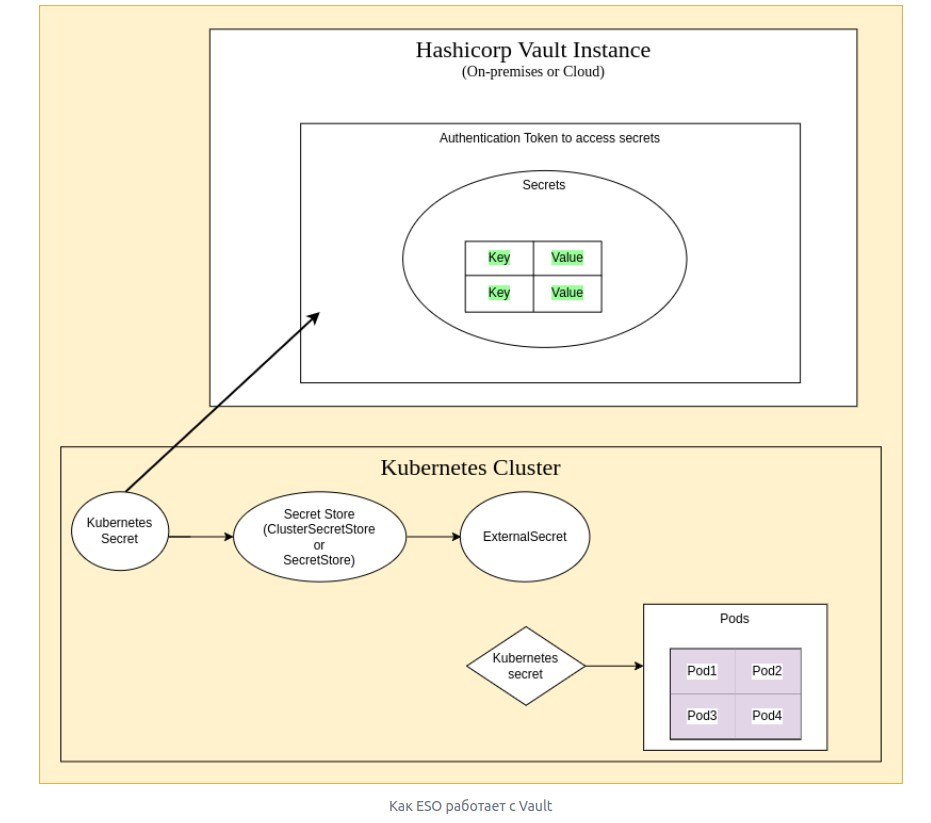
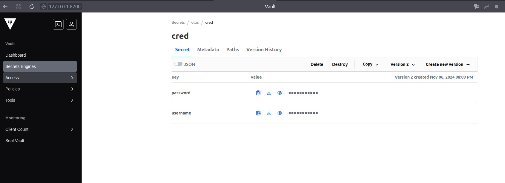
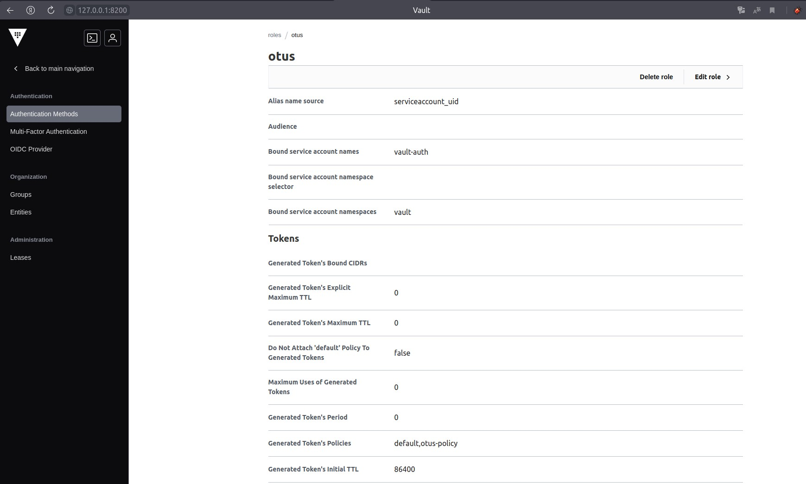
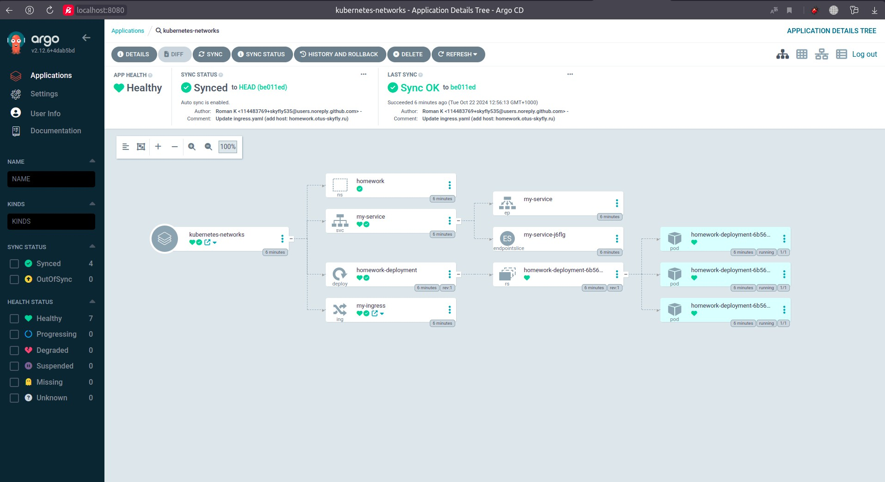
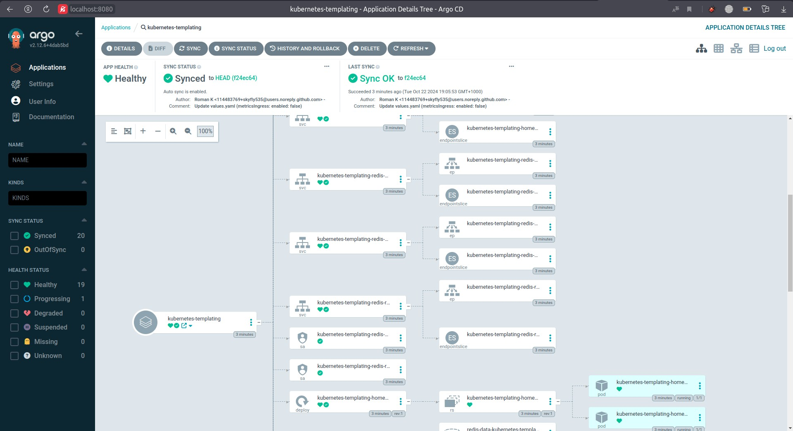
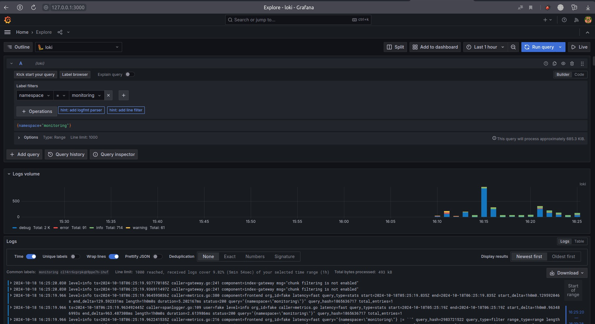

# Репозиторий для выполнения домашних заданий курса "Инфраструктурная платформа на основе Kubernetes-2024-08" 

# Практические занятия:

## skyfly535_repo
skyfly535 kubernetes repository

### Оглавление:

- [HW1 Знакомство с решениями для запуска локального Kubernetes кластера, создание первого pod.](#hw1-знакомство-с-решениями-для-запуска-локального-kubernetes-кластера-создание-первого-pod)

- [HW2 Kubernetes controllers. ReplicaSet, Deployment, DaemonSet.](#hw2-kubernetes-controllers-replicaset-deployment-daemonset)

- [HW3 Сетевое взаимодействие Pod, сервисы.](#hw3-сетевое-взаимодействие-pod-сервисы)

- [HW4 Volumes, StorageClass, PV, PVC.](#hw4-volumes-storageclass-pv-pvc)

- [HW5 Настройка сервисных аккаунтов и ограничение прав для них.](#hw5-настройка-сервисных-аккаунтов-и-ограничение-прав-для-них)

- [HW6 Шаблонизация манифестов приложения, использование Helm. Установка community Helm charts.](#hw6-шаблонизация-манифестов-приложения-использование-helm-установка-community-helm-charts)

- [HW7 Создание собственного CRD.](#hw7-создание-собственного-crd)

- [HW8 Мониторинг приложения в кластере.](#hw8-мониторинг-приложения-в-кластере)

- [HW9 Сервисы централизованного логирования для Kubernetes.](#hw9-сервисы-централизованного-логирования-для-kubernetes)

- [HW10 GitOps и инструменты поставки.](#hw10-gitops-и-инструменты-поставки)

- [HW11 Хранилище секретов для приложения. Vault.](#hw11-хранилище-секретов-для-приложения-vault)

- [HW12 Установка и использование CSI драйвера.](#hw12-установка-и-использование-csi-драйвера)

- [HW14 Подходы к развертыванию и обновлению production-grade кластера.](#hw14-подходы-к-развертыванию-и-обновлению-production-grade-кластера)


# HW14 Подходы к развертыванию и обновлению production-grade кластера.

## В процессе выполнения ДЗ выполнены следующие мероприятия:

### **1. Написаны манифесты Terraform для развертывания виртуальных машин удовлетворяющего условиям ДЗ в Yandex Cloud.**

Создан файл `./kubernetes-prod/terraform_YC_k8s/nods.tf` со следующим содержимым:

```hcl
# описание ноды с Сontrol plane (master)
resource "yandex_compute_instance" "master" {
  count = var.cp_nodes_count
  name  = "k8s-master-${count.index}"
  hostname = "master-${count.index}"
  

  resources {
    cores  = var.node_cpu_count_master
    memory = var.node_memory_size_master
  }

  boot_disk {
    initialize_params {
      type = "network-ssd"
      image_id = var.image_id # ID образа Ubuntu 20.04 LTS
      size = var.node_disk_size_master
    }
  }

  network_interface {
    subnet_id = var.subnet_id
    nat       = true
  }

  metadata = {
    ssh-keys = "ubuntu:${file(var.public_key_path)}"
    user-data = file("${path.module}/userdata.yaml")
  }
}

# описание worker нод
resource "yandex_compute_instance" "worker" {
  count = var.workload_nodes_count
  name  = "k8s-worker-${count.index}"
  hostname = "worker${count.index}"

  resources {
    cores  = var.node_cpu_count_worker
    memory = var.node_memory_size_worker
  }

  boot_disk {
    initialize_params {
      type = "network-ssd"
      image_id = var.image_id # ID образа Ubuntu 20.04 LTS
      size = var.node_disk_size_worker
    }
  }

  network_interface {
    subnet_id = var.subnet_id
    nat       = true
  }

  metadata = {
    ssh-keys = "ubuntu:${file(var.public_key_path)}"
    user-data = file("${path.module}/userdata.yaml")
  }
}
```
---

### **2. Нагуглен и адаптирован файл `./kubernetes-prod/terraform_YC_k8s/userdata.yaml` для передачи в виртуальные машины скрипта для автоматической настройки окружения с помощью Cloud-Init при её запуске.**

```yaml
#cloud-config
users:
 - default # Добавляется пользователь по умолчанию (default), который наследует настройки от стандартного пользователя операционной системы

runcmd:
- |
  #!/bin/bash
  # Отключение и остановка автоматического обновления APT
  systemctl disable apt-daily.service && systemctl disable apt-daily.timer && systemctl disable apt-daily-upgrade.timer &&  systemctl disable apt-daily-upgrade.service
  systemctl stop apt-daily.service && systemctl stop apt-daily.timer && systemctl stop apt-daily-upgrade.timer && systemctl stop apt-daily-upgrade.service
  systemctl kill --kill-who=all apt-daily.service
  while ! (systemctl list-units --all apt-daily.service | egrep -q '(dead|failed)')
  do
    sleep 1;
  done
  # Создается файл /etc/sysctl.d/k8s.conf с параметрами
  cat <<EOF |  tee /etc/sysctl.d/k8s.conf
  # Включение форвардинга
  net.bridge.bridge-nf-call-iptables  = 1
  net.ipv4.ip_forward                 = 1
  # Включение маршрутизации для iptables
  net.bridge.bridge-nf-call-ip6tables = 1
  EOF
  # Применяются изменения с помощью sysctl --system
  sudo sysctl --system
  # Загрузка необходимых модулей ядра
  cat <<EOF | tee /etc/modules-load.d/k8s.conf
  overlay
  br_netfilter
  EOF
  modprobe overlay
  modprobe br_netfilter
  # Отключение и остановка брандмауэра UFW
  systemctl stop ufw && systemctl disable ufw
  # Импортируется ключ репозитория Kubernetes
  curl -fsSL https://pkgs.k8s.io/core:/stable:/v1.30/deb/Release.key | sudo gpg --dearmor -o /etc/apt/keyrings/kubernetes-apt-keyring.gpg
  apt-get update
  apt-get install -y apt-transport-https ca-certificates curl gpg
  # Добавляется репозиторий для Kubernetes версии 1.30
  echo 'deb [signed-by=/etc/apt/keyrings/kubernetes-apt-keyring.gpg] https://pkgs.k8s.io/core:/stable:/v1.30/deb/ /' | tee /etc/apt/sources.list.d/kubernetes.list
  OS=xUbuntu_20.04
  CRIO_VERSION=1.28
  echo "deb https://download.opensuse.org/repositories/devel:/kubic:/libcontainers:/stable/$OS/ /"|sudo tee /etc/apt/sources.list.d/devel:kubic:libcontainers:stable.list
  echo "deb http://download.opensuse.org/repositories/devel:/kubic:/libcontainers:/stable:/cri-o:/$CRIO_VERSION/$OS/ /"| tee /etc/apt/sources.list.d/devel:kubic:libcontainers:stable:cri-o:$CRIO_VERSION.list
  curl -L https://download.opensuse.org/repositories/devel:kubic:libcontainers:stable:cri-o:$CRIO_VERSION/$OS/Release.key |  apt-key add -
  curl -L https://download.opensuse.org/repositories/devel:/kubic:/libcontainers:/stable/$OS/Release.key | apt-key add -
  apt-get update
  # Устанавливаются пакеты: kubelet, kubeadm, kubectl (основные инструменты Kubernetes), устанавливаются пакеты CRI-O: cri-o, cri-o-runc, cri-tools (контейнерный рантайм)
  apt-get install -y kubelet kubeadm kubectl cri-o cri-o-runc cri-tools
  # Включаются и запускаются службы CRI-O и Kubelet
  systemctl enable crio.service
  systemctl start crio.service
  # Ставится "hold" на пакеты Kubernetes (kubelet, kubeadm, kubectl) для предотвращения их автоматического обновления
  apt-mark hold kubelet kubeadm kubectl
  systemctl enable --now kubelet
```

#### Результат выполнения файла:
После старта виртуальной машины:
- Установлены и настроены Kubernetes и CRI-O.
- Подготовлена система для запуска Kubernetes-кластера.
- Отключены лишние службы для минимизации помех при настройке Kubernetes. 

Этот подход автоматизирует первичную настройку виртуальной машины и снижает вероятность человеческой ошибки.

---

### **3. Нагуглен и адаптирован файл `./kubernetes-prod/terraform_YC_k8s/apply.sh` скрипта предназначенного для автоматизации развёртывания Kubernetes-кластера с помощью Terraform и kubeadm.**

```bash
# Развёртывание инфраструктуры с помощью Terraform
terraform apply -auto-approve
# Ожидание инициализации виртуальных машин
sleep 60
# Выполнение скрипта установки на мастер-ноде
cat install_master.sh | ssh -o StrictHostKeyChecking=no ubuntu@$(terraform output -json | jq  '.master_ip_addr.value' | tr -d '"') 'sudo bash' | tee out/master.log
# Приостанавливает выполнение скрипта на 5 секунд для завершения процессов инициализации на мастер-ноде
sleep 5
# Подготовка скрипта для воркер-нод
echo 'cloud-init status --wait' > out/install_worker.sh 
cat out/master.log  | grep -A 1 'kubeadm join' >> out/install_worker.sh  
# Выполнение скрипта на воркер-нодах
for i in $(terraform output -json | jq  '.worker_ip_addr.value[]' | tr -d '"') ;do cat out/install_worker.sh | ssh  -o StrictHostKeyChecking=no ubuntu@$i sudo bash ; done  
```

## **Общий рабочий процесс скрипта**

1. **Развёртывание инфраструктуры:**
   - Создаются виртуальные машины для мастер- и воркер-нод с помощью Terraform.

2. **Настройка SSH-доступа:**
   - Устанавливаются корректные права доступа к приватному SSH-ключу.

3. **Инициализация мастер-ноды:**
   - Выполняется скрипт `install_master.sh` на мастер-ноде, который инициализирует Kubernetes-кластер.
   - Вывод сохраняется для последующего использования.

4. **Подготовка скрипта для воркер-нод:**
   - Создаётся скрипт `install_worker.sh`, содержащий команду ожидания завершения `cloud-init` и команду `kubeadm join`.

5. **Присоединение воркер-нод:**
   - Скрипт `install_worker.sh` выполняется на каждой воркер-ноде, присоединяя их к кластеру.

файл `./kubernetes-prod/terraform_YC_k8s/install_master.sh`

```bash
# Ожидание завершения процессов Cloud-Init (аставляет скрипт ждать, пока все процессы cloud-init не завершатся)
cloud-init status --wait
# команда, используемая для инициализации мастер-ноды Kubernetes, то есть для установки компонентов управления (control plane)
kubeadm init --upload-certs --pod-network-cidr=10.244.0.0/16
# Настройка окружения для kubectl
export KUBECONFIG=/etc/kubernetes/admin.conf
# Установка сетевого плагина Flannel
kubectl apply -f https://github.com/flannel-io/flannel/releases/latest/download/kube-flannel.yml
```

## **Общий рабочий процесс скрипта**

1. **Ожидание завершения инициализации виртуальной машины:**

   - Убеждается, что все процессы `cloud-init` завершены, и система готова к установке Kubernetes.

2. **Инициализация мастер-ноды Kubernetes:**

   - Устанавливает компоненты управления Kubernetes.
   - Подготавливает кластер для присоединения воркер-нод и установки сетевого плагина.

3. **Настройка доступа к кластеру:**

   - Устанавливает переменную `KUBECONFIG`, чтобы команды `kubectl` могли взаимодействовать с кластером с правами администратора.

4. **Установка сетевого плагина Flannel:**

   - Обеспечивает сетевое взаимодействие между подами в кластере.
   - Завершает базовую настройку кластера, делая его готовым к развертыванию приложений и присоединению дополнительных узлов.

---

### **4. Нагуглен и адаптирован файл `./kubernetes-prod/terraform_YC_k8s/upgrade.sh` скрипта предназначенного для автоматизации процесса обновления Kubernetes-кластера до версии v1.31.0, включая обновление мастер-нод и воркер-нод.**

```bash
echo "Start upgrade master"
# Получение IP-адреса мастер-ноды
MASTER_IP=$(terraform output -json | jq  '.master_ip_addr.value' | tr -d '"')
# Установка SSH-подключения и выполнение команд на мастер-ноде
cat <<  EOF  | ssh -o StrictHostKeyChecking=no ubuntu@$MASTER_IP  'sudo bash'
        # Добавление репозитория Kubernetes версии v1.31
        echo 'deb [signed-by=/etc/apt/keyrings/kubernetes-apt-keyring.gpg] https://pkgs.k8s.io/core:/stable:/v1.31/deb/ /' | tee /etc/apt/sources.list.d/kubernetes.list
        # Обновление списка пакетов
        apt-get update
        # Разблокировка пакетов kubeadm и kubectl
        apt-mark unhold kubeadm kubectl
        # Установка новых версий kubeadm и kubectl
        apt-get install -y kubeadm kubectl
        # Блокировка пакетов kubeadm и kubectl
        apt-mark hold kubeadm kubectl
        # Экспорт переменной KUBECONFIG
        export KUBECONFIG=/etc/kubernetes/admin.conf
        # Планирование обновления Kubernetes
        kubeadm upgrade plan
        # Применение обновления до версии v1.31.0
        echo 'y' | kubeadm upgrade apply v1.31.0
        # Разблокировка пакета kubelet
        apt-mark unhold kubelet 
        # Установка новой версии kubelet
        apt-get install -y kubelet
        # Блокировка пакета kubelet
        apt-mark hold kubelet 
        # Перезапуск kubelet
        systemctl daemon-reload
        systemctl restart kubelet
        # Создание скрипта upgrade-worker.sh для воркер-нод
        echo 'echo "deb [signed-by=/etc/apt/keyrings/kubernetes-apt-keyring.gpg] https://pkgs.k8s.io/core:/stable:/v1.31/deb/ /" | tee /etc/apt/sources.list.d/kubernetes.list
        apt-get update
        apt-mark unhold kubeadm kubectl kubelet
        apt-get install -y kubeadm kubectl kubelet
        apt-mark hold kubeadm kubectl kubelet
        systemctl daemon-reload
        systemctl restart kubelet' >  upgrade-worker.sh
EOF
# Ожидание завершения обновления мастер-ноды
sleep 60
# Получение списка воркер-нод и их IP-адресов
ssh   -o StrictHostKeyChecking=no ubuntu@$MASTER_IP 'export KUBECONFIG=/etc/kubernetes/admin.conf ; sudo -E kubectl get nodes -o json' | python3 -c "
import json
import sys
data = json.load(sys.stdin)
for i in (data['items']):
   print(i['status']['addresses'][1]['address']+' '+i['status']['addresses'][0]['address'])"  | grep 'worker' | while read a b
 do
    # Обновление воркер-нод в цикле
    echo "Upgrading on $a"
    # Выполнение команд на мастер-ноде для управления воркер-нодой
    cat  << EOF | ssh -A -o StrictHostKeyChecking=no  ubuntu@$MASTER_IP  "bash" 
    # Дрейн воркер-ноды
    export KUBECONFIG=/etc/kubernetes/admin.conf ; sudo -E kubectl  drain $a --ignore-daemonsets &&
    sleep 10 &&
    # Обновление воркер-ноды
    cat upgrade-worker.sh | ssh -o StrictHostKeyChecking=no  $b 'sudo bash' &&
    sleep 10 &&
    # Разблокировка воркер-ноды
    sudo -E kubectl uncordon $a &&
    sleep 10
EOF 
    echo "Upgrade on $a done"
done
```

## **Итоговый рабочий процесс скрипта**

1. **Обновление мастер-ноды**:
   - Обновляются компоненты управления Kubernetes на мастер-ноде до версии `v1.31.0`.
   - Создается скрипт `upgrade-worker.sh` для обновления воркер-нод.

2. **Получение списка воркер-нод**:
   - Извлекаются имена и IP-адреса воркер-нод из кластера.

3. **Обновление воркер-нод в цикле**:
   - Для каждой воркер-ноды выполняются команды:
     - **Дрейн узла**: Перемещение подов с воркер-ноды.
     - **Обновление пакетов Kubernetes**: Выполнение `upgrade-worker.sh` на воркер-ноде.
     - **Uncordon узла**: Возвращение воркер-ноды в активное состояние.

---

### **5. Произведена проверка развернутой инфраструктуры.**

**5.1** Cтатус и версия k8s всех нод кластера после развертывания:

```bash
ubuntu@master-0:~$ kubectl get nodes -o wide
NAME       STATUS   ROLES           AGE     VERSION   INTERNAL-IP   EXTERNAL-IP   OS-IMAGE             KERNEL-VERSION      CONTAINER-RUNTIME
master-0   Ready    control-plane   3m39s   v1.30.7   10.115.0.21   <none>        Ubuntu 22.04.3 LTS   5.15.0-91-generic   cri-o://1.28.4
worker0    Ready    <none>          2m29s   v1.30.7   10.115.0.34   <none>        Ubuntu 22.04.3 LTS   5.15.0-91-generic   cri-o://1.28.4
worker1    Ready    <none>          2m21s   v1.30.7   10.115.0.5    <none>        Ubuntu 22.04.3 LTS   5.15.0-91-generic   cri-o://1.28.4
worker2    Ready    <none>          2m12s   v1.30.7   10.115.0.30   <none>        Ubuntu 22.04.3 LTS   5.15.0-91-generic   cri-o://1.28.4
```
**5.2** Cтатус и версия k8s всех нод кластера после обновления:

```bash
ubuntu@master-0:~$ kubectl get nodes -o wide
NAME       STATUS   ROLES           AGE   VERSION   INTERNAL-IP   EXTERNAL-IP   OS-IMAGE             KERNEL-VERSION      CONTAINER-RUNTIME
master-0   Ready    control-plane   24m   v1.31.3   10.115.0.21   <none>        Ubuntu 22.04.3 LTS   5.15.0-91-generic   cri-o://1.28.4
worker0    Ready    <none>          23m   v1.31.3   10.115.0.34   <none>        Ubuntu 22.04.3 LTS   5.15.0-91-generic   cri-o://1.28.4
worker1    Ready    <none>          23m   v1.31.3   10.115.0.5    <none>        Ubuntu 22.04.3 LTS   5.15.0-91-generic   cri-o://1.28.4
worker2    Ready    <none>          23m   v1.31.3   10.115.0.30   <none>        Ubuntu 22.04.3 LTS   5.15.0-91-generic   cri-o://1.28.4
```
---

# HW13 Диагностика и отладка в Kubernetes.

## В процессе выполнения ДЗ выполнены следующие мероприятия:

### **1. Запущен кластер minikube на хостовой машине.**

```bash
minikube start --kubernetes-version=v1.31.0 --driver=virtualbox
😄  minikube v1.34.0 на Ubuntu 20.04
✨  Используется драйвер virtualbox на основе конфига пользователя
👍  Starting "minikube" primary control-plane node in "minikube" cluster
🔥  Creating virtualbox VM (CPUs=2, Memory=2200MB, Disk=20000MB) ...
🐳  Подготавливается Kubernetes v1.31.0 на Docker 27.2.0 ...
    ▪ Generating certificates and keys ...
    ▪ Booting up control plane ...
    ▪ Configuring RBAC rules ...
🔗  Configuring bridge CNI (Container Networking Interface) ...
🔎  Компоненты Kubernetes проверяются ...
    ▪ Используется образ gcr.io/k8s-minikube/storage-provisioner:v5
🌟  Включенные дополнения: storage-provisioner, default-storageclass

❗  /usr/local/bin/kubectl is version 1.29.1, which may have incompatibilities with Kubernetes 1.31.0.
    ▪ Want kubectl v1.31.0? Try 'minikube kubectl -- get pods -A'
🏄  Готово! kubectl настроен для использования кластера "minikube" и "default" пространства имён по умолчанию
```
---

### **2. Создан манифест `./kubernetes-debug/nginx.yaml`, описывающий pod с `kyos0109/nginx-distroless` образом для создания необходимого контейнера.**

```yaml
apiVersion: v1
kind: Pod
metadata:
  name: "nginx-distroless"
  namespace: default
  labels:
    app.kubernetes.io/name: nginx
spec:
  containers:
  - name: nginx-distroless 
    image: kyos0109/nginx-distroless
    resources:
      limits:
        cpu: 100m
        memory: 500Mi
      requests:
        cpu: 100m
        memory: 200Mi
    ports:
    - containerPort: 80
      name: http
    securityContext:
      privileged: true
      capabilities:
        add: ["SYS_PTRACE", "SYS_ADMIN"]
      allowPrivilegeEscalation: true
      seccompProfile:
        type: Unconfined
  restartPolicy: Always
```

Так же создан манифест `./kubernetes-debug/service_nginx.yaml` для обеспечения сетевого взаимодействия тестовго Pod

```yaml
apiVersion: v1
kind: Service
metadata:
  name: nginx
spec:
  selector:
    app.kubernetes.io/name: nginx
  ports:
  - name: web
    protocol: TCP
    port: 80
    targetPort: 80
```

и манифест `./kubernetes-debug/curl.yaml` для генерации нагрузки 

```yaml
apiVersion: v1
kind: Pod
metadata:
  name: "curl"
  namespace: default
spec:
  containers:
  - name: curl
    image: curlimages/curl
    command: ["/bin/sh"]
    args: ["-c","while true; do curl http://nginx/; sleep 3; done"]
    resources:
      limits:
        cpu: 100m
        memory: 500Mi
      requests:
        cpu: 100m
        memory: 200Mi
  restartPolicy: Always
```
---

### **3. Запущенна описанная инфраструктура.**

```bash
kubectl apply -f nginx.yaml 
pod/nginx-distroless created

kubectl apply -f service_nginx.yaml 
service/nginx created

kubectl apply -f curl.yaml 
pod/curl created

kubectl get pod
NAME               READY   STATUS              RESTARTS   AGE
curl               0/1     ContainerCreating   0          9s
nginx-distroless   1/1     Running             0          23s

kubectl get pod
NAME               READY   STATUS    RESTARTS   AGE
curl               1/1     Running   0          26s
nginx-distroless   1/1     Running   0          40s
```

----

### **4. С помощью команды kubectl debug создайте эфемерный контейнер для отладки пода.**

```bash 
kubectl debug -it nginx-distroless --image=ubuntu --target=nginx-distroless
Targeting container "nginx-distroless". If you don't see processes from this container it may be because the container runtime doesn't support this feature.
Defaulting debug container name to debugger-w6chs.
If you don't see a command prompt, try pressing enter.

root@nginx-distroless:/# 
```
---

### **5. В дебаг контейнере установленны необходимые пакеты и запущенна команда tcpdump**

```bash
apt update
apt install -y tcpdump strace
```

```bash
root@nginx-distroless:/# tcpdump -nn -i any -e port 80
tcpdump: data link type LINUX_SLL2
tcpdump: verbose output suppressed, use -v[v]... for full protocol decode
listening on any, link-type LINUX_SLL2 (Linux cooked v2), snapshot length 262144 bytes
06:13:05.759841 eth0  In  ifindex 3 b6:19:c7:a3:ec:41 ethertype IPv4 (0x0800), length 80: 10.244.0.4.36136 > 10.244.0.3.80: Flags [S], seq 3730945754, win 64240, options [mss 1460,sackOK,TS val 29322771 ecr 0,nop,wscale 7], length 0
06:13:05.759884 eth0  Out ifindex 3 26:3c:91:e9:25:51 ethertype IPv4 (0x0800), length 80: 10.244.0.3.80 > 10.244.0.4.36136: Flags [S.], seq 1287817036, ack 3730945755, win 65160, options [mss 1460,sackOK,TS val 1861122678 ecr 29322771,nop,wscale 7], length 0
06:13:05.759975 eth0  In  ifindex 3 b6:19:c7:a3:ec:41 ethertype IPv4 (0x0800), length 72: 10.244.0.4.36136 > 10.244.0.3.80: Flags [.], ack 1, win 502, options [nop,nop,TS val 29322771 ecr 1861122678], length 0
06:13:05.760288 eth0  In  ifindex 3 b6:19:c7:a3:ec:41 ethertype IPv4 (0x0800), length 

...

06:13:08.863029 eth0  In  ifindex 3 b6:19:c7:a3:ec:41 ethertype IPv4 (0x0800), length 72: 10.244.0.4.36154 > 10.244.0.3.80: Flags [F.], seq 70, ack 851, win 501, options [nop,nop,TS val 29325874 ecr 1861125781], length 0
06:13:08.863077 eth0  Out ifindex 3 26:3c:91:e9:25:51 ethertype IPv4 (0x0800), length 72: 10.244.0.3.80 > 10.244.0.4.36154: Flags [F.], seq 851, ack 71, win 509, options [nop,nop,TS val 1861125781 ecr 29325874], length 0
06:13:08.863102 eth0  In  ifindex 3 b6:19:c7:a3:ec:41 ethertype IPv4 (0x0800), length 72: 10.244.0.4.36154 > 10.244.0.3.80: Flags [.], ack 852, win 501, options [nop,nop,TS val 29325874 ecr 1861125781], length 0
^C
24 packets captured
24 packets received by filter
0 packets dropped by kernel
```
---

### **6. С помощью `kubectl debug` создан отладочный под для ноды, на которой запущен под с distroless nginx и получен доступ к файловой системе ноды, и затем доступ к логам пода с distrolles nginx.**

```bash
kubectl debug node/minikube -it --image=ubuntu
Creating debugging pod node-debugger-minikube-m2hps with container debugger on node minikube.
If you don't see a command prompt, try pressing enter.
root@minikube:/# 
```

```bash
root@minikube:/# cat /host/var/lib/docker/containers/af9027e69d5f8d7111a4d46c82fad31e58f5fec93cb533e27f6e1888a46a7a88/af9027e69d5f8d7111a4d46c82fad31e58f5fec93cb533e27f6e1888a46a7a88-json.log
{"log":"10.244.0.4 - - [01/Dec/2024:13:41:34 +0800] \"GET / HTTP/1.1\" 200 612 \"-\" \"curl/8.11.0\" \"-\"\n","stream":"stdout","time":"2024-12-01T05:41:34.051891896Z"}
{"log":"10.244.0.4 - - [01/Dec/2024:13:41:37 +0800] \"GET / HTTP/1.1\" 200 612 \"-\" \"curl/8.11.0\" \"-\"\n","stream":"stdout","time":"2024-12-01T05:41:37.068888825Z"}
{"log":"10.244.0.4 - - [01/Dec/2024:13:41:40 +0800] \"GET / HTTP/1.1\" 200 612 \"-\" \"curl/8.11.0\" \"-\"\n","stream":"stdout","time":"2024-12-01T05:41:40.151378876Z"}
{"log":"10.244.0.4 - - [01/Dec/2024:13:41:43 +0800] \"GET / HTTP/1.1\" 200 612 \"-\" \"curl/8.11.0\" \"-\"\n","stream":"stdout","time":"2024-12-01T05:41:43.253009408Z"}
{"log":"10.244.0.4 - - [01/Dec/2024:13:41:46 +0800] \"GET / HTTP/1.1\" 200 612 \"-\" \"curl/8.11.0\" \"-\"\n","stream":"stdout","time":"2024-12-01T05:41:46.4554229Z"}

...

{"log":"10.244.0.4 - - [01/Dec/2024:13:59:00 +0800] \"GET / HTTP/1.1\" 200 612 \"-\" \"curl/8.11.0\" \"-\"\n","stream":"stdout","time":"2024-12-01T05:59:00.158234165Z"}
{"log":"10.244.0.4 - - [01/Dec/2024:13:59:03 +0800] \"GET / HTTP/1.1\" 200 612 \"-\" \"curl/8.11.0\" \"-\"\n","stream":"stdout","time":"2024-12-01T05:59:03.352100076Z"}
{"log":"10.244.0.4 - - [01/Dec/2024:13:59:06 +0800] \"GET / HTTP/1.1\" 200 612 \"-\" \"curl/8.11.0\" \"-\"\n","stream":"stdout","time":"2024-12-01T05:59:06.454069263Z"}
{"log":"10.244.0.4 - - [01/Dec/2024:13:59:09 +0800] \"GET / HTTP/1.1\" 200 612 \"-\" \"curl/8.11.0\" \"-\"\n","stream":"stdout","time":"2024-12-01T05:59:09.553745235Z"}
{"log":"10.244.0.4 - - [01/Dec/2024:13:59:12 +0800] \"GET / HTTP/1.1\" 200 612 \"-\" \"curl/8.11.0\" \"-\"\n","stream":"stdout","time":"2024-12-01T05:59:12.661940572Z"}
```
---
### P.S. В файловой системе отлаживаемого контейнера (kyos0109/nginx-distroless) из эфемерного директории `/etc/nginx` нет.

```bash
root@nginx-distroless:~#  ls -la /etc   
total 296
drwxr-xr-x 1 root root    4096 Dec  1 07:48 .
drwxr-xr-x 1 root root    4096 Dec  1 07:48 ..
-rw------- 1 root root       0 Oct 16 06:54 .pwd.lock
drwxr-xr-x 2 root root    4096 Oct 16 07:00 alternatives
drwxr-xr-x 8 root root    4096 Oct 16 06:54 apt
-rw-r--r-- 1 root root    2319 Mar 31  2024 bash.bashrc
-rw-r--r-- 1 root root     367 Aug  2  2022 bindresvport.blacklist
drwxr-xr-x 2 root root    4096 Oct 16 07:00 cloud
drwxr-xr-x 2 root root    4096 Oct 16 07:00 cron.d
drwxr-xr-x 2 root root    4096 Oct 16 07:00 cron.daily
-rw-r--r-- 1 root root    2967 Apr 12  2024 debconf.conf
-rw-r--r-- 1 root root      11 Apr 22  2024 debian_version
drwxr-xr-x 2 root root    4096 Oct 16 07:00 default
drwxr-xr-x 4 root root    4096 Oct 16 07:00 dpkg
-rw-r--r-- 1 root root     685 Apr  8  2024 e2scrub.conf
-rw-r--r-- 1 root root     106 Oct 16 06:54 environment
-rw-r--r-- 1 root root      37 Oct 16 06:53 fstab
-rw-r--r-- 1 root root    2584 Jan 31  2024 gai.conf
drwxr-xr-x 2 root root    4096 Oct 16 07:00 gnutls
-rw-r--r-- 1 root root     503 Oct 16 07:00 group
-rw-r--r-- 1 root root     434 Oct 16 06:54 group-
-rw-r----- 1 root shadow   429 Oct 16 07:00 gshadow
-rw-r----- 1 root shadow   364 Oct 16 06:54 gshadow-
-rw-r--r-- 1 root root      92 Apr 22  2024 host.conf
-rw-r--r-- 1 root root      17 Dec  1 07:43 hostname
-rw-r--r-- 1 root root     211 Dec  1 07:48 hosts
drwxr-xr-x 2 root root    4096 Oct 16 07:00 init.d
-rw-r--r-- 1 root root      26 Aug 23 14:20 issue
-rw-r--r-- 1 root root      19 Aug 23 14:20 issue.net
drwxr-xr-x 3 root root    4096 Oct 16 06:54 kernel
-rw-r--r-- 1 root root    5067 Oct 16 07:00 ld.so.cache
-rw-r--r-- 1 root root      34 Aug  2  2022 ld.so.conf
drwxr-xr-x 2 root root    4096 Oct 16 07:00 ld.so.conf.d
-rw-r--r-- 1 root root     267 Apr 22  2024 legal
-rw-r--r-- 1 root root     191 Mar 31  2024 libaudit.conf
-rw-r--r-- 1 root root   12345 Feb 22  2024 login.defs
drwxr-xr-x 2 root root    4096 Oct 16 07:00 logrotate.d
-rw-r--r-- 1 root root     104 Aug 23 14:20 lsb-release
-rw-r--r-- 1 root root       0 Oct 16 07:00 machine-id
-rw-r--r-- 1 root root     744 Apr  8  2024 mke2fs.conf
lrwxrwxrwx 1 root root      12 Dec  1 07:48 mtab -> /proc/mounts
-rw-r--r-- 1 root root      91 Apr 22  2024 networks
-rw-r--r-- 1 root root     494 Aug  2  2022 nsswitch.conf
drwxr-xr-x 2 root root    4096 Oct 16 06:53 opt
lrwxrwxrwx 1 root root      21 Aug 23 14:20 os-release -> ../usr/lib/os-release
-rw-r--r-- 1 root root     552 Oct 13  2022 pam.conf
drwxr-xr-x 2 root root    4096 Oct 16 07:00 pam.d
-rw-r--r-- 1 root root     888 Oct 16 07:00 passwd
-rw-r--r-- 1 root root     839 Oct 16 06:54 passwd-
-rw-r--r-- 1 root root     582 Apr 22  2024 profile
drwxr-xr-x 2 root root    4096 Oct 16 07:00 profile.d
drwxr-xr-x 2 root root    4096 Dec  6  2023 rc0.d
drwxr-xr-x 2 root root    4096 Dec  6  2023 rc1.d
drwxr-xr-x 2 root root    4096 Dec  6  2023 rc2.d
drwxr-xr-x 2 root root    4096 Dec  6  2023 rc3.d
drwxr-xr-x 2 root root    4096 Dec  6  2023 rc4.d
drwxr-xr-x 2 root root    4096 Dec  6  2023 rc5.d
drwxr-xr-x 2 root root    4096 Dec  6  2023 rc6.d
drwxr-xr-x 2 root root    4096 Oct 16 06:54 rcS.d
-rw-r--r-- 1 root root     103 Dec  1 07:43 resolv.conf
lrwxrwxrwx 1 root root      13 Apr  8  2024 rmt -> /usr/sbin/rmt
drwxr-xr-x 4 root root    4096 Oct 16 07:00 security
drwxr-xr-x 2 root root    4096 Oct 16 06:58 selinux
-rw-r----- 1 root shadow   502 Oct 16 07:00 shadow
-rw-r----- 1 root shadow   474 Oct 16 06:54 shadow-
-rw-r--r-- 1 root root     118 Oct 16 06:54 shells
drwxr-xr-x 2 root root    4096 Oct 16 06:54 skel
-rw-r--r-- 1 root root      20 Oct 16 07:00 subgid
-rw-r--r-- 1 root root       0 Oct 16 06:54 subgid-
-rw-r--r-- 1 root root      20 Oct 16 07:00 subuid
-rw-r--r-- 1 root root       0 Oct 16 06:54 subuid-
-rw-r--r-- 1 root root    2209 Mar 24  2024 sysctl.conf
drwxr-xr-x 2 root root    4096 Oct 16 07:00 sysctl.d
drwxr-xr-x 4 root root    4096 Dec  6  2023 systemd
drwxr-xr-x 2 root root    4096 Oct 16 06:59 terminfo
drwxr-xr-x 2 root root    4096 Oct 16 07:00 update-motd.d
-rw-r--r-- 1 root root     681 Apr  8  2024 xattr.conf
```
---

# HW12 Установка и использование CSI драйвера.

## В процессе выполнения ДЗ выполнены следующие мероприятия:

### **1. Написаны манифесты Terraform для установки кластера Kubernetes и всей необходимой инфраструктуры удовлетворяющей условиям ДЗ в Yandex Cloud.**

Развернута следующая инфраструктура:

1. **Развернут `Kubernetes-кластер` в Yandex Cloud**

2. **Создан бакет в `Object Storage` Yandex Cloud**

3. **Создан `ServiceAccount` и сгенерирован `ключи доступа`**

4. **Создн `Secret` с ключами для доступа к Object Storage**

Файл `./kubernetes-csi/terraform_YC_k8s/k8s-kltr.tf`

```hcl
# Создание сервисного аккаунта 
resource "yandex_iam_service_account" "otus_sa" {
  name = var.service_account_name
}
# Назначение IAM ролей
resource "yandex_resourcemanager_folder_iam_member" "otus_sa_roles" {
  for_each = toset([
    "editor",
    "storage.admin",
    "container-registry.images.puller",
    "container-registry.images.pusher"
  ])

  role      = each.value
  folder_id = var.folder_id
  member    = "serviceAccount:${yandex_iam_service_account.otus_sa.id}"
  depends_on = [yandex_iam_service_account.otus_sa]
}


# Создание Kubernetes-кластера
resource "yandex_kubernetes_cluster" "yc_cluster" {
  name                    = var.cluster_name

  master {
    zonal {
      zone      = var.zone
      subnet_id = var.subnet_id
    }
    version               = var.k8s_version
    public_ip             = true
  }

  network_id              = var.network_id

  service_account_id      = var.service_account_id
  node_service_account_id = var.service_account_id

  release_channel         = "RAPID"
  network_policy_provider = "CALICO"

  timeouts {
    create = "30m"
    update = "30m"
  }

  depends_on = [yandex_iam_service_account.otus_sa]
}

# Создание групп узлов для рабочих нагрузок
resource "yandex_kubernetes_node_group" "workload_node_group" {
  cluster_id  = yandex_kubernetes_cluster.yc_cluster.id

  name        = "${var.cluster_name}-workload"
  version     = var.k8s_version
  count       = var.workload_nodes_count

  instance_template {
    platform_id = "standard-v2"

    network_interface {
      nat                = true
      subnet_ids         = [var.subnet_id]
    }

    resources {
      memory = var.node_memory_size
      cores  = var.node_cpu_count
    }

    boot_disk {
      type = "network-ssd"
      size = var.node_disk_size
    }

    scheduling_policy {
      preemptible = false
    }

    # container_runtime {
    #   type = "containerd"
    # }
  }

  scale_policy {
    fixed_scale {
      size = 1
    }
  }
  depends_on = [yandex_kubernetes_cluster.yc_cluster]
  # Создание метки для узлов этой группы для управления раскаткой нагрузки
  
  node_labels = {
    worknode = "true"
  }

}
# Генерация случайного суффикса для имени S3-бакета
resource "random_id" "bucket_suffix" {
  byte_length = 4
}
# Создание S3-бакета для хранения 
resource "yandex_storage_bucket" "volume1" {
  access_key = yandex_iam_service_account_static_access_key.s3.access_key
  secret_key = yandex_iam_service_account_static_access_key.s3.secret_key
  bucket        = "volume-${random_id.bucket_suffix.hex}"
  force_destroy = true
  depends_on = [yandex_iam_service_account.otus_sa]
}
# Создание статического ключа доступа для S3
resource "yandex_iam_service_account_static_access_key" "s3" {
  service_account_id = yandex_iam_service_account.otus_sa.id
  description        = "S3 access key"
  depends_on = [yandex_iam_service_account.otus_sa]
}
# создания секретов
resource "kubernetes_secret" "csi_s3_secret" {
  metadata {
    name      = "csi-s3-secret"
    namespace = "kube-system"
  }

  data = {
    accessKeyID     = yandex_iam_service_account_static_access_key.s3.access_key
    secretAccessKey = yandex_iam_service_account_static_access_key.s3.secret_key
    endpoint        = "https://storage.yandexcloud.net"
    
  }
  depends_on = [yandex_iam_service_account_static_access_key.s3]
}
# Выходные переменные для отображения cluster_endpoint и cluster_ca_certificate кластера Kubernetes.
output "cluster_endpoint" {
  value = yandex_kubernetes_cluster.yc_cluster.master.0.external_v4_endpoint
}

output "cluster_ca_certificate" {
  value = yandex_kubernetes_cluster.yc_cluster.master.0.cluster_ca_certificate
}
```
---

### **2. Создан манифест `./kubernetes-csi/manifest/storageClass.yaml` со следующим содержимым:**

```yaml
kind: StorageClass
apiVersion: storage.k8s.io/v1
metadata:
  name: homework-csi
provisioner: ru.yandex.s3.csi
parameters:
  mounter: geesefs
  options: "--memory-limit 1000 --dir-mode 0777 --file-mode 0666"
  bucket: volume1
  csi.storage.k8s.io/provisioner-secret-name: csi-s3-secret
  csi.storage.k8s.io/provisioner-secret-namespace: kube-system
  csi.storage.k8s.io/controller-publish-secret-name: csi-s3-secret
  csi.storage.k8s.io/controller-publish-secret-namespace: kube-system
  csi.storage.k8s.io/node-stage-secret-name: csi-s3-secret
  csi.storage.k8s.io/node-stage-secret-namespace: kube-system
  csi.storage.k8s.io/node-publish-secret-name: csi-s3-secret
  csi.storage.k8s.io/node-publish-secret-namespace: kube-system
```
#### Описание манифеста StorageClass

Этот манифест создаёт **StorageClass** для динамического управления хранилищем в Kubernetes, используя провайдер **Yandex Cloud S3** через **CSI (Container Storage Interface)**.

---

#### **Ключевые части манифеста**

1. **kind: StorageClass**
   - Тип ресурса Kubernetes, который определяет класс хранилища. Используется для создания PersistentVolume (PV) с динамическим выделением.

2. **apiVersion: storage.k8s.io/v1**
   - Версия API для работы с объектом StorageClass.

3. **metadata**
   - **name: homework-csi**: Имя StorageClass, которое будет использоваться для ссылки на этот класс при создании PersistentVolumeClaim (PVC).

4. **provisioner**
   - **provisioner: ru.yandex.s3.csi**: Указывает на CSI-драйвер для работы с S3-хранилищем в Yandex Cloud. Этот драйвер отвечает за создание, настройку и удаление томов.

5. **parameters**
   - Содержит параметры конфигурации для S3-хранилища:
     - **mounter: geesefs**: Указывает, что для монтирования S3-хранилища будет использоваться утилита **geesefs**.
     - **options: "--memory-limit 1000 --dir-mode 0777 --file-mode 0666"**:
       - `--memory-limit 1000`: Устанавливает лимит памяти для монтирования.
       - `--dir-mode 0777`: Задаёт режим доступа к директориям.
       - `--file-mode 0666`: Задаёт режим доступа к файлам.
     - **bucket: volume1**: Имя S3-бакета в Yandex Cloud, который будет использоваться для хранения данных.
     - **csi.storage.k8s.io/...-secret-name**: Указывает имя секрета Kubernetes для аутентификации драйвера:
       - **csi.storage.k8s.io/provisioner-secret-name**: Для динамического выделения томов.
       - **csi.storage.k8s.io/controller-publish-secret-name**: Для управления доступом к томам.
       - **csi.storage.k8s.io/node-stage-secret-name**: Для подготовки узлов.
       - **csi.storage.k8s.io/node-publish-secret-name**: Для монтирования томов.
     - **csi.storage.k8s.io/...-secret-namespace**: Все секреты расположены в пространстве имён `kube-system`.

#### **Как это работает**

1. **CSI-драйвер S3** взаимодействует с Yandex Cloud для управления бакетами.
2. При создании PVC драйвер использует указанный бакет `volume1` для хранения данных.
3. Секреты (`csi-s3-secret`) содержат учетные данные для доступа к S3.
4. Параметры монтирования (`mounter` и `options`) определяют, как S3-том будет подключен к узлам Kubernetes.

---

#### **Преимущества**

- **Гибкость**: Легко управлять хранилищем через Kubernetes, не требуя ручной настройки бакетов.
- **Интеграция**: Использование секрета упрощает управление доступом к хранилищу.
- **Совместимость**: Использование CSI-драйвера делает этот подход совместимым с другими системами Kubernetes.

### **3. Создан манифест `./kubernetes-csi/manifest/pvc.yaml` со следующим содержимым:**

```yaml
apiVersion: v1
kind: PersistentVolumeClaim
metadata:
  name: homework-csi
spec:
  storageClassName: homework-csi
  accessModes:
    - ReadWriteOnce
  resources:
    requests:
      storage: 2Gi
```
В манифесте PersistentVolumeClaim указана ссылка на созданный StorageClass.


### **4. Создан манифест `./kubernetes-csi/manifest/s3-test-pod.yaml` со следующим содержимым:**

Создать Pod, использующий созданный PVC.

Создайте файл `s3-test-pod.yaml` со следующим содержимым:

```yaml
aapiVersion: v1
kind: Pod
metadata:
  name: s3-test-pod
spec:
  containers:
    - name: app
      image: busybox
      command: ["/bin/sh", "-c", "while true; do echo $(date) >> /mnt/data/log.txt; sleep 5; done"]
      volumeMounts:
        - name: s3-volume
          mountPath: /mnt/data
  volumes:
    - name: s3-volume
      persistentVolumeClaim:
        claimName: homework-csi
```

Созданый Pod, использует созданный PVC.

### **5. Написан скрипт `install.sh` для автоматического развертывания требуемой инфраструктуры.**

```bash
# Переход в каталог с конфигурации Terraform для развертывания необходимой инфраструктуры
cd terraform_YC_k8s
# Инициализация Terraform и обновление версии провайдеров и модулей до последних доступных
terraform init -upgrade
# Установка кластера Kubernetes удовлетворяющего условиям ДЗ в Yandex Cloud (без запроса дополнительного ввода от пользователя)
terraform apply -input=false  -compact-warnings -auto-approve
# Получение учетных данных Kubernetes-кластера, регистрация кластер локально
yc k8s cluster get-credentials --id $(yc k8s cluster list  | grep 'RUNNING' | awk -F '|' '{print $2}')  --external --force
# Добавляение репозитория Helm charts для CSI-драйвера Yandex S3 с указанным URL
helm repo add yandex-s3 https://yandex-cloud.github.io/k8s-csi-s3/charts
# Установка CSI-драйвер Yandex S3 в Kubernetes-кластер, используя Helm. Релиз называется csi-s3.
helm install csi-s3 yandex-s3/csi-s3
# Применение манифеста storageClass.yaml, который определяет StorageClass для динамического создания PersistentVolume на основе Yandex S3
cd .. && kubectl apply -f manifest/storageClass.yaml
# Применение манифеста pvc.yaml, который создает PersistentVolumeClaim, запрашивая хранилище согласно ранее созданному StorageClass
kubectl apply -f  manifest/pvc.yaml
# Применение манифеста s3-test-pod.yaml, который будет использовать примонтированный том из Yandex S3
kubectl apply -f  manifest/s3-test-pod.yaml
```
---

### **6. Произведена проверка развернутой инфраструктуры.**

**6.1** Проверяем состояние развернутого `S3` хранилища:

```bash
yc storage bucket list
+-----------------+----------------------+----------+-----------------------+---------------------+
|      NAME       |      FOLDER ID       | MAX SIZE | DEFAULT STORAGE CLASS |     CREATED AT      |
+-----------------+----------------------+----------+-----------------------+---------------------+
| volume-7f41354b | b1ghhcttrug793gc11tt |        0 | STANDARD              | 2024-11-25 21:30:13 |
| volume1         | b1ghhcttrug793gc11tt |        0 | STANDARD              | 2024-11-25 21:41:43 |
+-----------------+----------------------+----------+-----------------------+---------------------+
```
**6.2** Проверяем состояние развернутого `PVC` :

```bash
kubectl get pvc
NAME           STATUS   VOLUME                                     CAPACITY   ACCESS MODES   STORAGECLASS   AGE
homework-csi   Bound    pvc-b559e478-ee81-4a05-ac2d-aa39a2262042   2Gi        RWO            homework-csi   17m
```

**6.3** Скачиваем файл `log.txt` из `S3` хранилища через UI YC, проверяем содержимое:

```
Mon Nov 25 21:42:04 UTC 2024
Mon Nov 25 21:42:09 UTC 2024
Mon Nov 25 21:42:14 UTC 2024
Mon Nov 25 21:42:19 UTC 2024

...

Mon Nov 25 21:54:05 UTC 2024
Mon Nov 25 21:54:10 UTC 2024
```
Видим, что каждые 5 секунд в файл /mnt/data/log.txt добавляется текущая дата и время.


# HW11 Хранилище секретов для приложения. Vault.

## В процессе выполнения ДЗ выполнены следующие мероприятия:

### **1. Написаны манифесты `Terraform` для установки кластера Kubernetes удовлетворяющего условиям ДЗ в `Yandex Cloud`.**

Создан файл `./kubernetes-vault/terraform_YC_k8s/k8s-kltr.tf` со следующим содержимым:

```
# Создание Kubernetes-кластера

resource "yandex_kubernetes_cluster" "yc_cluster" {
  name                    = var.cluster_name

  master {
    zonal {
      zone      = var.zone
      subnet_id = var.subnet_id
    }
    version               = var.k8s_version
    public_ip             = true
  }

  network_id              = var.network_id

  service_account_id      = var.service_account_id
  node_service_account_id = var.service_account_id

  release_channel         = "RAPID"
  network_policy_provider = "CALICO"
}

# Создание групп узлов для рабочих нагрузок
resource "yandex_kubernetes_node_group" "workload_node_group" {
  cluster_id  = yandex_kubernetes_cluster.yc_cluster.id

  name        = "${var.cluster_name}-workload"
  version     = var.k8s_version
  count       = var.workload_nodes_count

  instance_template {
    platform_id = "standard-v2"

    network_interface {
      nat                = true
      subnet_ids         = [var.subnet_id]
    }

    resources {
      memory = var.node_memory_size
      cores  = var.node_cpu_count
    }

    boot_disk {
      type = "network-ssd"
      size = var.node_disk_size
    }

    scheduling_policy {
      preemptible = false
    }

    container_runtime {
      type = "containerd"
    }
  }

  scale_policy {
    fixed_scale {
      size = 1
    }
  }
  
  # создана метка для узлов этой группы для управления раскаткой нагрузки
  
  node_labels = {
    worknode = "true"
  }
  
}
```
---

### **2. При помощи файла `values.yaml` (чарта `Consul`) сконфигурирована установка компонентов `Consul` в одноименный namespase.**

**Установка Consul в namespace `consul` с 3 репликами сервера**

Создан файл чарта `./kubernetes-vault/consul/helmfile.yaml` со следующим содержимым:

```yaml
---
repositories:
- name: hashicorp
  url: https://helm.releases.hashicorp.com

releases:
- name: consul
  namespace: consul
  chart: hashicorp/consul
  values: 
  - values.yaml
```


Создан файл переменных `./kubernetes-vault/consul/values.yaml` со следующим содержимым:

```yaml
global:
  name: consul
  image: "dockerhub.timeweb.cloud/hashicorp/consul"
  imageK8S: "dockerhub.timeweb.cloud/hashicorp/consul-k8s-control-plane"
server:
  replicas: 3
```

**Consul** — это инструмент с открытым исходным кодом, разработанный компанией HashiCorp, который предоставляет распределенную, высокодоступную систему для обнаружения сервисов, управления конфигурацией и сегментации сети. Он предназначен для упрощения сложностей современных облачных инфраструктур и предлагает следующие ключевые функции:

1. **Обнаружение сервисов**: Consul позволяет сервисам регистрироваться и обнаруживать другие сервисы с помощью DNS или HTTP интерфейсов. Это обеспечивает динамическую регистрацию и обнаружение без необходимости жестко задавать IP-адреса.

2. **Проверка работоспособности**: Он выполняет проверки состояния сервисов, чтобы убедиться в их корректной работе. Если сервис не проходит проверку, Consul может автоматически удалить его из реестра, предотвращая отправку трафика на неисправные сервисы.

3. **Хранилище ключ/значение**: Consul включает распределенное хранилище ключ/значение, которое можно использовать для хранения конфигурационных данных, флагов функций или любых других динамических параметров, необходимых приложениям во время выполнения.

4. **Многодатацентровое развертывание**: Consul разработан для работы в нескольких датацентрах, обеспечивая единое обнаружение сервисов и управление конфигурацией независимо от расположения сервисов.

5. **Сегментация сервисов**: С помощью возможностей сервисной сетки (service mesh), Consul может управлять безопасным взаимодействием между сервисами, предоставляя функции аутентификации и шифрования с использованием mTLS.

В контексте текущего развертывания Kubernetes:

- **Бэкенд высокой доступности для Vault**: Vault — это инструмент для безопасного хранения и доступа к секретам и конфиденциальным данным. При работе Vault в режиме высокой доступности (HA) требуется хранилище, поддерживающее выбор лидера и репликацию данных. Consul служит таким хранилищем, обеспечивая необходимые функции для поддержания высокой доступности Vault и согласованной репликации данных между узлами.

- **Координация сервисов**: Consul помогает координировать различные сервисы внутри вашего кластера Kubernetes. Благодаря обнаружению сервисов и проверкам их состояния, он обеспечивает надежное и эффективное взаимодействие между ними.

- **Динамическая конфигурация**: С помощью своего хранилища ключ/значение, Consul позволяет централизованно управлять конфигурационными данными. Приложения могут получать настройки во время выполнения, что позволяет динамически обновлять конфигурации без перезапуска сервисов.

- **Масштабируемость и надежность**: Распределенная архитектура Consul позволяет ему масштабироваться вместе с вашей инфраструктурой. Его способность работать в нескольких узлах и датацентрах повышает общую надежность и устойчивость вашей системы.

---

### **3. При помощи файла `values.yaml` (чарта `Vault`) сконфигурирована установка компонентов `Vault` в одноименный namespase.**

**Установка Vault в namespace `vault` с использованием Consul в режиме HA**

Создан файл чарта `./kubernetes-vault/vault/helmfile.yaml` со следующим содержимым:

```yaml
---
repositories:
- name: hashicorp
  url: https://helm.releases.hashicorp.com

releases:
- name: vault
  namespace: vault
  chart: hashicorp/vault
  values: 
  - values.yaml
```


Создан файл переменных `./kubernetes-vault/vault/values.yaml` со следующим содержимым:

```yaml
injector:
  image:
    repository: "dockerhub.timeweb.cloud/hashicorp/vault-k8s"
  agentImage:
    repository: "dockerhub.timeweb.cloud/hashicorp/vault"
csi:
  image:
    repository: "dockerhub.timeweb.cloud/hashicorp/vault-csi-provider"
agent:
  image:
    repository: "dockerhub.timeweb.cloud/hashicorp/vault"
server:
   image:
     repository: "dockerhub.timeweb.cloud/hashicorp/vault" 
   ha:
    enabled: true
    replicas: 3
    config: |
      ui = true

      listener "tcp" {
        tls_disable = 1
        address = "[::]:8200"
      }
      storage "consul" {
        path = "vault"
        address = "consul-server.consul:8500"
      }

      service_registration "kubernetes" {}
```

Данный файл `values.yaml` предназначен для настройки установки HashiCorp Vault с помощью Helm-чарта в Kubernetes. В нем определены параметры для различных компонентов Vault, таких как сервер, агент, инжектор и CSI-провайдер. Ниже подробно описан каждый раздел файла:

---

#### **1. Инжектор (injector):**

```yaml
injector:
  image:
    repository: "dockerhub.timeweb.cloud/hashicorp/vault-k8s"
  agentImage:
    repository: "dockerhub.timeweb.cloud/hashicorp/vault"
```

**Описание:**

- **injector.image.repository**: Указывает пользовательский репозиторий Docker-образа для инжектора Vault Kubernetes. В данном случае используется репозиторий `dockerhub.timeweb.cloud/hashicorp/vault-k8s`.
  
- **injector.agentImage.repository**: Указывает репозиторий Docker-образа для агента Vault, который используется инжектором. Здесь используется образ `dockerhub.timeweb.cloud/hashicorp/vault`.

**Назначение:**

Инжектор Vault Kubernetes автоматически внедряет секреты из Vault в поды Kubernetes без необходимости изменения исходного кода приложений. Это облегчает управление секретами и повышает безопасность приложений.

---

#### **2. CSI-провайдер (csi):**

```yaml
csi:
  image:
    repository: "dockerhub.timeweb.cloud/hashicorp/vault-csi-provider"
```

**Описание:**

- **csi.image.repository**: Указывает репозиторий Docker-образа для провайдера Vault CSI. Используется образ `dockerhub.timeweb.cloud/hashicorp/vault-csi-provider`.

**Назначение:**

Vault CSI-провайдер позволяет Kubernetes использовать секреты из Vault в качестве томов через интерфейс Container Storage Interface (CSI). Это дает возможность приложениям монтировать секреты как файлы или тома, обеспечивая более гибкое и безопасное управление конфиденциальными данными.

---

#### **3. Агент (agent):**

```yaml
agent:
  image:
    repository: "dockerhub.timeweb.cloud/hashicorp/vault"
```

**Описание:**

- **agent.image.repository**: Указывает репозиторий Docker-образа для агента Vault. Образ берется из `dockerhub.timeweb.cloud/hashicorp/vault`.

**Назначение:**

Агент Vault работает в подах и обеспечивает кэширование и обновление секретов, полученных из Vault. Он взаимодействует с инжектором и помогает минимизировать количество запросов к серверу Vault, повышая эффективность и производительность.

---

#### **4. Сервер (server):**

```yaml
server:
   image:
     repository: "dockerhub.timeweb.cloud/hashicorp/vault" 
   ha:
    enabled: true
    replicas: 3
    config: |
      ui = true

      listener "tcp" {
        tls_disable = 1
        address = "[::]:8200"
      }
      storage "consul" {
        path = "vault"
        address = "consul-server.consul:8500"
      }

      service_registration "kubernetes" {}
```

**Описание:**

- **server.image.repository**: Указывает репозиторий Docker-образа для сервера Vault. Используется образ `dockerhub.timeweb.cloud/hashicorp/vault`.

- **ha.enabled**: Включает режим высокой доступности (High Availability) для Vault. Значение `true` означает, что HA-режим активирован.

- **ha.replicas**: Указывает количество реплик сервера Vault в HA-режиме. Здесь установлено 3 реплики для обеспечения отказоустойчивости и распределения нагрузки.

- **ha.config**: Содержит встроенную конфигурацию сервера Vault. Вот что входит в эту конфигурацию:

  - **ui = true**: Активирует веб-интерфейс Vault, позволяя администраторам управлять секретами через браузер.

  - **listener "tcp" { ... }**: Настраивает сетевой слушатель Vault.
    - **tls_disable = 1**: Отключает TLS-шифрование. Это означает, что соединения будут нешифрованными. *Важно*: В производственной среде TLS должен быть включен для обеспечения безопасности.
    - **address = "[::]:8200"**: Указывает, что Vault будет слушать на порту 8200 на всех сетевых интерфейсах (IPv4 и IPv6).

  - **storage "consul" { ... }**: Настраивает Consul в качестве бэкенда хранения для Vault.
    - **path = "vault"**: Указывает путь в Consul, где Vault будет хранить свои данные.
    - **address = "consul-server.consul:8500"**: Указывает адрес Consul-сервера. В данном случае это сервис `consul-server` в namespace `consul` на порту 8500.

  - **service_registration "kubernetes" {}**: Включает регистрацию сервиса Vault в Kubernetes. Это позволяет Vault взаимодействовать с Kubernetes API для обнаружения сервисов и упрощения интеграции.

**Назначение:**

Этот раздел настраивает серверную часть Vault для работы в режиме высокой доступности с использованием Consul в качестве хранилища данных. Это обеспечивает надежное и устойчивое к сбоям хранение секретов и состояния кластера Vault.

---

#### **Дополнительные пояснения:**

- **Пользовательские репозитории образов:**

  Все образы Docker берутся из частного реестра `dockerhub.timeweb.cloud/hashicorp/`. Это может быть необходимо для ускорения загрузки образов, соответствия политикам безопасности компании или использования проверенных версий образов.

- **Отключение TLS:**

  В конфигурации слушателя TLS отключен (`tls_disable = 1`). Это упрощает начальную настройку и тестирование, но не рекомендуется для производственной среды из-за рисков безопасности. В реальных условиях следует настроить TLS для шифрования трафика между клиентами и сервером Vault.

- **Использование Consul в качестве бэкенда хранения:**

  Consul предоставляет распределенное, согласованное хранилище, которое Vault использует для хранения данных и координации между репликами в режиме высокой доступности. Это позволяет обеспечить непрерывную работу Vault даже при сбое отдельных узлов.

- **Регистрация сервиса в Kubernetes:**

  Секция `service_registration "kubernetes" {}` позволяет Vault автоматически регистрировать себя в Kubernetes. Это упрощает процессы обслуживания и обновления, а также позволяет другим сервисам в кластере находить Vault через стандартные механизмы Kubernetes.

---

#### **Итоговое назначение файла `values.yaml`:**

- **Устанавливает Vault в режиме высокой доступности с 3 репликами.**
- **Настраивает использование Consul в качестве бэкенда хранения для обеспечения отказоустойчивости и согласованности данных.**
- **Конфигурирует инжектор и агент Vault для автоматического внедрения секретов в приложения Kubernetes.**
- **Включает веб-интерфейс Vault для удобства управления.**
- **Использует пользовательские образы Docker из частного реестра.**

---

**Этот файл `values.yaml` позволяет развернуть Vault в Kubernetes с оптимальными настройками для разработки и тестирования, обеспечивая при этом основы для перехода в производственную среду с минимальными изменениями.**

---
### **4. Создан файл  `./skyfly535_repo/kubernetes-vault/external-secrets-operator/helmfile.yaml` для установка компонентов (чарта `external-secrets`) `external-secrets` в namespase `Vault`.**

```yaml
---
repositories:
- name: external-secrets
  url: https://charts.external-secrets.io

releases:
- name: external-secrets
  namespace: vault
  chart: external-secrets/external-secrets
```

 `External Secret Operator` — это, по сути, `контроллер Kubernetes`, который управляет секретами, хранящимися за пределами кластера, например, в `HashiCorp Vault` или облачной системе управления секретами, такой как AWS Secrets Manager. Когда модулю требуется доступ к определённому секрету, внешний оператор секретов извлекает его из внешней системы и делает доступным для модуля в качестве секрета Kubernetes.

External Secret Operator работает, создавая три `custom resource definitions (CRDs)`: ClusterSecretStore, SecretStore и ExternalSecret.

CRD ClusterSecretStore используется для определения параметров подключения к внешнему хранилищу секретов, таких как конечная точка, данные аутентификации и другие параметры конфигурации. CRD SecretStore похож на ресурс ClusterSecretStore, но имеет собственное пространство имён. CRD ExternalSecret используется для создания секретов Kubernetes и управления ими на основе конфигурации, заданной в CRD ClusterSecretStore или CRD SecretStore.

External Secret Operator отслеживает изменения в ресурсах ExternalSecret и при необходимости динамически создает секреты Kubernetes, заполняя их полученными секретными данными. Таким образом, секреты остаются в безопасности и могут регулярно обновляться без ущерба для использующих их приложений.



---
### **5. Создан файл  `./skyfly535_repo/kubernetes-vault/sa.yaml` для создания `serviceAccount` с именем `vault-auth` и `ClusterRoleBinding` для него с ролью `system:auth-delegator` в namespase `Vault`.**

```yaml
---
apiVersion: v1
kind: ServiceAccount
metadata:
  name: vault-auth
  namespace: vault

---
apiVersion: rbac.authorization.k8s.io/v1
kind: ClusterRoleBinding
metadata:
  name: vault-auth-system-auth-delegator
roleRef:
  apiGroup: rbac.authorization.k8s.io
  kind: ClusterRole
  name: system:auth-delegator
subjects:
- kind: ServiceAccount
  namespace: vault
  name: vault-auth
```

### **6. Создан файл  `./skyfly535_repo/kubernetes-vault/otus-policy.hcl` для  применитя политики `otus-policy` секретов `/otus/cred` с `capabilities = [“read”, “list”]`.**

```
path "/otus/data/cred" {
  capabilities = ["read","list"]
}

path "/otus/metadata/cred" {
    capabilities = ["read", "list"]
}

path "auth/token/renew-self" {
    capabilities = ["update"]
}
```

### **7. Создан манифест  `./skyfly535_repo/kubernetes-vault/secretStore.yaml` в namespace `vault`, сконфигурированный для доступа к `KV секретам Vault` с использованием ранее созданной роли `otus` и сервис аккаунта `vault-auth`.**

```yaml
---
apiVersion: external-secrets.io/v1beta1
kind: SecretStore
metadata:
  name: otus
  namespace: vault
spec:
  provider:
    vault:
      server: "http://vault.vault:8200"
      namespace: "vault"
      path: "otus"
      version: "v2"
      auth:
        kubernetes:
          mountPath: "kubernetes"
          role: "otus"
          serviceAccountRef:
            name: "vault-auth"
```

### **8. Создан манифест  `./skyfly535_repo/kubernetes-vault/externalSecret.yaml` удовлетваряющий параметрам ДЗ.**

● ns – vaultж;

● SecretStore – созданный на прошлом шаге;

● Target.name = otus-cred;

● Получает значения KV секрета /otus/cred из vault и
отображает их в два ключа – username и password
соответственно.

```yaml
apiVersion: external-secrets.io/v1beta1
kind: ExternalSecret
metadata:
  name: otus
  namespace: vault
spec:
  refreshInterval: 1h           
  secretStoreRef:
    kind: SecretStore
    name: otus   
  target:
    name: otus-cred 
    creationPolicy: Owner
  dataFrom:
  - extract:
      key: cred
```

### **9. Написан скрипт `install.sh` для автоматического развертывания требуемой инфраструктуры.**

```bash
# Установка кластера Kubernetes удовлетворяющего условиям ДЗ в Yandex Cloud
cd terraform_YC_k8s && terraform apply -auto-approve
# Регистрация кластер локально
yc managed-kubernetes cluster get-credentials skyfly535 --external
# Установка из Helm чарта consul с требуемыми настройками
cd ../consul && helmfile apply . && cd ..
# Установка из Helm чарта vault с требуемыми настройками
cd vault && helmfile apply . && cd ..
#Ожидание (проверка) запуска Pod'ов Vault
while [[ "$(kubectl get pod -n vault  | grep -E 'vault-[0-9]' | grep  Running | wc -l)"  -lt "3" ]]; do echo 'waiting for all pod is running'; sleep 1 ;done
# Инициализация Vault (инициализирует Vault с тремя ключами и порогом в три для разблокировки (unseal))
kubectl -n vault exec -it vault-0 -- vault operator init \
          -key-shares=3 \
          -key-threshold=3 
# Расшифровка (Unseal) всех экземпляров Vault (потребуется вручную вводить unseal-ключи, которые были сгенерированы на этапе инициализации)
for i in 0 1 2; do
  for j in 1 2 3; do
    echo "Enter key number $j"
    kubectl -n vault exec -it  vault-$i -- vault operator unseal 
  done
done
# Настройка порт-форвардинга для доступа к Vault
kubectl -n vault  port-forward svc/vault 8200:8200 >/dev/null 2>&1 &
# Установка переменных окружения для доступа к Vault
echo "Enter Token"
read token
export VAULT_TOKEN=$token
export VAULT_ADDR=http://127.0.0.1:8200
# Настройка секретного хранилища и создание секретов в Vault
vault secrets enable -path otus/ kv-v2
vault kv put otus/cred 'username=otus'
vault kv patch otus/cred 'password=asajkjkahs'
# Создается ServiceAccount vault-auth в namespace vault (этот ServiceAccount будет использоваться для аутентификации Pod'ов в Kubernetes при обращении к Vault)
kubectl apply -f sa.yaml
# Настройка аутентификации Vault через Kubernetes
# Включает метод аутентификации Kubernetes в Vault
vault auth enable kubernetes
# Настраивает подключение к Kubernetes API из Vault
vault write auth/kubernetes/config \
    kubernetes_host=https://kubernetes.default.svc
# Создание политики vault с именем otus-policy     
vault policy write otus-policy otus-policy.hcl
# Создание роли otus для аутентификации через Kubernetes, связывая ее с ServiceAccount vault-auth в namespace vault и назначая политики default и otus-policy
vault write auth/kubernetes/role/otus \
      bound_service_account_names=vault-auth \
      bound_service_account_namespaces=vault \
      policies=default,otus-policy \
      ttl=24h
# Установка External Secrets Operator с помощью Helm (позволяет синхронизировать секреты из внешних систем (таких как Vault) в Kubernetes Secrets)
helmfile apply -f external-secrets-operator/
#  Ожидание готовности Pod'ов в namespace vault
kubectl wait pod \
  --all \
  --for=condition=Ready \
  --namespace=vault
# Применение конфигураций для SecretStore и ExternalSecret
kubectl apply -f secretStore.yaml
kubectl apply -f externalSecret.yaml
```

### **10. Произведена проверка развернутой инфраструктуры.**

**10.1** Получаем список ExternalSecret:

  ```bash
  kubectl get externalsecret -n vault
  NAME   STORE   REFRESH INTERVAL   STATUS         READY
  otus   otus    1h                 SecretSynced   True
  ```

**10.2** Смотрим подробности о ExternalSecret `otus`:

  ```bash
  kubectl describe externalsecret otus -n vault
  Name:         otus
  Namespace:    vault
  Labels:       <none>
  Annotations:  <none>
  API Version:  external-secrets.io/v1beta1
  Kind:         ExternalSecret
  Metadata:
    Creation Timestamp:  2024-11-06T10:11:21Z
    Generation:          1
    Resource Version:    42565
    UID:                 891bb4d9-b49c-4111-a215-cc7d33c24d06
  Spec:
    Data From:
      Extract:
        Conversion Strategy:  Default
        Decoding Strategy:    None
        Key:                  cred
        Metadata Policy:      None
    Refresh Interval:         1h
    Secret Store Ref:
      Kind:  SecretStore
      Name:  otus
    Target:
      Creation Policy:  Owner
      Deletion Policy:  Retain
      Name:             otus-cred
  Status:
    Binding:
      Name:  otus-cred
    Conditions:
      Last Transition Time:   2024-11-06T10:11:22Z
      Message:                Secret was synced
      Reason:                 SecretSynced
      Status:                 True
      Type:                   Ready
    Refresh Time:             2024-11-06T12:11:22Z
    Synced Resource Version:  1-71fd60287f5d3c8404ee31701921fc75
  Events:                     <none>
  ```

**10.3** Получаем YAML-спецификацию ExternalSecret `otus`:

  ```bash
  kubectl get externalsecret otus -n vault -o yaml
  apiVersion: external-secrets.io/v1beta1
  kind: ExternalSecret
  metadata:
    annotations:
      kubectl.kubernetes.io/last-applied-configuration: |
        {"apiVersion":"external-secrets.io/v1beta1","kind":"ExternalSecret","metadata":{"annotations":{},"name":"otus","namespace":"vault"},"spec":{"dataFrom":[{"extract":{"key":"cred"}}],"refreshInterval":"1h","secretStoreRef":{"kind":"SecretStore","name":"otus"},"target":{"creationPolicy":"Owner","name":"otus-cred"}}}
    creationTimestamp: "2024-11-06T10:11:21Z"
    generation: 1
    name: otus
    namespace: vault
    resourceVersion: "42565"
    uid: 891bb4d9-b49c-4111-a215-cc7d33c24d06
  spec:
    dataFrom:
    - extract:
        conversionStrategy: Default
        decodingStrategy: None
        key: cred
        metadataPolicy: None
    refreshInterval: 1h
    secretStoreRef:
      kind: SecretStore
      name: otus
    target:
      creationPolicy: Owner
      deletionPolicy: Retain
      name: otus-cred
  status:
    binding:
      name: otus-cred
    conditions:
    - lastTransitionTime: "2024-11-06T10:11:22Z"
      message: Secret was synced
      reason: SecretSynced
      status: "True"
      type: Ready
    refreshTime: "2024-11-06T12:11:22Z"
    syncedResourceVersion: 1-71fd60287f5d3c8404ee31701921fc75
  ```

**10.4** Проверяем статус синхронизации:

  ```bash
  kubectl get externalsecret otus -n vault -o jsonpath="{.status.conditions}"
  [{"lastTransitionTime":"2024-11-06T10:11:22Z","message":"Secret was synced","reason":"SecretSynced","status":"True","type":"Ready"}]
  ```

**10.5** Смотрим созданный Secret `otus-cred`:

  ```bash
  kubectl describe secret otus-cred -n vault
  Name:         otus-cred
  Namespace:    vault
  Labels:       reconcile.external-secrets.io/created-by=8217762423a09404adc9755e1c595e56
  Annotations:  reconcile.external-secrets.io/data-hash: f445955da15f3ae1278448facb7667cf

  Type:  Opaque

  Data
  ====
  password:  10 bytes
  username:  4 bytes
  ```

**10.6** Декодируем значения Secret (если необходимо):

  ```bash
  kubectl get secret otus-cred -n vault -o jsonpath="{.data.username}" | base64 --decode
  otus
  kubectl get secret otus-cred -n vault -o jsonpath="{.data.password}" | base64 --decode
  asajkjkahs
  ```

---



Хранилище секретов otus/ с Secret Engine KV и секретом otus/cred



Метод аутентификации Kubernetes

---

# HW10 GitOps и инструменты поставки.

## В процессе выполнения ДЗ выполнены следующие мероприятия:

### **1. Написаны манифесты `Terraform` для установки кластера Kubernetes удовлетворяющего условиям ДЗ в `Yandex Cloud`.**

```
# Создание Kubernetes-кластера

resource "yandex_kubernetes_cluster" "yc_cluster" {
  name                    = var.cluster_name

  master {
    zonal {
      zone      = var.zone
      subnet_id = var.subnet_id
    }
    version               = var.k8s_version
    public_ip             = true
  }

  network_id              = var.network_id

  service_account_id      = var.service_account_id
  node_service_account_id = var.service_account_id

  release_channel         = "RAPID"
  network_policy_provider = "CALICO"
}

# Создание групп узлов для рабочих нагрузок
resource "yandex_kubernetes_node_group" "workload_node_group" {
  cluster_id  = yandex_kubernetes_cluster.yc_cluster.id

  name        = "${var.cluster_name}-workload"
  version     = var.k8s_version
  count       = var.workload_nodes_count

  instance_template {
    platform_id = "standard-v2"

    network_interface {
      nat                = true
      subnet_ids         = [var.subnet_id]
    }

    resources {
      memory = var.node_memory_size
      cores  = var.node_cpu_count
    }

    boot_disk {
      type = "network-ssd"
      size = var.node_disk_size
    }

    scheduling_policy {
      preemptible = false
    }

    container_runtime {
      type = "containerd"
    }
  }

  scale_policy {
    fixed_scale {
      size = 1
    }
  }
  
  # создана метка для узлов этой группы для управления раскаткой нагрузки
  
  node_labels = {
    homework = "true"
  }

  
}

# Создание групп узлов для инфраструктуры
resource "yandex_kubernetes_node_group" "infra_node_group" {
  cluster_id  = yandex_kubernetes_cluster.yc_cluster.id

  name        = "${var.cluster_name}-infra"
  version     = var.k8s_version
  count       = var.infra_nodes_count

  instance_template {
    platform_id = "standard-v2"

    network_interface {
      nat                = true
      subnet_ids         = [var.subnet_id]
    }

    resources {
      memory = var.node_memory_size
      cores  = var.node_cpu_count
    }

    boot_disk {
      type = "network-ssd"
      size = var.node_disk_size
    }

    scheduling_policy {
      preemptible = false
    }

    container_runtime {
      type = "containerd"
    }
  }

  scale_policy {
    fixed_scale {
      size = 1
    }
  }

  # создана метка для узлов этой группы для управления раскаткой нагрузки

  node_labels = {
    node-role = "infra"
  }

  # добавлен taint, запрещающий на нее планирование подов с посторонней нагрузкой

  node_taints = [
    "node-role=infra:NoSchedule"
  ]
 

}
```
---

### **2. При помощи файла `values.yaml` (чарта `Argocd`) сконфигурирована установка   компонентов argoCD исключительно на infra-ноды (добавлены соответствующие `toleration` для обхода `taint`, а также `nodeSelector` и `nodeAffinity`).**

Файл `./kubernetes-gitops/argocd/values.yaml`

```yaml
global:
  tolerations:
  - key: "node-role"
    operator: "Equal"
    value: "infra"
    effect: "NoSchedule"
  affinity: 
    nodeAffinity:
      requiredDuringSchedulingIgnoredDuringExecution:
        nodeSelectorTerms:
        - matchExpressions:
          - key: node-role
            operator: In
            values:
            - infra

...
  
notifications:
  tolerations:
  - key: "node-role"
    operator: "Equal"
    value: "infra"
    effect: "NoSchedule"
  affinity: 
    nodeAffinity:
      requiredDuringSchedulingIgnoredDuringExecution:
        nodeSelectorTerms:
        - matchExpressions:
          - key: node-role
            operator: In
            values:
            - infra
   
```
### **3. Создан манифест `appproject.yaml` для развертывания в Argocd `project` с именем `Otus`.**

Файл `./kubernetes-gitops/appproject.yaml`

```yaml
apiVersion: argoproj.io/v1alpha1
kind: AppProject
metadata:
  name: otus
  namespace: default
spec:
  clusterResourceWhitelist:
  - group: '*'
    kind: '*'
  destinations:
  - namespace: '*'
    server: '*'
  sourceRepos:
  - '*'
```
---

### **4. Создан манифест `kubernetes-network.yaml` для развертывания в Argocd тестового приложения `kubernetes-network` описанного в репозитории `https://github.com/Kuber-2024-08OTUS/skyfly535_repo.git`.**

Файл `./kubernetes-gitops/kubernetes-network.yaml`

```yaml
---
apiVersion: argoproj.io/v1alpha1
kind: Application
metadata:
  name: kubernetes-networks
spec:
  destination:
    namespace: homework
    server: 'https://kubernetes.default.svc'
  source:
    path: kubernetes-networks
    repoURL: 'https://github.com/Kuber-2024-08OTUS/skyfly535_repo.git'
    targetRevision: HEAD
  project: otus
  syncPolicy:
    automated:
      prune: true
      selfHeal: true
```

---

### **5. Создан манифест `kubernetes-templating.yaml` для развертывания в Argocd. тестового приложения `kubernetes-templating.yaml` описанного в репозитории `https://github.com/Kuber-2024-08OTUS/skyfly535_repo.git`.**

Файл `./kubernetes-gitops/kubernetes-templating.yaml`

```yaml
---
apiVersion: argoproj.io/v1alpha1
kind: Application
metadata:
  name: kubernetes-templating
spec:
  destination:
    namespace: homeworkhelm
    server: 'https://kubernetes.default.svc'
  source:
    path: kubernetes-templating/homework-app
    repoURL: 'https://github.com/Kuber-2024-08OTUS/skyfly535_repo.git'
    targetRevision: HEAD
    helm:
      valueFiles:
      - values.yaml
      valuesObject:
        namespace: homeworkhelm
        replicaCount: 2
        imageInit:
          repository: alpine/curl
  syncPolicy:
    automated: 
      prune: true 
      selfHeal: true 
    syncOptions:
    - CreateNamespace=true
  project: otus
```
---

### **5. Написан скрипт `install.sh` для автоматического развертывания требуемой инфраструктуры.**

Файл `./kubernetes-gitops/install.sh`

```bash
# Установка кластера Kubernetes удовлетваряющего условиям ДЗ в Yandex Cloud
cd terraform_YC_k8s && terraform apply -auto-approve
# Регистррация кластер локально
yc managed-kubernetes cluster get-credentials skyfly535 --external
# Установка из Helm чарта argocd с требуемыми настройками
cd ../argocd && helmfile apply && cd ..
# установк из Helm чарта ingress-nginx для тестовых приложений поднимаемых а argocd
helm upgrade --install ingress-nginx ingress-nginx \
  --repo https://kubernetes.github.io/ingress-nginx \
  --namespace ingress-nginx --create-namespace
# Установка в Argocd `project` с именем `Otus`
kubectl apply -f appproject.yaml
# Установка в Argocd тестового приложения `kubernetes-network`
kubectl apply -f kubernetes-network.yaml
# Установка в Argocd тестового приложения `kubernetes-templating`
kubectl apply -f kubernetes-templating.yaml
```
---
После завершения работы скрипта полезно воспользоваться "выхлопом" установки чарта `Argocd`

```bash
Release "argocd" does not exist. Installing it now.
NAME: argocd
LAST DEPLOYED: Tue Oct 22 17:59:39 2024
NAMESPACE: default
STATUS: deployed
REVISION: 1
TEST SUITE: None
NOTES:
In order to access the server UI you have the following options:

1. kubectl port-forward service/argocd-server -n default 8080:443

    and then open the browser on http://localhost:8080 and accept the certificate

2. enable ingress in the values file `server.ingress.enabled` and either
      - Add the annotation for ssl passthrough: https://argo-cd.readthedocs.io/en/stable/operator-manual/ingress/#option-1-ssl-passthrough
      - Set the `configs.params."server.insecure"` in the values file and terminate SSL at your ingress: https://argo-cd.readthedocs.io/en/stable/operator-manual/ingress/#option-2-multiple-ingress-objects-and-hosts


After reaching the UI the first time you can login with username: admin and the random password generated during the installation. You can find the password by running:

kubectl -n default get secret argocd-initial-admin-secret -o jsonpath="{.data.password}" | base64 -d

(You should delete the initial secret afterwards as suggested by the Getting Started Guide: https://argo-cd.readthedocs.io/en/stable/getting_started/#4-login-using-the-cli)

Listing releases matching ^argocd$
argocd	default  	1       	2024-10-22 17:59:39.378831107 +1000 +10	deployed	argo-cd-7.6.12	v2.12.6    


UPDATED RELEASES:
NAME     CHART               VERSION   DURATION
argocd   argo-helm/argo-cd   7.6.12       1m24s

```
---

### **6. Произведена проверка развернутой инфраструктуры.**

- **6.1** Вся нагрузка `Argocd` развернута на инфраструктурной ноде, а нагрузка приложений на ноде для рабочей нагрузки. 

```bash
$ kubectl get nodes -o custom-columns=NAME:.metadata.name,TAINTS:.spec.taints
NAME                        TAINTS
cl16v4tv903vlmfhnidt-utel   [map[effect:NoSchedule key:node-role value:infra]]
cl1u5t8pmkfkr7gn26pi-uhyh   <none>

$ kubectl get pods -o wide
NAME                                               READY   STATUS    RESTARTS   AGE   IP              NODE                        NOMINATED NODE   READINESS GATES
argocd-application-controller-0                    1/1     Running   0          72m   10.112.128.4    cl16v4tv903vlmfhnidt-utel   <none>           <none>
argocd-applicationset-controller-c9697658-gxp4n    1/1     Running   0          72m   10.112.128.7    cl16v4tv903vlmfhnidt-utel   <none>           <none>
argocd-dex-server-76d5bdcbf4-2bw2z                 1/1     Running   0          72m   10.112.128.10   cl16v4tv903vlmfhnidt-utel   <none>           <none>
argocd-notifications-controller-79f78d44bc-dchsp   1/1     Running   0          72m   10.112.128.5    cl16v4tv903vlmfhnidt-utel   <none>           <none>
argocd-redis-5bdf85566c-9zqrs                      1/1     Running   0          72m   10.112.128.6    cl16v4tv903vlmfhnidt-utel   <none>           <none>
argocd-repo-server-76d6bcf6c7-w45dg                1/1     Running   0          72m   10.112.128.8    cl16v4tv903vlmfhnidt-utel   <none>           <none>
argocd-server-bc65fdd6c-scmn6                      1/1     Running   0          72m   10.112.128.9    cl16v4tv903vlmfhnidt-utel   <none>           <none>

$ kubectl get pods -n homeworkhelm -o wide
NAME                                                  READY   STATUS    RESTARTS   AGE     IP              NODE                        NOMINATED NODE   READINESS GATES
kubernetes-templating-homework-app-5665d68f57-b2nts   1/1     Running   0          8m11s   10.112.129.23   cl1u5t8pmkfkr7gn26pi-uhyh   <none>           <none>
kubernetes-templating-homework-app-5665d68f57-shmgs   1/1     Running   0          8m11s   10.112.129.24   cl1u5t8pmkfkr7gn26pi-uhyh   <none>           <none>
kubernetes-templating-redis-master-0                  1/1     Running   0          8m11s   10.112.129.25   cl1u5t8pmkfkr7gn26pi-uhyh   <none>           <none>
kubernetes-templating-redis-replicas-0                1/1     Running   0          8m11s   10.112.129.26   cl1u5t8pmkfkr7gn26pi-uhyh   <none>           <none>
kubernetes-templating-redis-replicas-1                1/1     Running   0          7m      10.112.129.27   cl1u5t8pmkfkr7gn26pi-uhyh   <none>           <none>
kubernetes-templating-redis-replicas-2                1/1     Running   0          6m18s   10.112.129.28   cl1u5t8pmkfkr7gn26pi-uhyh   <none>           <none>
```
---

- **6.2** Смотрим через `Argocd` на визуализацию запущенного тестового приложения `kubernetes-network`.



Стучимся в приложение

```bash
$ curl http://homework.otus-skyfly.ru/homepage
Hello, OTUS! Homework 3!
$ curl http://homework.otus-skyfly.ru/index.html
Hello, OTUS! Homework 3!
```
---

- **6.3** Смотрим через `Argocd` на визуализацию запущенного тестового приложения `kubernetes-templating`.



Стучимся в приложение

```bash 
$ curl http://homework.otus-skyfly.ru/homepage
Hello, OTUS! Homework 6! ConfigMap Text.
$ curl http://homework.otus-skyfly.ru/index.html
Hello, OTUS! Homework 6! ConfigMap Text.
```
---

# HW9 Сервисы централизованного логирования для Kubernetes.

## В процессе выполнения ДЗ выполнены следующие мероприятия:

### **1. Проверена работ ранее подготовленного интерфейса командной строки Yandex Cloud.**


```bash
yc vpc network list
+----------------------+---------+
|          ID          |  NAME   |
+----------------------+---------+
| enpj03ta8*********** | default |
+----------------------+---------+
```

### **2. Нагуглен и адаптирован скрипт, разворачивающий инфраструктуру удовлетворяющую условиям ДЗ.**

```sh
# Создание сервисного аккаунта для работы в YC
yc iam service-account create --name k8s-cluster-logging
FOLDER_ID=$(yc config get folder-id)
SA_ID=$(yc iam service-account get --name k8s-cluster-logging --format json | jq .id -r)
# Назначение роли admin сервисному аккаунту
yc resource-manager folder add-access-binding --id $FOLDER_ID  --role admin --subject serviceAccount:$SA_ID
# Создание статического ключа доступа для сервисного аккаунта, который можно использовать для доступа к Yandex Object Storage
if [ ! -f .sa.secret ]; then
  yc iam access-key create  --service-account-id $SA_ID >  .sa.secret
fi 
# Создание переменных окружения с параметрами созданного секрета
export accessKeyId=$(cat .sa.secret | grep 'key_id' | awk -F ':' '{print $2}')
export secretAccessKey=$(cat .sa.secret | grep 'secret' | awk -F ':' '{print $2}')

# Шаблонизировоние файла переменных для loki
cat loki/values.yaml.tpl | envsubst > loki/values.yaml

# Создание кластера managed-kubernetes в YC
yc managed-kubernetes cluster create \
 --name k8s-logging --network-name default \
 --zone ru-central1-a  --subnet-name k8s \
 --public-ip \
 --service-account-id ${SA_ID} --node-service-account-id ${SA_ID} 

# Создание групп узлов (Node Groups)
# Группа узлов для рабочих нагрузок
 yc managed-kubernetes node-group create   \
 --name  k8s-logging-workers \
 --cluster-name k8s-logging \
 --cores 2 \
 --memory 4 \
 --core-fraction 5 \
 --preemptible \
 --fixed-size 1 \
 --network-interface subnets=k8s,ipv4-address=nat
# Группа узлов для инфраструктуры
 yc managed-kubernetes node-group create \
 --name  k8s-logging-infra \
 --cluster-name k8s-logging \
 --cores 2 \
 --memory 4 \
 --core-fraction 5 \
 --fixed-size 1 \
 --preemptible \
 --node-labels node-role=infra \
 --network-interface subnets=k8s,ipv4-address=nat
# Регистррация кластер локально
yc managed-kubernetes cluster get-credentials --external --name k8s-logging --force
# Создание taint для узлов инфраструктуры
kubectl taint nodes -l node-role=infra node-role=infra:NoSchedule
# Создание namespase monitoring
kubectl create ns monitoring

# Создание S3 бакетов для хранения логов
yc storage bucket create  monitoring-loki-chunks
yc storage bucket create  monitoring-loki-ruler
yc storage bucket create  monitoring-loki-admin
# Предоставление созданному сервисному акаунту прав на созданные S3 бакеты
yc storage bucket update --name monitoring-loki-chunks  \
    --grants grant-type=grant-type-account,grantee-id=${SA_ID},permission=permission-full-control

yc storage bucket update --name monitoring-loki-ruler   \
    --grants grant-type=grant-type-account,grantee-id=${SA_ID},permission=permission-full-control

yc storage bucket update --name monitoring-loki-admin  \
    --grants grant-type=grant-type-account,grantee-id=${SA_ID},permission=permission-full-control

# Запуск установки Helm loki
cd loki && helmfile apply; cd ..
# Запуск установки Helm promtail
cd promtail && helmfile apply; cd ..
# Запуск установки Helm grafana
cd grafana && helmfile apply; cd ..
```

```bash
/kubernetes-logging$ sh install.sh 
done (1s)
id: ajei14g8nj**********
folder_id: b1ghhcttru**********
created_at: "2024-10-18T12:29:44.867445870Z"
name: k8s-cluster-logging

done (3s)
effective_deltas:
  - action: ADD
    access_binding:
      role_id: admin
      subject:
        id: ajei14g8nj**********
        type: serviceAccount

done (8m2s)

...

Listing releases matching ^grafana$
grafana	monitoring	1       	2024-10-18 22:46:02.737090945 +1000 +10	deployed	grafana-7.3.8	10.4.1     


UPDATED RELEASES:
NAME      CHART             VERSION   DURATION
grafana   grafana/grafana   7.3.8          23s
```


### **3. Произведена проверка развернутой инфраструктуры.**

- **3.1** Вся нагрузка развернута (за исключением одного poda promatil) на инфраструктурной ноде.

```bash
$ kubectl get nodes -o custom-columns=NAME:.metadata.name,TAINTS:.spec.taints
NAME                        TAINTS
cl128qd0q29qcm4ckion-ohim   [map[effect:NoSchedule key:node-role value:infra]]
cl1bl0ebne1kivk33qbc-ymoq   <none>

$ kubectl get pods -n monitoring -o wide
NAME                            READY   STATUS    RESTARTS   AGE   IP              NODE                        NOMINATED NODE   READINESS GATES
grafana-77d7446cb4-lkrq6        1/1     Running   0          43m   10.112.129.10   cl128qd0q29qcm4ckion-ohim   <none>           <none>
loki-backend-0                  2/2     Running   0          44m   10.112.129.8    cl128qd0q29qcm4ckion-ohim   <none>           <none>
loki-chunks-cache-0             2/2     Running   0          44m   10.112.129.6    cl128qd0q29qcm4ckion-ohim   <none>           <none>
loki-gateway-5c7d554f54-zlh2r   1/1     Running   0          44m   10.112.129.3    cl128qd0q29qcm4ckion-ohim   <none>           <none>
loki-read-7d75cc8694-br594      1/1     Running   0          44m   10.112.129.4    cl128qd0q29qcm4ckion-ohim   <none>           <none>
loki-results-cache-0            2/2     Running   0          44m   10.112.129.5    cl128qd0q29qcm4ckion-ohim   <none>           <none>
loki-write-0                    1/1     Running   0          44m   10.112.129.7    cl128qd0q29qcm4ckion-ohim   <none>           <none>
promatil-promtail-hwhlh         1/1     Running   0          43m   10.112.128.8    cl1bl0ebne1kivk33qbc-ymoq   <none>           <none>
promatil-promtail-z6dsx         1/1     Running   0          43m   10.112.129.9    cl128qd0q29qcm4ckion-ohim   <none>           <none>
```

- **3.2** Созданы необходимые `S3` бакеты.

```bash
$ yc storage bucket list
+------------------------+----------------------+----------+-----------------------+---------------------+
|          NAME          |      FOLDER ID       | MAX SIZE | DEFAULT STORAGE CLASS |     CREATED AT      |
+------------------------+----------------------+----------+-----------------------+---------------------+
| monitoring-loki-chunks | b1ghhcttrug793gc11tt |        0 | STANDARD              | 2024-10-18 12:24:35 |
| monitoring-loki-ruler  | b1ghhcttrug793gc11tt |        0 | STANDARD              | 2024-10-18 12:24:41 |
| monitoring-loki-admin  | b1ghhcttrug793gc11tt |        0 | STANDARD              | 2024-10-18 12:24:47 |
+------------------------+----------------------+----------+-----------------------+---------------------+

```

- **3.3** Проверена визуализаця информации логирования в Grafana.

Пользуемся "выхлопом" `Helm чарта Grafana`

```bash
1. Get your 'admin' user password by running:

   kubectl get secret --namespace monitoring grafana -o jsonpath="{.data.admin-password}" | base64 --decode ; echo


2. The Grafana server can be accessed via port 80 on the following DNS name from within your cluster:

   grafana.monitoring.svc.cluster.local

   Get the Grafana URL to visit by running these commands in the same shell:
     export POD_NAME=$(kubectl get pods --namespace monitoring -l "app.kubernetes.io/name=grafana,app.kubernetes.io/instance=grafana" -o jsonpath="{.items[0].metadata.name}")
     kubectl --namespace monitoring port-forward $POD_NAME 3000

3. Login with the password from step 1 and the username: admin
#################################################################################
######   WARNING: Persistence is disabled!!! You will lose your data when   #####
######            the Grafana pod is terminated.                            #####
#################################################################################
```
наблюдаем следующую картину



# HW8 Мониторинг приложения в кластере.

## В процессе выполнения ДЗ выполнены следующие мероприятия:

### 1. Установлен `Prometheus Operator` через Helm-чарт.

**1.1 Добавка репозитория и обновление его:**

```bash
helm repo add prometheus-community https://prometheus-community.github.io/helm-charts
helm repo update
```

**1.2 Установка Prometheus Operator:**

```bash
helm install prometheus-operator prometheus-community/kube-prometheus-stack
```
### 2. Создан манифест `CM-Nginx.yaml (ConfigMap)`, который содержит необходимую `конфигурацию NGINX` для дальнейшего монтирования `Deployment`.

```yaml
apiVersion: v1
kind: ConfigMap
metadata:
  name: nginx-config
  namespace: default
data:
  nginx.conf: |
    events {}

    http {
        server {
            listen 80;

            location / {
                root /usr/share/nginx/html;  # Путь к директории, откуда NGINX будет обслуживать файлы
                index index.html;            # Главная страница, которую NGINX будет отображать по запросу "/"
                try_files $uri $uri/ =404;   # Если файл не найден, вернется ошибка 404
            }

            # Endpoint для метрик
            location /stub_status {
                stub_status;
                allow all;  # Рекомендуется ограничить доступ по IP в продакшене
            }
        }
    }
```
### **3. Создан `Deployment` для nginx с необходимыми настройками для `Prometheus Exporter`.**

Реализован вариант включения экспортера при помощи `sidecar контейнером`.

```yaml
apiVersion: apps/v1
kind: Deployment
metadata:
  name: homework-deployment
  labels:
    app: nginx
spec:
  replicas: 1
  selector:
    matchLabels:
      app: nginx
  template:
    metadata:
      labels:
        app: nginx
    spec:
      containers:
      - name: nginx
        image: nginx:alpine
        ports:
        - containerPort: 80
        volumeMounts:
        - name: nginx-config-volume
          mountPath: /etc/nginx/nginx.conf
          subPath: nginx.conf
        - name: homework-volume
          mountPath: /homework
        lifecycle:
          preStop:
            exec:
              command: ["rm", "/homework/index.html"]
        command: ["/bin/sh", "-c"]
        args:
          - |
            cp /homework/index.html /usr/share/nginx/html/index.html && \
            exec nginx -g 'daemon off;' -c /etc/nginx/nginx.conf
        readinessProbe:
          exec:
            command:
            - cat
            - /homework/index.html
          initialDelaySeconds: 5
          periodSeconds: 10
      - name: nginx-prometheus-exporter # включение экспортера
        image: nginx/nginx-prometheus-exporter:latest
        args:
          - -nginx.scrape-uri=http://localhost/stub_status
        ports:
        - containerPort: 9113
      initContainers:
      - name: init-container
        image: busybox
        command: ["/bin/sh", "-c"]
        args:
          - echo "Hello, OTUS! Homework 8.0 Metrics." > /homework/index.html
        volumeMounts:
        - name: homework-volume
          mountPath: /homework
      volumes:
      - name: nginx-config-volume
        configMap:
          name: nginx-config
      - name: homework-volume
        emptyDir: {}

```

### **4. Создан `Service` Deployment-а для экспонирования метрик.**

**b. Service (`nginx-service.yaml`):**

```yaml
apiVersion: v1
kind: Service
metadata:
  name: nginx-service
  labels:
    app: nginx
spec:
  selector:
    app: nginx
  ports:
    - name: http 
      protocol: TCP
      port: 80
      targetPort: 80
    - name: metrics
      port: 9113
      targetPort: 9113
  type: LoadBalancer
```

---

### **5. Создан `ServiceMonitor` для сбора метрик.**

ServiceMonitor (`nginx-servicemonitor.yaml`)

```yaml
apiVersion: monitoring.coreos.com/v1
kind: ServiceMonitor
metadata:
  name: nginx-servicemonitor
  labels:
    app: nginx
spec:
  selector:
    matchLabels:
      app: nginx
  endpoints:
  - port: metrics
    interval: 15s
```

---

### **Применяем манифесты **

```bash
kubectl apply -f CM-Nginx.yaml
kubectl apply -f deployment.yaml
kubectl apply -f service.yaml
kubectl apply -f nginx-servicemonitor.yaml
```

---

### **Проверяем**

```bash
$ minikube service nginx-service
|-----------|---------------|--------------|---------------------------|
| NAMESPACE |     NAME      | TARGET PORT  |            URL            |
|-----------|---------------|--------------|---------------------------|
| default   | nginx-service | http/80      | http://192.168.49.2:30246 |
|           |               | metrics/9113 | http://192.168.49.2:31544 |
|-----------|---------------|--------------|---------------------------|

[default nginx-service http/80
metrics/9113 http://192.168.49.2:30246
http://192.168.49.2:31544]

$ curl http://192.168.49.2:30246/
Hello, OTUS! Homework 8.0 Metrics.

$ curl http://192.168.49.2:31544/metrics
# HELP go_gc_duration_seconds A summary of the pause duration of garbage collection cycles.
# TYPE go_gc_duration_seconds summary
go_gc_duration_seconds{quantile="0"} 0
go_gc_duration_seconds{quantile="0.25"} 0
go_gc_duration_seconds{quantile="0.5"} 0
go_gc_duration_seconds{quantile="0.75"} 0
go_gc_duration_seconds{quantile="1"} 0
go_gc_duration_seconds_sum 0
go_gc_duration_seconds_count 0
# HELP go_goroutines Number of goroutines that currently exist.
# TYPE go_goroutines gauge
go_goroutines 13
# HELP go_info Information about the Go environment.
# TYPE go_info gauge
go_info{version="go1.22.5"} 1
# HELP go_memstats_alloc_bytes Number of bytes allocated and still in use.
# TYPE go_memstats_alloc_bytes gauge
go_memstats_alloc_bytes 1.40464e+06
# HELP go_memstats_alloc_bytes_total Total number of bytes allocated, even if freed.
# TYPE go_memstats_alloc_bytes_total counter
go_memstats_alloc_bytes_total 1.40464e+06
# HELP go_memstats_buck_hash_sys_bytes Number of bytes used by the profiling bucket hash table.
# TYPE go_memstats_buck_hash_sys_bytes gauge
go_memstats_buck_hash_sys_bytes 8154
# HELP go_memstats_frees_total Total number of frees.
# TYPE go_memstats_frees_total counter
go_memstats_frees_total 0
# HELP go_memstats_gc_sys_bytes Number of bytes used for garbage collection system metadata.
# TYPE go_memstats_gc_sys_bytes gauge
go_memstats_gc_sys_bytes 1.478384e+06
# HELP go_memstats_heap_alloc_bytes Number of heap bytes allocated and still in use.
# TYPE go_memstats_heap_alloc_bytes gauge
go_memstats_heap_alloc_bytes 1.40464e+06
# HELP go_memstats_heap_idle_bytes Number of heap bytes waiting to be used.
# TYPE go_memstats_heap_idle_bytes gauge
go_memstats_heap_idle_bytes 3.93216e+06
# HELP go_memstats_heap_inuse_bytes Number of heap bytes that are in use.
# TYPE go_memstats_heap_inuse_bytes gauge
go_memstats_heap_inuse_bytes 3.784704e+06
# HELP go_memstats_heap_objects Number of allocated objects.
# TYPE go_memstats_heap_objects gauge
go_memstats_heap_objects 1334
# HELP go_memstats_heap_released_bytes Number of heap bytes released to OS.
# TYPE go_memstats_heap_released_bytes gauge
go_memstats_heap_released_bytes 3.93216e+06
# HELP go_memstats_heap_sys_bytes Number of heap bytes obtained from system.
# TYPE go_memstats_heap_sys_bytes gauge
go_memstats_heap_sys_bytes 7.716864e+06
# HELP go_memstats_last_gc_time_seconds Number of seconds since 1970 of last garbage collection.
# TYPE go_memstats_last_gc_time_seconds gauge
go_memstats_last_gc_time_seconds 0
# HELP go_memstats_lookups_total Total number of pointer lookups.
# TYPE go_memstats_lookups_total counter
go_memstats_lookups_total 0
# HELP go_memstats_mallocs_total Total number of mallocs.
# TYPE go_memstats_mallocs_total counter
go_memstats_mallocs_total 1334
# HELP go_memstats_mcache_inuse_bytes Number of bytes in use by mcache structures.
# TYPE go_memstats_mcache_inuse_bytes gauge
go_memstats_mcache_inuse_bytes 4800
# HELP go_memstats_mcache_sys_bytes Number of bytes used for mcache structures obtained from system.
# TYPE go_memstats_mcache_sys_bytes gauge
go_memstats_mcache_sys_bytes 15600
# HELP go_memstats_mspan_inuse_bytes Number of bytes in use by mspan structures.
# TYPE go_memstats_mspan_inuse_bytes gauge
go_memstats_mspan_inuse_bytes 64320
# HELP go_memstats_mspan_sys_bytes Number of bytes used for mspan structures obtained from system.
# TYPE go_memstats_mspan_sys_bytes gauge
go_memstats_mspan_sys_bytes 65280
# HELP go_memstats_next_gc_bytes Number of heap bytes when next garbage collection will take place.
# TYPE go_memstats_next_gc_bytes gauge
go_memstats_next_gc_bytes 4.194304e+06
# HELP go_memstats_other_sys_bytes Number of bytes used for other system allocations.
# TYPE go_memstats_other_sys_bytes gauge
go_memstats_other_sys_bytes 1.15951e+06
# HELP go_memstats_stack_inuse_bytes Number of bytes in use by the stack allocator.
# TYPE go_memstats_stack_inuse_bytes gauge
go_memstats_stack_inuse_bytes 655360
# HELP go_memstats_stack_sys_bytes Number of bytes obtained from system for stack allocator.
# TYPE go_memstats_stack_sys_bytes gauge
go_memstats_stack_sys_bytes 655360
# HELP go_memstats_sys_bytes Number of bytes obtained from system.
# TYPE go_memstats_sys_bytes gauge
go_memstats_sys_bytes 1.1099152e+07
# HELP go_threads Number of OS threads created.
# TYPE go_threads gauge
go_threads 9
# HELP nginx_connections_accepted Accepted client connections
# TYPE nginx_connections_accepted counter
nginx_connections_accepted 6
# HELP nginx_connections_active Active client connections
# TYPE nginx_connections_active gauge
nginx_connections_active 1
# HELP nginx_connections_handled Handled client connections
# TYPE nginx_connections_handled counter
nginx_connections_handled 6
# HELP nginx_connections_reading Connections where NGINX is reading the request header
# TYPE nginx_connections_reading gauge
nginx_connections_reading 0
# HELP nginx_connections_waiting Idle client connections
# TYPE nginx_connections_waiting gauge
nginx_connections_waiting 0
# HELP nginx_connections_writing Connections where NGINX is writing the response back to the client
# TYPE nginx_connections_writing gauge
nginx_connections_writing 1
# HELP nginx_exporter_build_info A metric with a constant '1' value labeled by version, revision, branch, goversion from which nginx_exporter was built, and the goos and goarch for the build.
# TYPE nginx_exporter_build_info gauge
nginx_exporter_build_info{branch="HEAD",goarch="amd64",goos="linux",goversion="go1.22.5",revision="9522f4e39ee1aed817d7d70a89514ccc0ae1594a",tags="unknown",version="1.3.0"} 1
# HELP nginx_http_requests_total Total http requests
# TYPE nginx_http_requests_total counter
nginx_http_requests_total 6
# HELP nginx_up Status of the last metric scrape
# TYPE nginx_up gauge
nginx_up 1
# HELP process_cpu_seconds_total Total user and system CPU time spent in seconds.
# TYPE process_cpu_seconds_total counter
process_cpu_seconds_total 0.01
# HELP process_max_fds Maximum number of open file descriptors.
# TYPE process_max_fds gauge
process_max_fds 1.048576e+06
# HELP process_open_fds Number of open file descriptors.
# TYPE process_open_fds gauge
process_open_fds 11
# HELP process_resident_memory_bytes Resident memory size in bytes.
# TYPE process_resident_memory_bytes gauge
process_resident_memory_bytes 1.1513856e+07
# HELP process_start_time_seconds Start time of the process since unix epoch in seconds.
# TYPE process_start_time_seconds gauge
process_start_time_seconds 1.72812581329e+09
# HELP process_virtual_memory_bytes Virtual memory size in bytes.
# TYPE process_virtual_memory_bytes gauge
process_virtual_memory_bytes 1.26662656e+09
# HELP process_virtual_memory_max_bytes Maximum amount of virtual memory available in bytes.
# TYPE process_virtual_memory_max_bytes gauge
process_virtual_memory_max_bytes 1.8446744073709552e+19
# HELP promhttp_metric_handler_requests_in_flight Current number of scrapes being served.
# TYPE promhttp_metric_handler_requests_in_flight gauge
promhttp_metric_handler_requests_in_flight 1
# HELP promhttp_metric_handler_requests_total Total number of scrapes by HTTP status code.
# TYPE promhttp_metric_handler_requests_total counter
promhttp_metric_handler_requests_total{code="200"} 2
promhttp_metric_handler_requests_total{code="500"} 0
promhttp_metric_handler_requests_total{code="503"} 0
```
---

# HW7 Создание собственного CRD.

## В процессе выполнения ДЗ выполнены следующие мероприятия:

### 1. Создан манифест объекта `CustomResourceDefinition` удовлетворяющий требованиям ДЗ.

**1.1 CustomResourceDefinition (CRD) для MySQL**

```yaml
apiVersion: apiextensions.k8s.io/v1
kind: CustomResourceDefinition
metadata:
  name: mysqls.otus.homework
spec:
  group: otus.homework
  versions:
    - name: v1
      served: true
      storage: true
      schema:
        openAPIV3Schema:
          type: object
          required:
            - spec
          properties:
            spec:
              type: object
              required:
                - image
                - database
                - password
                - storage_size
              properties:
                image:
                  type: string
                database:
                  type: string
                password:
                  type: string
                storage_size:
                  type: string
  scope: Namespaced
  names:
    plural: mysqls
    singular: mysql
    kind: MySQL
    shortNames:
      - my
```

---

**1.2 ServiceAccount, ClusterRole и ClusterRoleBinding**

- **ServiceAccount**

  ```yaml
  apiVersion: v1
  kind: ServiceAccount
  metadata:
    name: mysql-operator
    namespace: default
  ```

- **ClusterRole с полным доступом**

  ```yaml
  apiVersion: rbac.authorization.k8s.io/v1
  kind: ClusterRole
  metadata:
    name: mysql-operator
  rules:
    - apiGroups: ["*"]
      resources: ["*"]
      verbs: ["*"]
  ```

- **ClusterRoleBinding**

  ```yaml
  apiVersion: rbac.authorization.k8s.io/v1
  kind: ClusterRoleBinding
  metadata:
    name: mysql-operator
  subjects:
    - kind: ServiceAccount
      name: mysql-operator
      namespace: default
  roleRef:
    kind: ClusterRole
    name: mysql-operator
    apiGroup: rbac.authorization.k8s.io
  ```

---

**1.3 Deployment для оператора**

```yaml
apiVersion: apps/v1
kind: Deployment
metadata:
  name: mysql-operator
  namespace: default
spec:
  replicas: 1
  selector:
    matchLabels:
      name: mysql-operator
  template:
    metadata:
      labels:
        name: mysql-operator
    spec:
      serviceAccountName: mysql-operator
      containers:
        - name: mysql-operator
          image: roflmaoinmysoul/mysql-operator:1.0.0
```

---

**1.4 Кастомный ресурс типа MySQL**

```yaml
apiVersion: otus.homework/v1
kind: MySQL
metadata:
  name: mysql-instance
  namespace: default
spec:
  image: mysql:5.7
  database: mydb
  password: mypassword
  storage_size: 1Gi
```

---

**Пояснение:**

- **CRD:** Определяет новый кастомный ресурс `MySQL` с обязательными строковыми атрибутами: `image`, `database`, `password` и `storage_size`.
- **ServiceAccount, ClusterRole, ClusterRoleBinding:** Настраивает сервисный аккаунт `mysql-operator` с полным доступом к API.
- **Deployment:** Развертывает оператор, используя указанный образ и сервисный аккаунт.
- **Кастомный ресурс:** Экземпляр `MySQL`, которым будет управлять оператор.


**Применяем манифесты и проверяем работу оператора**

Проверку проводим в `Minikube`

- **Применение манифестов**

```bash
./kubernetes-operators$ kubectl apply -f CRD_MySQL.yaml 
customresourcedefinition.apiextensions.k8s.io/mysqls.otus.homework created

./kubernetes-operators$ kubectl apply -f SA_MySQL.yaml 
serviceaccount/mysql-operator created

./kubernetes-operators$ kubectl apply -f CR_MySQL_old.yaml 
clusterrole.rbac.authorization.k8s.io/mysql-operator created

./kubernetes-operators$ kubectl apply -f CRB_MySQL.yaml 
clusterrolebinding.rbac.authorization.k8s.io/mysql-operator created

./kubernetes-operators$ kubectl apply -f Deployment_MySQL.yaml 
deployment.apps/mysql-operator created

./kubernetes-operators$ kubectl apply -f MySQL.yaml 
mysql.otus.homework/mysql-instance created
```

- **Проверка создания CRD**

```bash
$ kubectl get crd mysqls.otus.homework
NAME                   CREATED AT
mysqls.otus.homework   2024-10-01T12:43:58Z
```

- **Проверяем, что Deployment оператора работает**

```bash
$ kubectl get deployments
NAME             READY   UP-TO-DATE   AVAILABLE   AGE
mysql-instance   1/1     1            1           2m24s
mysql-operator   1/1     1            1           4m43s
```

- **Проверка кастомного ресурса**

```bash
$ kubectl get mysqls
NAME             AGE
mysql-instance   3m55s
```

- **Проверка созданных оператором Deployment, Service, PV и PVC**

```bash
$ kubectl get deployments
NAME             READY   UP-TO-DATE   AVAILABLE   AGE
mysql-instance   1/1     1            1           4m57s
mysql-operator   1/1     1            1           7m16s

$ kubectl get service
NAME             TYPE        CLUSTER-IP   EXTERNAL-IP   PORT(S)    AGE
kubernetes       ClusterIP   10.96.0.1    <none>        443/TCP    10m
mysql-instance   ClusterIP   None         <none>        3306/TCP   5m5s

$ kubectl get pv
NAME                CAPACITY   ACCESS MODES   RECLAIM POLICY   STATUS   CLAIM                        STORAGECLASS   REASON   AGE
mysql-instance-pv   1Gi        RWO            Retain           Bound    default/mysql-instance-pvc   standard                5m13s

$ kubectl get pvc
NAME                 STATUS   VOLUME              CAPACITY   ACCESS MODES   STORAGECLASS   AGE
mysql-instance-pvc   Bound    mysql-instance-pv   1Gi        RWO            standard       5m19s

$ kubectl get pod
NAME                              READY   STATUS    RESTARTS   AGE
mysql-instance-6d64c5596f-lfz4r   1/1     Running   0          5m26s
mysql-operator-68b4cf86d-hnrvc    1/1     Running   0          7m45s\
```

- **Удаление кастомного ресурса и проверка очистки**

```bash
$ kubectl delete -f MySQL.yaml 
mysql.otus.homework "mysql-instance" deleted

$ kubectl get deployments
NAME             READY   UP-TO-DATE   AVAILABLE   AGE
mysql-operator   1/1     1            1           10m

$ kubectl get service
NAME         TYPE        CLUSTER-IP   EXTERNAL-IP   PORT(S)   AGE
kubernetes   ClusterIP   10.96.0.1    <none>        443/TCP   13m

$ kubectl get pv
No resources found

$ kubectl get pvc
No resources found in default namespace.
```
### 2. Изменен манифест `ClusterRole`, для описания в нем минимального набора прав доступа необходимых для нашего CRD.

**Обновленный манифест ClusterRole с минимальным набором прав доступа:**

```yaml
apiVersion: rbac.authorization.k8s.io/v1
kind: ClusterRole
metadata:
  name: mysql-operator
rules:
  - apiGroups:
      - "otus.homework"
    resources:
      - mysqls
      - mysqls/status
    verbs:
      - get
      - list
      - watch
      - create
      - update
      - patch
      - delete
  - apiGroups:
      - ""
    resources:
      - pods              # данный компонент добавлен для для наблюдения за изменениями ресурсов (создание, удаление, обновление). Иначе оператор будет обновлять ресурсы только при перезапуске.
      - events
      - pods/status        
      - services          # данный компонент добавлен для для наблюдения за изменениями ресурсов (создание, удаление, обновление). Иначе оператор будет обновлять ресурсы только при перезапуске.
      - persistentvolumeclaims
      - persistentvolumes # если PV не используется можно удалить
    verbs:
      - get
      - list
      - watch
      - create
      - update
      - patch
      - delete
  - apiGroups:
      - "apps"
    resources:
      - deployments      # данный компонент добавлен для для наблюдения за изменениями ресурсов (создание, удаление, обновление). Иначе оператор будет обновлять ресурсы только при перезапуске.
      - deployments/status
    verbs:
      - get
      - list
      - watch
      - create
      - update
      - patch
      - delete
```

**Пояснение:**

**2.1 Управление ресурсом CRD (`MySQL`):**

   - **apiGroups:** `otus.homework`
   - **resources:** `mysqls` , `mysqls/status`
   - **verbs:** `get`, `list`, `watch`, `create`, `update`, `patch`, `delete`

   Это позволяет оператору управлять своими кастомными ресурсами `MySQL`, включая их создание, обновление и удаление.

**2.2 Создание и управление Deployment:**

   - **apiGroups:** `apps`
   - **resources:** `deployments` , `deployments/status`
   - **verbs:** `get`, `list`, `watch`, `create`, `update`, `patch`, `delete`

   Оператор создает Deployment для запуска экземпляра MySQL, поэтому ему необходимы эти права.

**2.3 Создание и управление Service и PersistentVolumeClaim (PVC):**

   - **apiGroups:** `""` (core API group)
   - **resources:** `services`, `persistentvolumeclaims` , `pods` , `events` , `pods/status` , `persistentvolumes`
   - **verbs:** `get`, `list`, `watch`, `create`, `update`, `patch`, `delete`


**Проверяем**

```bash
kubectl apply -f CR_MySQL.yaml

kubectl apply -f CRB_MySQL.yaml
   ```

**Смотрим лог пода кастомного ресурса**

```bash
$ kubectl logs mysql-instance-6d64c5596f-fs6dm
2024-10-01 13:00:24+00:00 [Note] [Entrypoint]: Entrypoint script for MySQL Server 5.7.44-1.el7 started.
2024-10-01 13:00:24+00:00 [Note] [Entrypoint]: Switching to dedicated user 'mysql'
2024-10-01 13:00:24+00:00 [Note] [Entrypoint]: Entrypoint script for MySQL Server 5.7.44-1.el7 started.
'/var/lib/mysql/mysql.sock' -> '/var/run/mysqld/mysqld.sock'
2024-10-01T13:00:24.846002Z 0 [Warning] TIMESTAMP with implicit DEFAULT value is deprecated. Please use --explicit_defaults_for_timestamp server option (see documentation for more details).
2024-10-01T13:00:24.846830Z 0 [Note] mysqld (mysqld 5.7.44) starting as process 1 ...
2024-10-01T13:00:24.849048Z 0 [Note] InnoDB: PUNCH HOLE support available
2024-10-01T13:00:24.849061Z 0 [Note] InnoDB: Mutexes and rw_locks use GCC atomic builtins
2024-10-01T13:00:24.849064Z 0 [Note] InnoDB: Uses event mutexes
2024-10-01T13:00:24.849066Z 0 [Note] InnoDB: GCC builtin __atomic_thread_fence() is used for memory barrier
2024-10-01T13:00:24.849068Z 0 [Note] InnoDB: Compressed tables use zlib 1.2.13
2024-10-01T13:00:24.849070Z 0 [Note] InnoDB: Using Linux native AIO
2024-10-01T13:00:24.849248Z 0 [Note] InnoDB: Number of pools: 1
2024-10-01T13:00:24.849334Z 0 [Note] InnoDB: Using CPU crc32 instructions
2024-10-01T13:00:24.850284Z 0 [Note] InnoDB: Initializing buffer pool, total size = 128M, instances = 1, chunk size = 128M
2024-10-01T13:00:24.855467Z 0 [Note] InnoDB: Completed initialization of buffer pool

...

```
### 3. Создан свой оператор, который реализовывать функционал удовлетворяющий условиям ДЗ.

- При создании объекта `MySQL` оператор будет создавать:
  - Deployment с указанным образом MySQL.
  - Service типа `ClusterIP`.
  - PersistentVolume (PV) и PersistentVolumeClaim (PVC) с заданным размером и `StorageClass`.
- При удалении объекта `MySQL` оператор будет удалять созданные ресурсы.

---

### Установка Operator SDK

1. **Установка `Go` (необходим для Operator SDK):**

```bash
wget https://golang.org/dl/go1.17.6.linux-amd64.tar.gz
sudo tar -C /usr/local -xzf go1.17.6.linux-amd64.tar.gz
export PATH=$PATH:/usr/local/go/bin
```

2. **Установка `Operator SDK`:**

```bash
curl -LO https://github.com/operator-framework/operator-sdk/releases/download/v1.15.0/operator-sdk_linux_amd64
chmod +x operator-sdk_linux_amd64
sudo mv operator-sdk_linux_amd64 /usr/local/bin/operator-sdk
```

3.   **Проверка установки:**

```bash
operator-sdk version
```

---

### Инициализация проекта оператора

1. **Создаем директорию для проекта и переходим в нее:**

```bash
mkdir mysql-operator
cd mysql-operator
```

2. **Инициализируем новый `Ansible-оператор`:**

```bash
operator-sdk init --plugins=ansible --domain=otus.homework 
```

---

### Создание API и CRD

1. **Создайте API для ресурса `MySQL`:**

```bash
operator-sdk create api --group=otus.homework --version=v1 --kind=MySQL --generate-role
```

  Это создаст структуру каталогов и файлов для вашего CRD и соответствующих Ansible-ролей.

2. **Обновлен CRD с необходимыми полями и валидацией. Файл `config/crd/bases/mysql.otus.homework_mysqls.yaml`.**

```yaml
apiVersion: apiextensions.k8s.io/v1
kind: CustomResourceDefinition
metadata:
  name: mysqls.mysql.otus.homework
spec:
  group: mysql.otus.homework
  names:
    kind: MySQL
    listKind: MySQLList
    plural: mysqls
    singular: mysql
  scope: Namespaced
  versions:
    - name: v1
      served: true
      storage: true
      schema:
        openAPIV3Schema:
          type: object
          properties:
            spec:
              type: object
              required:
                - image
                - database
                - password
                - storage_size
                - storageClassName
              properties:
                image:
                  type: string
                database:
                  type: string
                password:
                  type: string
                storage_size:
                  type: string
                storageClassName:
                  type: string
      subresources:
        status: {}
```
---

### Разработка Ansible-ролей

1. **Переходим в директорию роли:**

```bash
cd roles/mysql
```

2. **Редактируем файл `tasks/main.yml`, чтобы описать логику создания и удаления ресурсов.**

   **Создание файла `tasks/main.yml`:**

```yaml
---

- name: Print available variables
  debug:
    var: vars

- name: Check if resource is being deleted
  when: meta.deletionTimestamp is defined
  include_tasks: "../handlers/main.yml"

- name: Exit if resource is being deleted and skip further tasks
  when: meta.deletionTimestamp is defined
  debug:
    msg: "Resource is being deleted"
  vars:
    ansible_skip_tasks: true

# +kubebuilder:permissions:verbs=create;update;delete;get;list;watch,resources=persistentvolumeclaims
- name: Create PVC
  k8s:
    state: present
    definition:
      apiVersion: v1
      kind: PersistentVolumeClaim
      metadata:
        name: "{{ meta.name }}-pvc"
        namespace: "{{ meta.namespace }}"
      spec:
        accessModes:
          - ReadWriteOnce
        resources:
          requests:
            storage: "{{ spec.storage_size }}"
        storageClassName: "{{ spec.storageClassName }}"

- name: Create Deployment
  k8s:
    state: present
    definition:
      apiVersion: apps/v1
      kind: Deployment
      metadata:
        name: "{{ meta.name }}"
        namespace: "{{ meta.namespace }}"
      spec:
        replicas: 1
        selector:
          matchLabels:
            app: "{{ meta.name }}"
        template:
          metadata:
            labels:
              app: "{{ meta.name }}"
          spec:
            containers:
              - name: mysql
                image: "{{ spec.image }}"
                env:
                  - name: MYSQL_DATABASE
                    value: "{{ spec.database }}"
                  - name: MYSQL_ROOT_PASSWORD
                    value: "{{ spec.password }}"
                ports:
                  - containerPort: 3306
                volumeMounts:
                  - name: mysql-storage
                    mountPath: /var/lib/mysql
            volumes:
              - name: mysql-storage
                persistentVolumeClaim:
                  claimName: "{{ meta.name }}-pvc"

- name: Create Service
  k8s:
    state: present
    definition:
      apiVersion: v1
      kind: Service
      metadata:
        name: "{{ meta.name }}"
        namespace: "{{ meta.namespace }}"
      spec:
        type: ClusterIP
        selector:
          app: "{{ meta.name }}"
        ports:
          - protocol: TCP
            port: 3306
            targetPort: 3306

```

   **Удаление ресурсов при удалении CR:**

   Ansible оператор автоматически удаляет созданные ресурсы при удалении кастомного ресурса, если вы используете `k8s` модуль с `state: absent`. Однако в данном случае, поскольку мы используем `state: present`, нам нужно убедиться, что удаление ресурсов происходит автоматически.

   **Добавляем файл `handlers/main.yml`:**

```yaml
---

- name: Delete Deployment
  k8s:
    state: absent
    kind: Deployment
    name: "{{ meta.name }}"
    namespace: "{{ meta.namespace }}"

- name: Delete Service
  k8s:
    state: absent
    kind: Service
    name: "{{ meta.name }}"
    namespace: "{{ meta.namespace }}"

- name: Delete PVC
  k8s:
    state: absent
    kind: PersistentVolumeClaim
    name: "{{ meta.name }}-pvc"
    namespace: "{{ meta.namespace }}"

```

**Создание файла `./watches.yaml` (Чтобы упростить доступ к данным из metadata и spec, явно определяем переменные `meta` и `spec` в файле watches.yaml):**

```yaml
---
# Use the 'create api' subcommand to add watches to this file.
- version: v1
  group: mysql.otus.homework
  kind: MySQL
  role: mysql
  vars:
    meta: "{{ _mysql_otus_homework_mysql.metadata }}"
    spec: "{{ _mysql_otus_homework_mysql.spec }}"
#+kubebuilder:scaffold:watch
```

### Обновляем права доступа (RBAC)

1. **Обновите файл `config/rbac/role.yaml` с минимально необходимыми правами:**

```yaml
   apiVersion: rbac.authorization.k8s.io/v1
kind: ClusterRole
metadata:
  name: manager-role
rules:
  - apiGroups:
      - ""
    resources:
      - pods
    verbs:
      - get
      - list
      - watch
  - apiGroups:
      - ""
    resources:
      - persistentvolumeclaims
      - services
    verbs:
      - get
      - list
      - watch
      - create
      - update
      - patch
      - delete
  - apiGroups:
      - apps
    resources:
      - deployments
    verbs:
      - get
      - list
      - watch
      - create
      - update
      - patch
      - delete
```
---

### Построение и развертывание оператора

1. **Собираем контейнерный образ оператора:**

   Обновляем файл `Makefile`, указав репозиторий:

```makefile
IMG=<your-dockerhub-username>/mysql-operator:latest
```

   Строим образ:

```bash
make docker-build docker-push IMG=<your-dockerhub-username>/mysql-operator:latest
```

2. **Разверните оператор в кластер (сервис `k8s` от `YC`):**

```bash
$ make deploy IMG=skyfly534/mysql-operator:01.10.6
cd config/manager && /home/roman/Infr_k8s/skyfly535_repo/kubernetes-operators/mysql-operator/bin/kustomize edit set image controller=skyfly534/mysql-operator:01.10.6
/home/roman/Infr_k8s/skyfly535_repo/kubernetes-operators/mysql-operator/bin/kustomize build config/default | kubectl apply -f -
namespace/mysql-operator-system created
customresourcedefinition.apiextensions.k8s.io/mysqls.mysql.otus.homework created
serviceaccount/mysql-operator-controller-manager created
role.rbac.authorization.k8s.io/mysql-operator-leader-election-role created
clusterrole.rbac.authorization.k8s.io/mysql-operator-manager-role created
clusterrole.rbac.authorization.k8s.io/mysql-operator-metrics-reader created
clusterrole.rbac.authorization.k8s.io/mysql-operator-proxy-role created
rolebinding.rbac.authorization.k8s.io/mysql-operator-leader-election-rolebinding created
clusterrolebinding.rbac.authorization.k8s.io/mysql-operator-manager-rolebinding created
clusterrolebinding.rbac.authorization.k8s.io/mysql-operator-proxy-rolebinding created
configmap/mysql-operator-manager-config created
service/mysql-operator-controller-manager-metrics-service created
deployment.apps/mysql-operator-controller-manager created

$ kubectl logs deployment/mysql-operator-controller-manager -n mysql-operator-system -c manager
{"level":"info","ts":1727791527.5388258,"logger":"cmd","msg":"Version","Go Version":"go1.16.13","GOOS":"linux","GOARCH":"amd64","ansible-operator":"v1.15.0","commit":"f6326e832a8a5e5453d0ad25e86714a0de2c0fc8"}
{"level":"info","ts":1727791527.539148,"logger":"cmd","msg":"Watch namespaces not configured by environment variable WATCH_NAMESPACE or file. Watching all namespaces.","Namespace":""}
{"level":"info","ts":1727791527.5794044,"logger":"controller-runtime.metrics","msg":"metrics server is starting to listen","addr":"127.0.0.1:8080"}
{"level":"info","ts":1727791527.5800602,"logger":"watches","msg":"Environment variable not set; using default value","envVar":"ANSIBLE_VERBOSITY_MYSQL_MYSQL_OTUS_HOMEWORK","default":2}
{"level":"info","ts":1727791527.5801437,"logger":"cmd","msg":"Environment variable not set; using default value","Namespace":"","envVar":"ANSIBLE_DEBUG_LOGS","ANSIBLE_DEBUG_LOGS":false}
{"level":"info","ts":1727791527.5801656,"logger":"ansible-controller","msg":"Watching resource","Options.Group":"mysql.otus.homework","Options.Version":"v1","Options.Kind":"MySQL"}
{"level":"info","ts":1727791527.5818841,"logger":"proxy","msg":"Starting to serve","Address":"127.0.0.1:8888"}
I1001 14:05:27.582040       7 leaderelection.go:248] attempting to acquire leader lease mysql-operator-system/mysql-operator...
{"level":"info","ts":1727791527.5821953,"msg":"starting metrics server","path":"/metrics"}
```

**Образ в моей репе Docker Hub**

### skyfly534/mysql-operator:01.10.6
---

### Создание экземпляра MySQL

1. **Создан файл `config/samples/otus.homework_v1_mysql.yaml`:**

   ```yaml
   apiVersion: otus.homework/v1
   kind: MySQL
   metadata:
     name: mysql-instance
     namespace: default
   spec:
     image: mysql:5.7
     database: mydb
     password: mypassword
     storage_size: 1Gi
     storageClassName: yc-network-hdd
   ```

2. **Применяем манифест:**

```bash
kubectl apply -f config/samples/mysql_v1_mysql.yaml
```

---

### Проверяем

```bash
$ kubectl get pods -n default
NAME                             READY   STATUS     RESTARTS      AGE
mysql-instance-5fd67b867-w6dr5   1/1     Running    0             70s

$ kubectl get services
NAME             TYPE        CLUSTER-IP     EXTERNAL-IP   PORT(S)    AGE
kubernetes       ClusterIP   10.96.128.1    <none>        443/TCP    80m
mysql-instance   ClusterIP   10.96.144.83   <none>        3306/TCP   105s

$ kubectl get pvc
NAME                 STATUS   VOLUME                                     CAPACITY   ACCESS MODES   STORAGECLASS     AGE
mysql-instance-pvc   Bound    pvc-647c2ea0-3f69-4302-9093-0c7a5e05024e   2Gi        RWO            yc-network-hdd   115s
```
  
Можно настроить оператор для работы в кластерном режиме, изменив настройки в `config/manager/manager.yaml`.

---

# HW6 Шаблонизация манифестов приложения, использование Helm. Установка community Helm charts.

## В процессе выполнения ДЗ выполнены следующие мероприятия:

### 1. Создана структура-заготовка для нового `Helm chart`, используется команда `helm create`. 

```bash
helm create homework-app-chart
Creating homework-app-chart
```

Эта команда автоматически создаёт базовую структуру файлов и папок, необходимых для Helm chart.

Helm создаст папку с именем `homework-app-chart` (или другим именем, указанным вами) и заполнит её следующей структурой:

```
homework-app-chart/
  Chart.yaml          # Основной файл с метаданными чарта (название, версия и т.д.)
  values.yaml         # Файл с дефолтными значениями параметров для шаблонов
  charts/             # Папка для зависимостей чарта (других Helm charts)
  templates/          # Папка для всех Kubernetes манифестов в виде шаблонов (deployment.yaml, service.yaml и т.д.)
  .helmignore         # Файл, указывающий, какие файлы игнорировать при создании архива чарта
```

### Описание файлов:
- **Chart.yaml**: Содержит метаданные чарта, такие как имя, версия, описание и т.д.
- **values.yaml**: Содержит значения по умолчанию, которые можно переопределить при установке чарта.
- **templates/**: Содержит файлы шаблонов Kubernetes-ресурсов (например, Deployment, Service, ConfigMap и другие).
- **charts/**: Эта директория используется для указания зависимостей, то есть других чартов, от которых зависит текущий чарт.
- **.helmignore**: Содержит список файлов и директорий, которые должны быть исключены из пакета чарта при его сборке.

Добавлены недостающие файлы

```bash
./kubernetes-templating/homework-app-chart/templates$ touch configmap.yaml pvc.yaml storageclass.yaml

./kubernetes-templating/homework-app-chart$ tree
.
├── charts
├── Chart.yaml
├── templates
│   ├── configmap.yaml
│   ├── deployment.yaml
│   ├── _helpers.tpl
│   ├── hpa.yaml
│   ├── ingress.yaml
│   ├── NOTES.txt
│   ├── pvc.yaml
│   ├── service.yaml
│   ├── storageclass.yaml
│   └── tests
│       └── test-connection.yaml
└── values.yaml
```
---
### 2. Параметризованны манифесты из предыдущих ДЗ. Создан файл `values.yaml`cодержащий значения по умолчанию, которые можно переопределить при установке чарта.

Чарт включает параметризацию ключевых значений, возможность включения/отключения проб, включает сообщение после установки, а также зависимость от `Redis` из community-чартов.
---

### **Chart.yaml**

```yaml
apiVersion: v2
name: homework-app
description: Helm-чарт для приложения Homework
type: application
version: 0.1.0
appVersion: "1.0"
dependencies:    #зависимость от Redis
  - name: redis
    version: ">=14.8.12"
    repository: "https://charts.bitnami.com/bitnami"
```

---

### **values.yaml**

```yaml
replicaCount: 3

image:
  repository: nginx
  tag: alpine
  pullPolicy: IfNotPresent

imagePullSecrets: []

nameOverride: ""
fullnameOverride: ""

podAnnotations: {}
podSecurityContext: {}
securityContext: {}

service:
  type: ClusterIP
  port: 80

ingress:
  enabled: true
  className: ""
  annotations:
    nginx.ingress.kubernetes.io/rewrite-target: /index.html
  hosts:
    - host: homework.otus
      paths:
        - path: /index.html
          pathType: Prefix
        - path: /homepage
          pathType: Prefix
  tls: []

metricsIngress:
  enabled: true
  annotations:
    nginx.ingress.kubernetes.io/rewrite-target: /metrics.html
  hosts:
    - host: homework.otus
      paths:
        - path: /metrics
          pathType: Exact
  tls: []

resources: {}

autoscaling:
  enabled: false

nodeSelector: 
  homework: "true"

tolerations: []

affinity: {}

message: "Hello, OTUS! Homework 6! PVC Text."

readinessProbe:
  enabled: true
  initialDelaySeconds: 5
  periodSeconds: 10
  exec:
    command:
      - cat
      - /homework/index.html

livenessProbe:
  enabled: false

persistence:
  enabled: true
  storageClass: my-storage-class
  accessModes:
    - ReadWriteOnce
  size: 1Gi

configMap:
  name: my-config
  data:
    text: "Hello, OTUS! Homework 6! ConfigMap Text."

redis:
  enabled: true

storageClass:
  enabled: true
  name: my-storage-class
  provisioner: k8s.io/minikube-hostpath
  reclaimPolicy: Retain
  volumeBindingMode: Immediate
```

---
### 3. Произведено дальнейшее описание чарта удовлетворяющее требованиям ДЗ.

### **templates/_helpers.tpl**

Это шаблонный файл Helm, который используется для `генерации имён` объектов Kubernetes (таких как Deployment, Service и т.д.) и других важных идентификаторов при установке чарта. Он позволяет гибко настраивать названия приложений и их версий, чтобы избежать конфликтов с уже существующими ресурсами, обеспечивая уникальность, предсказуемость и консистентность.

```yaml
{{/*
Задает стандартные метки для приложения.
*/}}
{{- define "homework-app.labels" -}}
app.kubernetes.io/name: {{ include "homework-app.name" . }}
app.kubernetes.io/instance: {{ .Release.Name }}
app.kubernetes.io/version: {{ .Chart.AppVersion }}
app.kubernetes.io/managed-by: {{ .Release.Service }}
{{- end -}}

{{/*
Задает имя для ServiceAccount
*/}}
{{- define "homework-app.serviceAccountName" -}}
{{- if .Values.serviceAccount.name }}
  {{- .Values.serviceAccount.name }}
{{- else }}
  {{ include "homework-app.fullname" . }}-sa
{{- end -}}
{{- end -}}

{{/*
Определение имени чарта (homework-app.name)
*/}}
{{- define "homework-app.name" -}}
{{- default .Chart.Name .Values.nameOverride | trunc 63 | trimSuffix "-" -}}
{{- end -}}

{{/*
Создание полного имени приложения (homework-app.fullname)
*/}}
{{- define "homework-app.fullname" -}}
{{- $name := default .Chart.Name .Values.nameOverride -}}
{{- if .Values.fullnameOverride -}}
{{- .Values.fullnameOverride | trunc 63 | trimSuffix "-" -}}
{{- else -}}
{{- printf "%s-%s" .Release.Name $name | trunc 63 | trimSuffix "-" -}}
{{- end -}}
{{- end -}}

{{/*
Включение версии чарта (homework-app.chart)
*/}}
{{- define "homework-app.chart" -}}
{{- printf "%s-%s" .Chart.Name .Chart.Version -}}
{{- end -}}
```
---

### **templates/NOTES.txt**

### Назначение файла `templates/NOTES.txt` в Helm

Этот файл Helm-чарта используется для предоставления важной информации пользователю после успешного развертывания приложения. Этот файл позволяет выводить текстовые сообщения с полезными инструкциями или ссылками, что делает процесс развертывания более информативным и удобным для пользователя.

### Описание файл `NOTES.txt`:

1. **Вывод полезной информации после деплоя**: После успешного развертывания приложения в Kubernetes, Helm выводит содержимое файла `NOTES.txt` в консоль. Это может быть инструкция о том, как получить доступ к приложению, проверка его состояния или дальнейшие шаги для его настройки.
  
2. **Гибкость для вывода динамической информации**: Так как Helm поддерживает шаблоны, можно выводить динамическую информацию, зависящую от значений в `values.yaml`. Например, URL для доступа к приложению через Ingress, который зависит от включённого или отключённого Ingress и настроенных хостов.

3. **Улучшение пользовательского опыта**: Этот файл позволяет улучшить взаимодействие с пользователем, предоставив информацию, которую пользователь обычно ищет после развертывания (например, URL для доступа, порты, статус и т.д.).

---

#### Основные функции:
- Вывод полезных сообщений после установки чарта.
- Поддержка динамического вывода на основе параметров из `values.yaml`.
- Улучшение удобства и прозрачности процесса деплоя для пользователя.

Если у вас есть дополнительные вопросы или необходимо более детальное объяснение какого-либо аспекта, дайте знать!

```
1. Приложение успешно развернуто!

Вы можете получить к нему доступ по следующему URL:

{{- if and .Values.ingress.enabled .Values.ingress.hosts }}
{{ range .Values.ingress.hosts }}
  http{{ if $.Values.ingress.tls }}s{{ end }}://{{ .host }}{{ (index .paths 0).path }}
{{- end }}
{{- else }}
  ПРИМЕЧАНИЕ: Ingress отключен или не настроены хосты.
{{- end }}
```

---

### **Пояснение**

- **Параметризация**: Все основные параметры, такие как имена объектов, имена контейнеров, образы, хосты, порты, количество реплик, сообщение для index.html и nodeSelector заданы как переменные в шаблонах. Вы можете настроить их через `values.yaml` или переопределить их, используя параметры `--set` при установке релиза.

- **Репозиторий и тег образа**: Репозиторий и тег образа заданы отдельными параметрами (`image.repository` и `image.tag` в `values.yaml`).

- **Включение/Отключение проб**: Можно включить или отключить readiness и liveness пробы, используя флаги `readinessProbe.enabled` и `livenessProbe.enabled` в `values.yaml`.

- **Сообщение после установки**: После установки релиза выводится сообщение, отображающее адрес, по которому можно обратиться к сервису. Это обрабатывается шаблоном `NOTES.txt`.

- **Зависимость**: Чарт включает зависимость от Redis, которая указана в `Chart.yaml` и может быть включена или отключена через `values.yaml`.

---

### **Обновление зависимостей**

Перед установкой чарта убедитесь, что вы обновили зависимости:

```bash
helm dependency update ./homework-app
```

### **Проверка**

Устанавливаем чарт с именем релиза `otusi-dev-release`:

```bash
/kubernetes-templating$ helm install otusi-dev-release ./homework-app
W0925 20:50:52.183012  163911 warnings.go:70] path /index.html cannot be used with pathType Prefix
NAME: otusi-dev-release
LAST DEPLOYED: Wed Sep 25 20:50:50 2024
NAMESPACE: default
STATUS: deployed
REVISION: 1
NOTES:
1. Приложение успешно развернуто!

Вы можете получить к нему доступ по следующему URL:

  http://homework.otus/index.html

$ kubectl get pod
NAME                                             READY   STATUS    RESTARTS   AGE
otusi-dev-release-homework-app-f49fdf946-fpdvd   1/1     Running   0          17m
otusi-dev-release-homework-app-f49fdf946-j2b56   1/1     Running   0          17m
otusi-dev-release-homework-app-f49fdf946-xmv55   1/1     Running   0          17m
otusi-dev-release-redis-master-0                 1/1     Running   0          17m
otusi-dev-release-redis-replicas-0               1/1     Running   0          17m
otusi-dev-release-redis-replicas-1               1/1     Running   0          16m
otusi-dev-release-redis-replicas-2               1/1     Running   0          15m

$ curl http://homework.otus/index.html
Hello, OTUS! Homework 6! ConfigMap Text.
```

Переопределяем параметры, используя `--set`, переопределим колличество реплик:

```bash
$ helm upgrade otusi-dev-release ./homework-app \
>   --set replicaCount=2
Release "otusi-dev-release" has been upgraded. Happy Helming!
NAME: otusi-dev-release
LAST DEPLOYED: Wed Sep 25 21:16:47 2024
NAMESPACE: default
STATUS: deployed
REVISION: 2
NOTES:
1. Приложение успешно развернуто!

Вы можете получить к нему доступ по следующему URL:

  http://homework.otus/index.html


$ kubectl get pod
NAME                                             READY   STATUS    RESTARTS   AGE
otusi-dev-release-homework-app-f49fdf946-fpdvd   1/1     Running   0          26m
otusi-dev-release-homework-app-f49fdf946-xmv55   1/1     Running   0          26m
otusi-dev-release-redis-master-0                 0/1     Running   0          10s
otusi-dev-release-redis-replicas-0               1/1     Running   0          26m
otusi-dev-release-redis-replicas-1               1/1     Running   0          24m
otusi-dev-release-redis-replicas-2               0/1     Running   0          11s
```

---

Переопределим выводимый в браузер текст:

```bash
$ helm upgrade otusi-dev-release ./homework-app \
>   --set configMap.data.text="Updated OTUS ConfigMap text"
Release "otusi-dev-release" has been upgraded. Happy Helming!
NAME: otusi-dev-release
LAST DEPLOYED: Wed Sep 25 21:23:21 2024
NAMESPACE: default
STATUS: deployed
REVISION: 4
NOTES:
1. Приложение успешно развернуто!

Вы можете получить к нему доступ по следующему URL:

  http://homework.otus/index.html

$ curl http://homework.otus/index.html
Updated OTUS ConfigMap text
```
---

```bash
$ kubectl describe pod kafka-prod-controller-0 -n prod | grep "Image:"
    Image:         docker.io/bitnami/kafka:3.5.2-debian-11-r0
    Image:         docker.io/bitnami/kafka:3.5.2-debian-11-r0
```
### 4. Установлены 2 релиза `kafka` из `bitnami helm-чарта`c следующими параметрами при помощи `helmfile`:

1.1 Установлен в namespace `prod`
 
1.2 Должно быть развернуто `5` брокеров

1.3 Должна быть установлена kafka версии `3.5.2`
 
1.4 Для клиентских и межброкерных взаимодействий
должен использоваться протокол `SASL_PLAINTEXT`

---

2.1 Установлен в namespace `dev`

2.2 Должно быть развернут `1` брокер

2.3 Должна быть установлена `последняя` доступная
версия kafka

2.4 Для клиентских и межброкерных взаимодействий
должен использоваться протокол `PLAINTEXT`,
`авторизация` для подключений к кластеру `отключена`

Для развертывания и возможности дальнейшее кастомизирование или включение конфигураций для конкретной среды, создан `Helmfile` с сыkками на отдельные файлы переменных  `values-prod.yaml` и `values-dev.yaml`.

```yaml
releases:
  - name: kafka-prod
    namespace: prod
    createNamespace: true
    chart: bitnami/kafka
    version: 25.3.5
    values:
      - values-prod.yaml

  - name: kafka-dev
    namespace: dev
    createNamespace: true
    chart: bitnami/kafka
    values:
      - values-dev.yaml
```

За основу файлов `values-prod.yaml` и `values-dev.yaml` взяты кастомные values файлы соответствующих версий Helm чартов и кастомизированны.

**Для окружения prod:**
 
1.1 Должно быть развернуто `5` брокеров

```yaml
broker:
  replicaCount: 5
```
1.2 Должна быть установлена kafka версии `3.5.2`
 
```yaml
image:
  registry: docker.io
  repository: bitnami/kafka
  tag: 3.5.2-debian-11-r0
  digest: ""
```
1.3 Для клиентских и межброкерных взаимодействий
должен использоваться протокол `SASL_PLAINTEXT`

```yaml
client:
    containerPort: 9092
    protocol: SASL_PLAINTEXT
    name: CLIENT
    sslClientAuth: ""

...

  interbroker:
    containerPort: 9094
    protocol: SASL_PLAINTEXT
    name: INTERNAL
    sslClientAuth: ""
```
**Для окружения dev:**

2.1 Должно быть развернут `1` брокер

```yaml
broker:
  replicaCount: 1
```

2.3 Должна быть установлена `последняя` доступная
версия kafka

```yaml
image:
  registry: docker.io
  repository: bitnami/kafka
  tag: latest
  digest: ""
```

2.4 Для клиентских и межброкерных взаимодействий
должен использоваться протокол `PLAINTEXT`,
`авторизация` для подключений к кластеру `отключена`

```yaml
  client:
    containerPort: 9092
    protocol: PLAINTEXT
    name: CLIENT
    sslClientAuth: ""
  
...

  interbroker:
    containerPort: 9094
    protocol: PLAINTEXT
    name: INTERNAL
    sslClientAuth: ""

...

auth:
  client:
    enabled: false
```
---
Запускаем:

```bash
./kubernetes-templating/kafka$ helmfile sync
```
---

Проверяем

```bash
$ kubectl describe pod kafka-prod-broker-0 -n prod | grep "Image:"
    Image:         docker.io/bitnami/kafka:3.5.2-debian-11-r0
    Image:         docker.io/bitnami/kafka:3.5.2-debian-11-r0

$ kubectl get pod -n prod
NAME                      READY   STATUS    RESTARTS  AGE
kafka-prod-broker-0       1/1     Running   0         35m
kafka-prod-broker-1       1/1     Running   0         35m
kafka-prod-broker-2       1/1     Running   0         35m
kafka-prod-broker-3       1/1     Running   0         35m
kafka-prod-broker-4       1/1     Running   0         35m
kafka-prod-controller-0   1/1     Running   0         35m

$ kubectl get pod -n dev
NAME                     READY   STATUS    RESTARTS   AGE
kafka-dev-broker-0       1/1     Running   0          35m
kafka-dev-controller-0   1/1     Running   0          35m
```
# HW5 Настройка сервисных аккаунтов и ограничение прав для них.

## В процессе выполнения ДЗ выполнены следующие мероприятия:

### 1. Создан `ServiceAccount` с именем `monitoring` в пространстве имен `homework` и предоставлен доступ к эндпоинту `/metrics` кластера.

**a. Создан ServiceAccount:**

```yaml
apiVersion: v1
kind: ServiceAccount
metadata:
  name: monitoring
  namespace: homework
```

**b. Создан ClusterRole для доступа к `/metrics`:**

```yaml
apiVersion: rbac.authorization.k8s.io/v1
kind: ClusterRole
metadata:
  name: metrics-reader
rules:
  - nonResourceURLs: ["/metrics"]
    verbs: ["get"]
```

**c. Привязан ClusterRole к ServiceAccount `monitoring`:**

```yaml
apiVersion: rbac.authorization.k8s.io/v1
kind: ClusterRoleBinding
metadata:
  name: monitoring-metrics-reader
subjects:
  - kind: ServiceAccount
    name: monitoring
    namespace: homework
roleRef:
  kind: ClusterRole
  name: metrics-reader
  apiGroup: rbac.authorization.k8s.io
```
---
Применяем конфигурации:

```bash
kubectl apply -f sa_monitoring.yaml
kubectl apply -f cr_monitoring.yaml
kubectl apply -f crb_monitoring.yaml
```
---

### 2. Измен манифест Deployment, чтобы поды запускались под `ServiceAccount` `monitoring`.

```yaml
spec:
  template:
    spec:
      serviceAccountName: monitoring  # Добавлена эта строка
      containers:
      - name: web-server
        # ... остальная часть спецификации контейнера
```
Применяем конфигурацию:

```bash
kubectl apply -f deployment.yaml
```
Проверяем метаданные ресурса `deployment homework-deployment`

```bash
$ kubectl get deployment homework-deployment -o yaml -n homework | grep monitoring
      {"apiVersion":"apps/v1","kind":"Deployment","metadata":{"annotations":{},"name":"homework-deployment","namespace":"homework"},"spec":{"replicas":3,"selector":{"matchLabels":{"app":"homework-app"}},"strategy":{"rollingUpdate":{"maxUnavailable":1},"type":"RollingUpdate"},"template":{"metadata":{"labels":{"app":"homework-app"}},"spec":{"containers":[{"args":["cp /homework/conf/text /homework/index.html \u0026\u0026 \\\ncp /homework/index.html /usr/share/nginx/html/index.html \u0026\u0026 \\\nexec nginx -g 'daemon off;' -c /etc/nginx/nginx.conf\n"],"command":["/bin/sh","-c"],"image":"nginx:alpine","lifecycle":{"preStop":{"exec":{"command":["rm","/homework/index.html"]}}},"name":"web-server","ports":[{"containerPort":80}],"readinessProbe":{"exec":{"command":["cat","/homework/index.html"]},"initialDelaySeconds":5,"periodSeconds":10},"volumeMounts":[{"mountPath":"/homework/pvc","name":"homework-volume"},{"mountPath":"/homework/conf","name":"config-volume"}]}],"initContainers":[{"args":["echo \"Hello, OTUS! Homework 4! PVC Text.\" \u003e /init/index.html"],"command":["/bin/sh","-c"],"image":"busybox","name":"init-container","volumeMounts":[{"mountPath":"/init","name":"homework-volume"}]}],"nodeSelector":{"homework":"true"},"serviceAccountName":"monitoring","volumes":[{"name":"homework-volume","persistentVolumeClaim":{"claimName":"my-pvc"}},{"configMap":{"name":"my-config"},"name":"config-volume"}]}}}}
      serviceAccount: monitoring
      serviceAccountName: monitoring
```
---

### 3. Создан `ServiceAccount` с именем `cd` в пространстве имен `homework` и предоставлена роль `admin` в рамках этого пространства имен.

**a. Создан ServiceAccount:**

```yaml
apiVersion: v1
kind: ServiceAccount
metadata:
  name: cd
  namespace: homework
```

**b. Привязан ClusterRole `admin` к ServiceAccount `cd` в пространстве имен `homework`:**

```yaml
apiVersion: rbac.authorization.k8s.io/v1
kind: RoleBinding
metadata:
  name: cd-admin-binding
  namespace: homework
subjects:
  - kind: ServiceAccount
    name: cd
    namespace: homework
roleRef:
  kind: ClusterRole
  name: admin
  apiGroup: rbac.authorization.k8s.io
```
---
Применяем конфигурации:

```bash
kubectl apply -f sa_cd.yaml
kubectl apply -f rb_cd.yaml
```
Для проверки используем команду `kubectl describe`, чтобы получить подробную информацию о конкретной привязке ролей для `RoleBinding`:

```bash
$ kubectl describe rolebinding cd-admin-binding -n homework
Name:         cd-admin-binding
Labels:       <none>
Annotations:  <none>
Role:
  Kind:  ClusterRole
  Name:  admin
Subjects:
  Kind            Name  Namespace
  ----            ----  ---------
  ServiceAccount  cd    homework
```
---

### 4. Сгенерирован kubeconfig для ServiceAccount cd. Сгенерирован токен со сроком действия 1 день и сохранен в файл token.

**a. Получена информацию о кластере:**

```bash
CLUSTER_NAME=$(kubectl config view --raw --flatten --minify -o jsonpath='{.clusters[0].name}')
SERVER=$(kubectl config view --raw --flatten --minify -o jsonpath='{.clusters[0].cluster.server}')
CA_CERT=$(kubectl config view --raw --flatten --minify -o jsonpath='{.clusters[0].cluster.certificate-authority-data}')
```

**b. Сгенерирован токен для ServiceAccount `cd` со сроком действия 1 день и сохранён его в файл `token`:**

```bash
kubectl -n homework create token cd --duration=24h > token
```

**c. Создан файл kubeconfig:**

```bash
TOKEN=$(cat token)
cat <<EOF > kubeconfig
apiVersion: v1
kind: Config
clusters:
- cluster:
    certificate-authority-data: $CA_CERT
    server: $SERVER
  name: $CLUSTER_NAME
contexts:
- context:
    cluster: $CLUSTER_NAME
    user: cd
    namespace: homework
  name: cd-context
current-context: cd-context
users:
- name: cd
  user:
    token: $TOKEN
EOF
```
Устанавливаем переменную окружения `KUBECONFIG`, чтобы команды kubectl автоматически использовали `kubeconfig файл`

```bash
$ export KUBECONFIG=~/skyfly535_repo/kubernetes-security/kubeconfig
```
---
Проверяем:

```bash
kubectl get all
NAME                                       READY   STATUS    RESTARTS   AGE
pod/homework-deployment-5f96bddf87-bdjq2   1/1     Running   0          90m
pod/homework-deployment-5f96bddf87-gr4vc   1/1     Running   0          90m
pod/homework-deployment-5f96bddf87-rbd2n   1/1     Running   0          90m

$ kubectl config current-context
cd-context

$ kubectl config get-contexts
CURRENT   NAME         CLUSTER    AUTHINFO   NAMESPACE
*         cd-context   minikube   cd         homework
```
---
### 5. Модифицирован Deployment так, чтобы при запуске пода происходило обращение к эндпоинту `/metrics` кластера, результат сохранялся в файл `metrics.html`, и этот файл можно было получить по адресу `/metrics.html`.

 Модификация Deployment для обращения к `/metrics` и предоставления `metrics.html`

Обновляем раздел `args` в вашем Deployment:

- Устанавливаем `curl` в контейнере (при необходимости).
- Обращаемся к эндпоинту `/metrics`, используя токен и сертификат ServiceAccount.
- Сохраняем ответ в `metrics.html` и скопируем его в HTML-директорию `NGINX`.

**Обновленный манифест Deployment:**

```yaml
apiVersion: apps/v1
kind: Deployment
metadata:
  name: homework-deployment
  namespace: homework
spec:
  replicas: 3
  selector:
    matchLabels:
      app: homework-app
  template:
    metadata:
      labels:
        app: homework-app
    spec:
      serviceAccountName: monitoring  # Убедитесь, что эта строка присутствует
      containers:
      - name: web-server
        image: nginx:alpine
        ports:
        - containerPort: 80
        volumeMounts:
        - name: homework-volume
          mountPath: /homework/pvc
        - name: config-volume
          mountPath: /homework/conf
        lifecycle:
          preStop:
            exec:
              command: ["rm", "/homework/index.html"]
        command: ["/bin/sh", "-c"]
        args:
          - |
            apk add --no-cache curl && \
            cp /homework/conf/text /homework/index.html && \
            cp /homework/index.html /usr/share/nginx/html/index.html && \
            curl --cacert /var/run/secrets/kubernetes.io/serviceaccount/ca.crt \
                 -H "Authorization: Bearer $(cat /var/run/secrets/kubernetes.io/serviceaccount/token)" \
                 https://kubernetes.default.svc/metrics -o /usr/share/nginx/html/metrics.html && \
            exec nginx -g 'daemon off;' -c /etc/nginx/nginx.conf
        readinessProbe:
          exec:
            command:
            - cat
            - /homework/index.html
          initialDelaySeconds: 5
          periodSeconds: 10
      initContainers:
      - name: init-container
        image: busybox
        command: ["/bin/sh", "-c"]
        args:
          - echo "Hello, OTUS! Homework 4! PVC Text." > /init/index.html
        volumeMounts:
        - name: homework-volume
          mountPath: /init
      volumes:
      - name: homework-volume
        persistentVolumeClaim:
          claimName: my-pvc
      - name: config-volume
        configMap:
          name: my-config
      nodeSelector:
        homework: "true"
  strategy:
    type: RollingUpdate
    rollingUpdate:
      maxUnavailable: 1
```
---

### Пояснение

- **Использование ServiceAccount:**
  - Поле `serviceAccountName: monitoring` гарантирует, что поды запускаются под `ServiceAccount` `monitoring`.
- **Доступ к эндпоинту `/metrics`:**
  - Установка `curl` с помощью `apk add --no-cache curl`.
  - Использование `curl` с токеном и сертификатом ServiceAccount для безопасного доступа к эндпоинту `/metrics`:
    ```bash
    curl --cacert /var/run/secrets/kubernetes.io/serviceaccount/ca.crt \
         -H "Authorization: Bearer $(cat /var/run/secrets/kubernetes.io/serviceaccount/token)" \
         https://kubernetes.default.svc/metrics -o /usr/share/nginx/html/metrics.html
    ```
  - Сохранение ответа в `/usr/share/nginx/html/metrics.html`, чтобы он был доступен по адресу `http://homework.otus/metrics`.

### Добавляем `Ingress` чтобы обслужить путь `/metrics`, переписывая его на /metrics.html


```yaml
apiVersion: networking.k8s.io/v1
kind: Ingress
metadata:
  name: metrics-ingress
  namespace: homework
  annotations:
    nginx.ingress.kubernetes.io/rewrite-target: /metrics.html
spec:
  rules:
  - host: homework.otus
    http:
      paths:
      - path: /metrics
        pathType: Exact
        backend:
          service:
            name: my-service
            port:
              number: 80
```
---

Проверяем:

```bash
$ curl http://homework.otus/metrics
{
  "kind": "Status",
  "apiVersion": "v1",
  "metadata": {},
  "status": "Failure",
  "message": "forbidden: User \"system:serviceaccount:homework:monitoring\" cannot get path \"/metrics\"",
  "reason": "Forbidden",
  "details": {},
  "code": 403
```
# HW4 Volumes, StorageClass, PV, PVC.

## В процессе выполнения ДЗ выполнены следующие мероприятия:

1. Создан манифест `pvc.yaml`, описывающий `PersistentVolumeClaim`, запрашивающий хранилище с `storageClass` по-умолчанию.

```yaml
apiVersion: v1
kind: PersistentVolumeClaim
metadata:
  name: my-pvc
  namespace: homework
spec:
  storageClassName: my-storage-class
  accessModes:
    - ReadWriteOnce
  resources:
    requests:
      storage: 1Gi
```

Этот `PersistentVolumeClaim` (PVC) предназначен для запроса динамического или статического хранилища в кластере Kubernetes. Вот его описание:

### Пояснение:

- **spec:**
  - **storageClassName:** `my-storage-class` — Указывает на `StorageClass`, который будет использоваться для предоставления запрашиваемого хранилища. В этом случае PVC пытается использовать хранилище, созданное с помощью `StorageClass` с именем `my-storage-class`.
  - **accessModes:**
    - `ReadWriteOnce` — Указывает, что PVC будет доступен для чтения и записи только одним узлом одновременно.
  - **resources:**
    - **requests:** 
      - **storage:** `1Gi` — Запрос на объем хранилища, который требуется. В данном случае запрашивается 1 гигабайт постоянного хранилища.

### Дальнейшие действия:

- PVC будет ждать, пока `PersistentVolume` (PV), соответствующий этим запросам, не будет доступен. Если используется динамическое выделение, `StorageClass` сработает и создаст PV автоматически.
- После создания и связывания PV с этим PVC, он будет доступен для подов в пространстве имен `homework` для использования в качестве постоянного хранилища.

2. Создан манифест `cm.yaml` для объекта типа `configMap`, описывающий произвольный набор пар ключ-значение.

```yaml
apiVersion: v1
kind: ConfigMap
metadata:
  name: my-config
  namespace: homework
data:
  text: Hello, OTUS! Homework 4! ConfigMap Text.
```

### Пояснение:

Этот `ConfigMap` предназначен для хранения конфигурационных данных в виде пар ключ-значение, которые могут быть использованы подами в кластере Kubernetes.

В нашем случае `ConfigMap` используется как `файл` и монтируется в под как `volume`,а значение будет доступно как файл.

3. В манифесте `deployment.yaml` изменена спецификация `volume` с типа `emptyDir`, который монтируется в init и основной контейнер, на `pvc`, созданный в предыдущем
пункте. Добавлено монтирование ранее созданного `configMap` как `volume` к основному контейнеру пода в директорию `/homework/conf`.

```yaml
apiVersion: apps/v1
kind: Deployment
metadata:
  name: homework-deployment
  namespace: homework
spec:
  replicas: 3
  selector:
    matchLabels:
      app: homework-app
  template:
    metadata:
      labels:
        app: homework-app
    spec:
      containers:
      - name: web-server
        image: nginx:alpine
        ports:
        - containerPort: 80
        volumeMounts:
        - name: homework-volume
          mountPath: /homework/pvc    # Монтируем PVC
        - name: config-volume
          mountPath: /homework/conf   # Монтируем ConfigMap как volume
        lifecycle:
          preStop:
            exec:
              command: ["rm", "/homework/index.html"]
        command: ["/bin/sh", "-c"]
        args:
          - |
            cp /homework/conf/text /homework/index.html && \
            cp /homework/index.html /usr/share/nginx/html/index.html && \
            exec nginx -g 'daemon off;' -c /etc/nginx/nginx.conf
        readinessProbe:
          exec:
            command:
            - cat
            - /homework/index.html
          initialDelaySeconds: 5
          periodSeconds: 10
      initContainers:
      - name: init-container
        image: busybox
        command: ["/bin/sh", "-c"]
        args:
          - echo "Hello, OTUS! Homework 4! PVC Text." > /init/index.html
        volumeMounts:
        - name: homework-volume
          mountPath: /init
      volumes:
      - name: homework-volume
        persistentVolumeClaim:
          claimName: my-pvc     # Здесь объявляется PVC 
      - name: config-volume 
        configMap:
          name: my-config       # Здесь монтируется ConfigMap
      nodeSelector:
        homework: "true"
  strategy:
    type: RollingUpdate
    rollingUpdate:
      maxUnavailable: 1
```

### Пояснение:

1. **Замена `emptyDir` на `PersistentVolumeClaim`:** Теперь volume `homework-volume` использует PVC с именем `my-pvc`.
2. **Добавлен ConfigMap:** Создан новый volume `config-volume`, который монтируется в папку `/homework/conf`.

Это позволит поду использовать постоянное хранилище и иметь доступ к данным из ConfigMap.

В данном случае содержимое `ConfigMap` проброшенно в каталог `/usr/share/nginx/html/index.html` и отобразится в браузере, при обращении по адресу `http://homework.otus/homepage`.
Файл хранящийся в `persistentVolumeClaim` и подмонтированный в каталог пода `/homework/pvc` будет доступен и после пересоздания Deployment, и после выкатки новой версии.

4. Создан манифест `storageClass.yaml` описывающий объект типа `storageClass` с provisioner https://k8s.io/minikube-hostpath и `reclaimPolicy Retain`.

```yaml
apiVersion: storage.k8s.io/v1
kind: StorageClass
metadata:
  name: my-storage-class
provisioner: k8s.io/minikube-hostpath
reclaimPolicy: Retain
volumeBindingMode: Immediate
```
Этот `StorageClass` определяет параметры для создания динамических томов хранения в кластере Kubernetes. Он предоставляет способ настройки и управления типами хранилища, которые могут быть динамически выделены для подов. Вот подробное описание этого `StorageClass`:

### Пояснение:

- **provisioner:** `k8s.io/minikube-hostpath` — Имя провиженера, который отвечает за создание томов хранения. В данном случае используется провиженер `minikube-hostpath`, который поддерживается Minikube для создания томов с использованием хранилища на узлах Minikube.
- **reclaimPolicy:** `Retain` — Политика возврата, определяющая, что происходит с томом после удаления `PersistentVolumeClaim` (PVC):
  - `Retain` — После удаления PVC том не удаляется автоматически, а сохраняется, чтобы данные могли быть восстановлены или использованы снова.
  - Другие варианты — `Delete` (том удаляется) и `Recycle` (том очищается и возвращается в пул доступных томов).
- **volumeBindingMode:** `Immediate` — Указывает, когда `PersistentVolume` (PV) должен быть привязан к `PersistentVolumeClaim` (PVC):
  - `Immediate` — Привязка PV к PVC происходит сразу после создания PVC.
  - Альтернативный вариант — `WaitForFirstConsumer`, где привязка PV откладывается до тех пор, пока под, использующий PVC, не будет запланирован на узел.

### Проверка

Применяем новые манифесты и обновляем Deployment

```bash
/kubernetes-volumes$ kubectl apply -f ./
```
смотрим

```bash
$ curl http://homework.otus/homepage
Hello, OTUS! Homework 4! ConfigMap Text.

$ kubectl exec -it homework-deployment-79bddf547f-blpg6 /bin/sh -n homework
kubectl exec [POD] [COMMAND] is DEPRECATED and will be removed in a future version. Use kubectl exec [POD] -- [COMMAND] instead.
Defaulted container "web-server" out of: web-server, init-container (init)
/ # cat /homework/pvc/index.html
Hello, OTUS! Homework 4! PVC Text.
```
Удаляем развертывание

```bash
$ kubectl delete -f deployment.yaml 
deployment.apps "homework-deployment" deleted
```
Коментим секцию с `initContainers` в манифесте `deployment` и создаем заново

```bash
$ kubectl apply -f deployment.yaml 
deployment.apps/homework-deployment created
```
Проверяем наличие файла в примонтированном `volume homework-volume`

```bash
$ kubectl exec -it homework-deployment-86dccd98f7-cjf9r /bin/sh -n homework
kubectl exec [POD] [COMMAND] is DEPRECATED and will be removed in a future version. Use kubectl exec [POD] -- [COMMAND] instead.
/ # cat /homework/pvc/index.html
Hello, OTUS! Homework 4! PVC Text.
```

# HW3 Сетевое взаимодействие Pod, сервисы.

## В процессе выполнения ДЗ выполнены следующие мероприятия:

1. В манифестах из предыдущего ДЗ в `service.yaml` поменян тип `type: LoadBalancer` на `type: ClusterIP`.

```yaml
apiVersion: v1
kind: Service
metadata:
  name: my-service
  namespace: homework
  labels:
    app: homework-app
spec:
  selector:
    app: homework-app
  ports:
    - protocol: TCP
      port: 80
      targetPort: 80
  #type: LoadBalancer
  type: ClusterIP
```
2. В кластер установлен  `ingress-контроллер nginx`.

Так как для выполнения ДЗ используется `minikube` достаточно проверить состояние `addon ingress`

```bash
$ minikube addons list
|-----------------------------|----------|--------------|--------------------------------|
|         ADDON NAME          | PROFILE  |    STATUS    |           MAINTAINER           |
|-----------------------------|----------|--------------|--------------------------------|
| ambassador                  | minikube | disabled     | 3rd party (Ambassador)         |
| auto-pause                  | minikube | disabled     | minikube                       |
| cloud-spanner               | minikube | disabled     | Google                         |
| csi-hostpath-driver         | minikube | disabled     | Kubernetes                     |
| dashboard                   | minikube | disabled     | Kubernetes                     |
| default-storageclass        | minikube | enabled ✅   | Kubernetes                     |
| efk                         | minikube | disabled     | 3rd party (Elastic)            |
| freshpod                    | minikube | disabled     | Google                         |
| gcp-auth                    | minikube | disabled     | Google                         |
| gvisor                      | minikube | disabled     | minikube                       |
| headlamp                    | minikube | disabled     | 3rd party (kinvolk.io)         |
| helm-tiller                 | minikube | disabled     | 3rd party (Helm)               |
| inaccel                     | minikube | disabled     | 3rd party (InAccel             |
|                             |          |              | [info@inaccel.com])            |
| ingress                     | minikube | enabled ✅   | Kubernetes                     |
| ingress-dns                 | minikube | disabled     | minikube                       |
| inspektor-gadget            | minikube | disabled     | 3rd party                      |
|                             |          |              | (inspektor-gadget.io)          |
| istio                       | minikube | disabled     | 3rd party (Istio)              |
| istio-provisioner           | minikube | disabled     | 3rd party (Istio)              |
| kong                        | minikube | disabled     | 3rd party (Kong HQ)            |
| kubeflow                    | minikube | disabled     | 3rd party                      |
| kubevirt                    | minikube | disabled     | 3rd party (KubeVirt)           |
| logviewer                   | minikube | disabled     | 3rd party (unknown)            |
| metallb                     | minikube | disabled     | 3rd party (MetalLB)            |
| metrics-server              | minikube | disabled     | Kubernetes                     |
| nvidia-device-plugin        | minikube | disabled     | 3rd party (NVIDIA)             |
| nvidia-driver-installer     | minikube | disabled     | 3rd party (Nvidia)             |
| nvidia-gpu-device-plugin    | minikube | disabled     | 3rd party (Nvidia)             |
| olm                         | minikube | disabled     | 3rd party (Operator Framework) |
| pod-security-policy         | minikube | disabled     | 3rd party (unknown)            |
| portainer                   | minikube | disabled     | 3rd party (Portainer.io)       |
| registry                    | minikube | disabled     | minikube                       |
| registry-aliases            | minikube | disabled     | 3rd party (unknown)            |
| registry-creds              | minikube | disabled     | 3rd party (UPMC Enterprises)   |
| storage-provisioner         | minikube | enabled ✅   | minikube                       |
| storage-provisioner-gluster | minikube | disabled     | 3rd party (Gluster)            |
| storage-provisioner-rancher | minikube | disabled     | 3rd party (Rancher)            |
| volumesnapshots             | minikube | disabled     | Kubernetes                     |
|-----------------------------|----------|--------------|--------------------------------|
```
и при необходимости задействовать его

```bash
minikube addons enable ingress
```

3. Написан манифест `ingress.yaml` удовлетворяющий требованиям ДЗ.

```yaml
apiVersion: networking.k8s.io/v1
kind: Ingress
metadata:
  name: my-ingress
  namespace: homework
  annotations:
    nginx.ingress.kubernetes.io/rewrite-target: /index.html
    #nginx.ingress.kubernetes.io/rewrite-target: /$2
spec:
  rules:
  - host: homework.otus
    http:
      paths:
      - path: /index.html
        pathType: Prefix
        #pathType: ImplementationSpecific
        backend:
          service:
            name: my-service
            port:
              number: 80
      - path: /homepage
        pathType: Prefix
        #pathType: ImplementationSpecific
        backend:
          service:
            name: my-service
            port:
              number: 80
```
### Пояснение:

1. **Аннотация `nginx.ingress.kubernetes.io/rewrite-target: /index.html`** указывает на то, что все запросы, удовлетворяющие правилам, должны быть переписаны на путь `/index.html`.
2. **Путь `/homepage`** в Ingress-ресурсе указывает, что все запросы, приходящие по этому URL, должны быть направлены на тот же сервис (`my-service`), но при этом фактический путь изменится на `/index.html`.

Применяем:

```bash
$ kubectl apply -f ingress.yaml
```

проверяем состояние:

```bash
$ kubectl get ingress -n homework

NAME         CLASS   HOSTS           ADDRESS          PORTS   AGE
my-ingress   nginx   homework.otus   192.168.59.103   80      26m
```

добавляем строку `192.168.59.103  homework.otus` с этим IP в файл `/etc/hosts` на хостовой машине:

```bash
sudo nano /etc/hosts
```
проверяем:

```bash
$ curl http://homework.otus/index.html
Hello, OTUS! Homework 3!

$ curl http://homework.otus/homepage
Hello, OTUS! Homework 3!
```
НЕ забываем включить `minikube tunnel`:

```bash
$  minikube tunnel
```

# HW2 Kubernetes controllers. ReplicaSet, Deployment, DaemonSet.

## В процессе выполнения ДЗ выполнены следующие мероприятия:

1. Манифест для `namespace` с именем `homework` взят из ДЗ №1 ./kubernetes-intro/namespace.yaml.

### 1. `namespace.yaml`
```yaml
apiVersion: v1
kind: Namespace
metadata:
  name: homework
```

2. Создан манифеста ./kubernetes-controllers/pod.yaml, описывающий поднимаемый `deployment` и удовлетворяющий требованиям ДЗ.

### 2. `deployment.yaml`
```yaml
apiVersion: apps/v1
kind: Deployment
metadata:
  name: homework-deployment
  namespace: homework
spec:
  replicas: 3
  selector:
    matchLabels:
      app: homework-app
  template:
    metadata:
      labels:
        app: homework-app
    spec:
      containers:
      - name: web-server
        image: nginx:alpine
        ports:
        - containerPort: 80
        volumeMounts:
        - name: homework-volume
          mountPath: /homework
        lifecycle:
          preStop:
            exec:
              command: ["rm", "/homework/index.html"]
        command: ["/bin/sh", "-c"]
        args:
          - |
            cp /homework/index.html /usr/share/nginx/html/index.html && \
            exec nginx -g 'daemon off;' -c /etc/nginx/nginx.conf
        readinessProbe:
          exec:
            command:
            - cat
            - /homework/index.html
          initialDelaySeconds: 5
          periodSeconds: 10
      initContainers:
      - name: init-container
        image: busybox
        command: ["/bin/sh", "-c"]
        args:
          - echo "Hello, OTUS! Homework 1!" > /init/index.html
        volumeMounts:
        - name: homework-volume
          mountPath: /init
      volumes:
      - name: homework-volume
        emptyDir: {}
      nodeSelector:
        homework: "true"
  strategy:
    type: RollingUpdate
    rollingUpdate:
      maxUnavailable: 1
```
### Пояснение:
**Deployment**:
   - **replicas: 3**: Создаются `3` экземпляра подов.
   - **readinessProbe**: Проба проверяет наличие файла `/homework/index.html` в контейнере.
   - **strategy**: Стратегия `RollingUpdate` настроена так, что во время обновления не более одного пода может быть недоступен (`maxUnavailable: 1`).
   
### Задание с * 

- **nodeSelector**: Указывает, что поды могут запускаться только на `нодах` с меткой `homework=true`. 

### Проверка

Производим развертывание и видим, что поды в состоянии `Pending` 

```
$ kubectl get pods -n homework
NAME                                   READY   STATUS    RESTARTS   AGE
homework-deployment-64cbbd86f8-2wv6v   0/1     Pending   0          41s
homework-deployment-64cbbd86f8-b4bfz   0/1     Pending   0          41s
homework-deployment-64cbbd86f8-tfdsp   0/1     Pending   0          41s
```
Это означает, что Kubernetes не может назначить их на ноды кластера без метки `homework`.

Исправляем

```
$ kubectl label node minikube homework=true
node/minikube labeled
```
Проверяем

```
$ kubectl get pods -n homework
NAME                                   READY   STATUS    RESTARTS   AGE
homework-deployment-64cbbd86f8-2wv6v   1/1     Running   0          2m57s
homework-deployment-64cbbd86f8-b4bfz   0/1     Running   0          2m57s
homework-deployment-64cbbd86f8-tfdsp   0/1     Running   0          2m57s

$ kubectl get pods -n homework
NAME                                   READY   STATUS    RESTARTS   AGE
homework-deployment-64cbbd86f8-2wv6v   1/1     Running   0          2m58s
homework-deployment-64cbbd86f8-b4bfz   0/1     Running   0          2m58s
homework-deployment-64cbbd86f8-tfdsp   0/1     Running   0          2m58s

$ kubectl get pods -n homework
NAME                                   READY   STATUS    RESTARTS   AGE
homework-deployment-64cbbd86f8-2wv6v   1/1     Running   0          3m23s
homework-deployment-64cbbd86f8-b4bfz   1/1     Running   0          3m23s
homework-deployment-64cbbd86f8-tfdsp   1/1     Running   0          3m23s
```

Вывод тот же, что и в первом ДЗ


Меняем выводимый текст `Hello, OTUS! Homework 2!` в `deployment.yaml` 

выполняем

```
$ kubectl apply -f ./
deployment.apps/homework-deployment configured
namespace/homework unchanged
service/homework-service unchanged
```
и проверяем как выполняется `RollingUpdate`

```
$ kubectl get pods -n homework
NAME                                   READY   STATUS     RESTARTS   AGE
homework-deployment-6449cb7fc6-p5r6d   0/1     Init:0/1   0          2s
homework-deployment-6449cb7fc6-v9b6q   0/1     Init:0/1   0          2s
homework-deployment-7c6dd4d867-bzp8v   1/1     Running    0          3m40s
homework-deployment-7c6dd4d867-nfw28   1/1     Running    0          3m40s

$ kubectl get pods -n homework
NAME                                   READY   STATUS     RESTARTS   AGE
homework-deployment-6449cb7fc6-p5r6d   0/1     Running    0          8s
homework-deployment-6449cb7fc6-v9b6q   0/1     Init:0/1   0          8s
homework-deployment-7c6dd4d867-bzp8v   1/1     Running    0          3m46s
homework-deployment-7c6dd4d867-nfw28   1/1     Running    0          3m46s

$ kubectl get pods -n homework
NAME                                   READY   STATUS     RESTARTS   AGE
homework-deployment-6449cb7fc6-kf762   0/1     Init:0/1   0          4s
homework-deployment-6449cb7fc6-p5r6d   1/1     Running    0          14s
homework-deployment-6449cb7fc6-v9b6q   0/1     Running    0          14s
homework-deployment-7c6dd4d867-bzp8v   1/1     Running    0          3m52s

$ kubectl get pods -n homework
NAME                                   READY   STATUS    RESTARTS   AGE
homework-deployment-6449cb7fc6-kf762   0/1     Running   0          7s
homework-deployment-6449cb7fc6-p5r6d   1/1     Running   0          17s
homework-deployment-6449cb7fc6-v9b6q   0/1     Running   0          17s
homework-deployment-7c6dd4d867-bzp8v   1/1     Running   0          3m55s

$ kubectl get pods -n homework
NAME                                   READY   STATUS        RESTARTS   AGE
homework-deployment-6449cb7fc6-kf762   0/1     Running       0          11s
homework-deployment-6449cb7fc6-p5r6d   1/1     Running       0          21s
homework-deployment-6449cb7fc6-v9b6q   1/1     Running       0          21s
homework-deployment-7c6dd4d867-bzp8v   1/1     Terminating   0          3m59s

$ kubectl get pods -n homework
NAME                                   READY   STATUS    RESTARTS   AGE
homework-deployment-6449cb7fc6-kf762   1/1     Running   0          24s
homework-deployment-6449cb7fc6-p5r6d   1/1     Running   0          34s
homework-deployment-6449cb7fc6-v9b6q   1/1     Running   0          34s
```


Проверяем работу `readinessProbe` удалением у одного из подов файла `/homework/index.html`

```
kubectl exec -it homework-deployment-7c6dd4d867-242mx -n homework -- rm /homework/index.html
```
видим 

```
$ kubectl get pods -n homework
NAME                                   READY   STATUS    RESTARTS   AGE
homework-deployment-7c6dd4d867-242mx   0/1     Running   0          19h
homework-deployment-7c6dd4d867-pcfw6   1/1     Running   0          19h
homework-deployment-7c6dd4d867-zw8l4   1/1     Running   0          19h
```

### 1. **Readiness Probe не будет выполнена**
У каждого пода настроена `readinessProbe`, которая проверяет наличие файла `/homework/index.html`. Если этот файл исчезнет, команда `cat /homework/index.html`, указанная в `readinessProbe`, не сможет найти файл и вернет ошибку.

Это приведет к тому, что `readinessProbe` будет считаться неуспешной для этого пода.

### 2. **Потеря статуса "Ready"**
Когда `readinessProbe` не выполняется, Kubernetes автоматически снимает статус `Ready` с пода, и под перестает считаться готовым к приему трафика. В выводе команды `kubectl get pods` статус пода будет отображаться как `0/1 Ready`.

### 3. **Трафик перестанет направляться на под**
Kubernetes использует `readinessProbe` для управления тем, какие поды могут принимать трафик. Как только под теряет статус "Ready", сервисы и балансировщики нагрузки Kubernetes (например, `Service` или `Ingress`) перестают направлять трафик на этот под. Это важно для обеспечения высокой доступности, чтобы пользователи не направлялись на под, который не может корректно обрабатывать запросы.

### 4. **Восстановление статуса "Ready"**
Если файл `/homework/index.html` будет восстановлен, `readinessProbe` снова пройдет успешно, и под вновь станет "Ready", после чего на него возобновится направление трафика.

Этот процесс показывает, что пропажа файла является сигналом для Kubernetes, что под не может работать в полном объеме, и он исключается из ротации трафика до устранения проблемы.

# HW1 Знакомство с решениями для запуска локального Kubernetes кластера, создание первого pod.

## В процессе выполнения ДЗ выполнены следующие мероприятия:

1. Подготовлено локальное окружение для работы с Kubernetes.

- kubectl - главная утилита для работы с Kubernets API (все, что делает kubectl, можно сделать с помощью HTTP-запросов к API k8s)

- minikube - утилита для разворачивания локальной инсталляции Kubernetes

- ~/.kube - каталог, который содержит служебную информацию для kubectl (конфиги, кеши, схемы API);

2. Поднят кластер в `minikube`.

Стандартный драйвер для развертывания кластера в minikube docker. В данной конфигурации кластера у меня возникли проблемы с доступом к образам моего аккаунта в `Docker Hub`, поэтому кластер был поднят с драйвером `Virtualbox` (с ним проблем не было).

```bash
$ minikube start --driver=virtualbox
```
В процессе поднятия кластера автоматически настраивается `kubectl`.

```bash
$ kubectl get nodes
NAME       STATUS   ROLES           AGE   VERSION
minikube   Ready    control-plane   32s   v1.28.3
```
3. Cоздан манифест `./kubernetes-intro/namespace.yaml` для namespace с именем `homework`.

```yaml
apiVersion: v1
kind: Namespace
metadata:
  name: homework
```

4. Создан манифеста `./kubernetes-intro/pod.yaml`, описывающий поднимаемый Pod и удовлетворяющий требованиям ДЗ.

```yaml
apiVersion: v1
kind: Pod
metadata:
  name: homework-pod
  namespace: homework
  labels:
    app: homework-pod
spec:
  containers:
  - name: web-server
    image: nginx:alpine
    ports:
    - containerPort: 8000
    volumeMounts:
    - name: homework-volume
      mountPath: /homework
    lifecycle:
      preStop:
        exec:
          command: ["rm", "/homework/index.html"]
    command: ["/bin/sh", "-c"]
    args:
    - |
      cp /homework/index.html /usr/share/nginx/html/index.html && \
      exec nginx -g 'daemon off;' -c /etc/nginx/nginx.conf
  initContainers:
  - name: init-container
    image: busybox
    command: ["/bin/sh", "-c"]
    args:
      - echo "Hello, OTUS! Homework 1!" > /init/index.html
    volumeMounts:
    - name: homework-volume
      mountPath: /init
  volumes:
  - name: homework-volume
    emptyDir: {}
```

### Пояснение:

1. **Namespace**: Pod создается в namespace `homework`.

2. **Init-контейнер**: 
    - Контейнер `init-container` использует образ `busybox` и генерирует файл `index.html` с текстом "Hello, OTUS! Homework 1", сохраняя его в директорию `/init`.
3. **Контейнер `web-server`**:
    - Использует образ `nginx:alpine` и поднимает веб-сервер на порту `8000`.
    - Файл `index.html` копируется в стандартную директорию веб-сервера Nginx `/usr/share/nginx/html/`.
    - Жизненный цикл контейнера настроен так, чтобы удалить файл `index.html` из директории `/homework` при завершении Pod (фаза `preStop`).
4. **Общий том**:
    - Том `homework-volume` является общим для обоих контейнеров. Он монтируется как `/homework` в основном контейнере и как `/init` в init-контейнере.
    - Том создается как `emptyDir`, что означает, что он является пустым и временным.

```bash
$ kubectl get pods -n homework
NAME           READY   STATUS    RESTARTS   AGE
homework-pod   1/1     Running   0          22h
```

5. Для отработки сетевого взаимодействия поднятого Pod и для получения доступа к нему через браузер на хостовой системе, написан манифест `./kubernetes-intro/service.yaml` для `Service` с типом `LoadBalancer`.

```yaml
apiVersion: v1
kind: Service
metadata:
  name: homework-service
  namespace: homework
spec:
  type: LoadBalancer
  selector:
    app: homework-pod
  ports:
    - protocol: TCP
      port: 8000
      targetPort: 80
```

### Пояснение:

1. **Selector**: 
   - `Service` определяет Pod, который ему необходимо обслуживать при помощи метки `app: homework-pod`.
   
2. **Ports**:
   - `port: 8000`: Порт, на котором `Service` будет доступен для внешних запросов.
   - `targetPort: 80`: Порт внутри Pod, на котором запущен веб-сервер.


Применяем манифест для Service:
   ```bash
   $ kubectl apply -f service.yaml
   ```

После этого получаем IP-адрес, выделенный для Service:
   ```bash
   $ minikube service homework-service -n homework --url
   http://192.168.59.102:31810

$ minikube service list
|----------------------|---------------------------|--------------|-----------------------------|
|      NAMESPACE       |           NAME            | TARGET PORT  |             URL             |
|----------------------|---------------------------|--------------|-----------------------------|
| default              | kubernetes                | No node port |                             |
| homework             | homework-service          |         8000 | http://192.168.59.102:31810 |
| kube-system          | kube-dns                  | No node port |                             |
| kubernetes-dashboard | dashboard-metrics-scraper | No node port |                             |
| kubernetes-dashboard | kubernetes-dashboard      | No node port |                             |
|----------------------|---------------------------|--------------|-----------------------------|

$ minikube service homework-service -n homework
|-----------|------------------|-------------|-----------------------------|
| NAMESPACE |       NAME       | TARGET PORT |             URL             |
|-----------|------------------|-------------|-----------------------------|
| homework  | homework-service |        8000 | http://192.168.59.102:31810 |
|-----------|------------------|-------------|-----------------------------|
🎉  Opening service homework/homework-service in default browser...
Found ffmpeg: /opt/yandex/browser-beta/libffmpeg.so
	avcodec: 3876708
	avformat: 3874148
	avutil: 3743332
Ffmpeg version is OK! Let's use it.
```
В `minikube` тип `LoadBalancer` работает путем перенаправления на `NodePort`, и minikube service автоматически открывает `URL` в `браузере` или предоставляет команду для его открытия.


Вывод браузера.